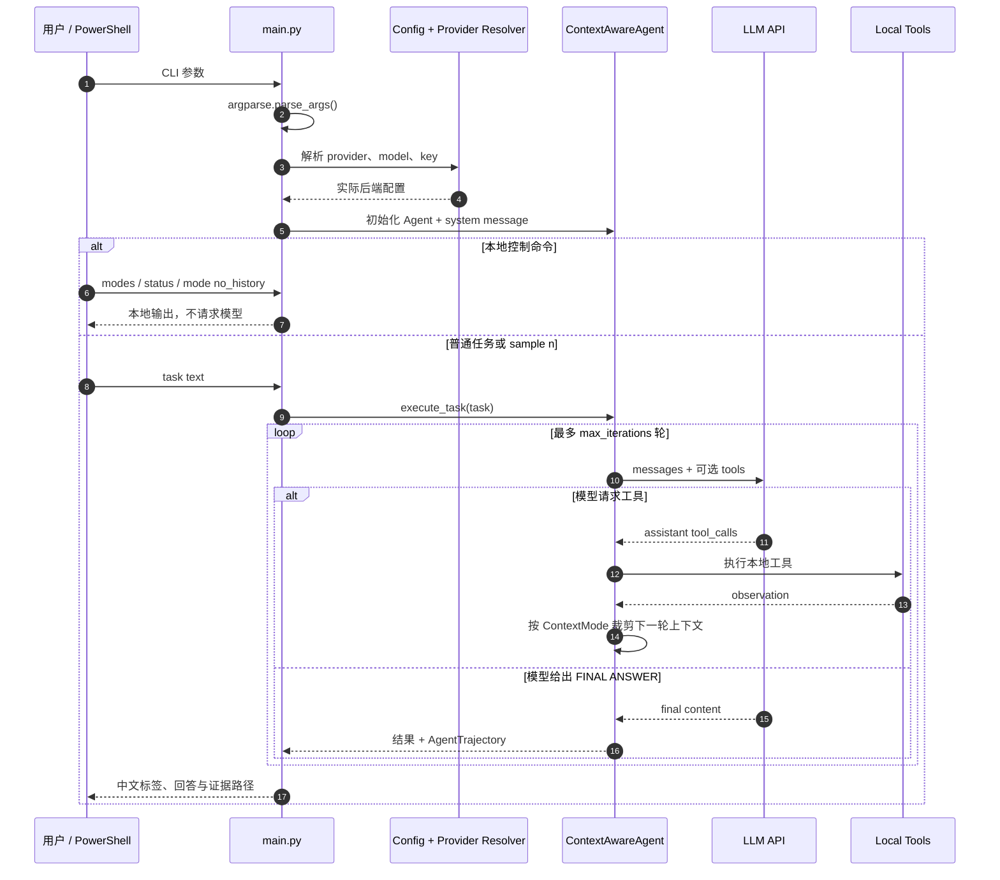

# 上下文感知 Agent 与消融实验

> 配套《深入理解 AI Agent》第 1 章 **实验 1-1 ★★：上下文的关键作用**。

← [返回学习目录](README.md) · 📖 [阅读上游第 1 章正文](https://github.com/bojieli/ai-agent-book/blob/main/book/chapter1.md)

---

## 学习入口（先看这里）

### 先分清四个入口

| 入口 | 用途 | 是否请求模型 | 主要产物 | 建议顺序 |
|---|---|---:|---|---:|
| `python -X utf8 main.py --help` | 查看真实 CLI 参数 | 否 | 终端帮助 | 1 |
| `python -X utf8 -m pytest -q` | 验证本地上下文裁剪、工具和命令分流 | 否 | 测试结果 | 2 |
| `python -X utf8 main.py --mode interactive --provider kimi --model kimi-k3` | 手动切换模式并逐条观察 | 仅输入任务时 | 终端轨迹 | 3 |
| `python -X utf8 run_experiment_1_1.py ...` | 运行正式对比实验，并检查模式是否真的生效 | 是，多次 | `evidence.json` | 4 |

`main.py` 是日常学习入口，支持 `single`、`ablation`、`interactive`；
`run_experiment_1_1.py` 是实验 1-1 的证据运行器。不要用 `test_*.py` 代替正常入口，
测试文件只负责验证实现是否符合预期。

> **当前工作树测试状态（2026-09-14）**：本机离线执行得到 `46 passed, 1 failed`。
> 唯一失败位于 `test_experiment_1_1.py::test_analysis_reports_which_arms_stated_unsupported_numbers`：
> 测试仍查找英文 `Vacuous by construction`，实现已改为中文“结构性必然”（也就是：请求里没有工具，所以一定不会调用工具）。这不是模型、网络或
> README 引起的失败；在测试断言同步前，不要把它解释为 Context 主循环不可用。

### 交互命令与模型任务的边界

进入 `interactive` 后，程序会先在本地判断输入：

- `help`、`status`、`samples`、`providers`、`modes`、`mode <name>`、`reset`、
  `create_pdfs` 和 `quit` 是本地控制命令，不应请求模型；
- `modes` 只列出五种模式；切换请写 `mode no_history`；旧写法
  `modes no_history` 仅作为兼容别名；
- 只有 `sample <n>` 或不匹配控制命令的普通文本才会进入
  `agent.execute_task()`，因而可能产生模型调用和费用；
- `mode <name>` 会重新创建 Agent，所以切换模式后历史从新的 system message 开始。



### 代码流程与实验结果可视化

- [实验逻辑流程](实验逻辑流程.md)：现成的 `CONTEXT_EXECUTION_FLOW.md`，包含三张 `sequenceDiagram`、状态变化和关键源码行。
- [实验总结](实验总结.md)：现成的 `EXPERIMENT_1_1_ANALYSIS.md`，逐组解释真实 Kimi K3 证据。
- 本地 `validation/latest.json` 保存机器可读验收台账；其中含真实调用轨迹，不上传到公开 GitHub。

### 推荐源码阅读顺序

1. `main.py:1135+`：`argparse` 从哪里生成 `args`，三个 CLI 模式怎样分流；
2. `main.py:906+`：交互命令为何不会被当成模型任务；
3. `agent.py:68+`：五种 `ContextMode` 分别叫什么；
4. `agent.py:681+`：每轮真正发送给模型的 messages 怎样裁剪；
5. `agent.py:716+`：消息 → 模型 → 工具 → 工具结果 → 下一轮/结束；
6. `run_experiment_1_1.py:343+`：如何从 `AgentTrajectory` 生成分支证据；
7. `grounding.py`：为什么“返回了文本”不等于“数字有依据”。

第一次阅读可以先跳过不同模型提供商的兼容字段、绘图样式和密钥检查，重点看懂 Agent 主循环，以及五种模式分别删除了什么。

## 项目说明

### 概述

本项目实现了一个能记住对话上下文的 AI Agent，并给它配备 PDF 解析、货币换算、计算器和代码解释器等工具。实验会有意删除某一类上下文，再观察 Agent 还能不能完成任务；这种对比方法叫作**消融实验**（Ablation Study）。项目支持阿里云百炼 Qwen、SiliconFlow Qwen、Doubao、Kimi 和 DeepSeek，对应书中的**实验 1-1 ★★：上下文的关键作用**。

### 主要特性

- **多提供商支持**：阿里云百炼（Qwen 直连）、SiliconFlow（Qwen）、Doubao（字节）、Kimi（月之暗面）、DeepSeek
- **多工具 Agent**：PDF 解析、货币换算、计算与 Python 代码执行
- **上下文模式**：五种配置，用于消融对照
- **交互与批处理**：单任务运行或完整测试套件
- **对话历史**：同一会话内跨多轮查询保持上下文
- **详细分析**：性能指标、可视化与综合报告

### 支持的 LLM 提供商

#### Doubao（字节跳动）— 默认

- **模型**：`doubao-seed-1-6-thinking-250715`（可自定义）
- **API**：火山引擎上的 OpenAI 兼容接口
- **适合**：深度推理、较快响应，中英文任务均可

#### SiliconFlow

- **模型**：`Qwen/Qwen3.5-397B-A17B`（可自定义）
- **API**：OpenAI 兼容
- **适合**：复杂推理与细致分析

#### 阿里云百炼（Qwen 直连）

- **模型**：`qwen3.7-plus`（可通过 `--model` 自定义）
- **API**：直连 DashScope 的 OpenAI 兼容接口，无需 SiliconFlow 账号
- **提供商名称**：规范名称为 `dashscope`，也可使用别名 `qwen` 或 `bailian`
- **区域说明**：API Key 与区域绑定。中国内地 Key 默认直连内地端点；国际站 Key 必须设置 `DASHSCOPE_BASE_URL=https://dashscope-intl.aliyuncs.com/compatible-mode/v1`

#### Kimi（月之暗面）

- **模型**：`kimi-k3`（K3 推理模型；temperature 强制为 1，max_tokens 足够容纳思考输出）
- **API**：Moonshot 平台 OpenAI 兼容接口
- **适合**：深度推理、多轮对话，中英文任务均可
- **特性**：上下文缓存以优化成本

#### DeepSeek

- **模型**：`deepseek-v4-flash`（默认；更强档可用 `--model deepseek-v4-pro`）
- **API**：[DeepSeek Platform](https://platform.deepseek.com/) 的 OpenAI 兼容接口
- **适合**：性价比高的工具调用；开启 thinking，便于 `no_reasoning` 消融剥离 `reasoning_content`
- **说明**：旧别名 `deepseek-chat` / `deepseek-reasoner` 已弃用（2026-07-24），请优先使用 V4 id

### 架构

#### 上下文组件

1. **Full Context** — 完整 Agent，保留全部组件
2. **No History** — 缺少历史工具调用追踪
3. **No Reasoning** — 无战略规划/思考过程
4. **No Tool Calls** — 无法执行外部工具
5. **No Tool Results** — 看不到工具执行结果

#### 可用工具

- **`parse_pdf(url)`** — 下载并抽取 PDF 文本
- **`convert_currency(amount, from, to)`** — 货币换算
- **`calculate(expression)`** — 简单数学表达式求值
- **`code_interpreter(code)`** — 执行 Python，用于复杂计算、汇总与数据处理

### 前置条件

- Python 3.10+
- 任一支持提供商的 API Key：
  - **阿里云百炼**：[百炼控制台](https://bailian.console.aliyun.com/)
  - **SiliconFlow**：[SiliconFlow](https://siliconflow.cn)
  - **Doubao（字节）**：[火山引擎](https://www.volcengine.com/)
  - **Kimi（月之暗面）**：[Moonshot Platform](https://platform.moonshot.cn/)
  - **DeepSeek**：[DeepSeek Platform](https://platform.deepseek.com/api_keys)

### 示例任务

系统预置 5 个样例任务：

1. **简单货币换算** — 基础多币种计算
2. **多币种预算分析** — 跨办公室费用分析
3. **PDF 财务分析** — 解析并分析财务文档
4. **投资增长计算** — 复利与货币换算
5. **综合财务报告** — 串联全部工具的完整流程

用于展示 Agent 能力与上下文消融的影响。

### 快速开始

#### 1. 安装

```bash
# 推荐在仓库根目录使用统一的第 1 章环境
uv sync --locked --extra ch1

# 切换目录前先激活环境：
# macOS/Linux：
source .venv/bin/activate
# Windows PowerShell：.\.venv\Scripts\Activate.ps1
# Windows cmd：.venv\Scripts\activate.bat

# 未安装 uv 时可用 pip 兜底：
# python -m pip install -e ".[ch1]"

# 进入本实验目录，后续命令都在这里运行
cd chapter1/context

# 迁移期间仍支持单项目兼容路径：
# python -m pip install -r requirements.txt

# 复制并配置环境变量
cp env.example .env
# 编辑 .env 并填入一个提供商的 API Key（例如 DASHSCOPE_API_KEY 或 ARK_API_KEY）
```

#### 2. 配置提供商

```bash
# For Doubao (ByteDance) - Default
export ARK_API_KEY=your_key_here  
python main.py  # Uses Doubao by default

# For SiliconFlow (Qwen)
export SILICONFLOW_API_KEY=your_key_here
python main.py --provider siliconflow

# 通过阿里云百炼直连 Qwen
export DASHSCOPE_API_KEY=your_key_here
python main.py --provider dashscope
# --provider qwen 与 --provider bailian 是等价别名。
# 如果使用国际站 Key，还需设置：
export DASHSCOPE_BASE_URL=https://dashscope-intl.aliyuncs.com/compatible-mode/v1

# For Kimi (Moonshot)
export MOONSHOT_API_KEY=your_key_here
python main.py --provider kimi

# For DeepSeek
export DEEPSEEK_API_KEY=your_key_here
python main.py --provider deepseek
# Optional stronger model:
python main.py --provider deepseek --model deepseek-v4-pro

# Or specify a custom model
python main.py --model doubao-seed-1-6-thinking-250715

# Universal OpenRouter fallback: if the provider key above is missing/invalid
# but OPENROUTER_API_KEY is set, requests are routed through OpenRouter and the
# model id is mapped automatically (bare gpt-*/o1-* -> openai/*, claude-* ->
# anthropic/*, deepseek-* -> deepseek/*, other native ids -> OPENROUTER_MODEL
# or openai/gpt-5.6-luna).
export OPENROUTER_API_KEY=your-openrouter-api-key
python main.py                       # falls back to OpenRouter when ARK_API_KEY is unset
python main.py --provider openrouter # or use OpenRouter directly
```

#### 3. 测试 Qwen / Kimi / DeepSeek 集成

```bash
# 通过阿里云百炼 Qwen 直接运行消融实验
export DASHSCOPE_API_KEY=your_key_here
python main.py --provider dashscope --mode ablation

# Quick test of Kimi K3 model
export MOONSHOT_API_KEY=your_key_here
python tests/manual/check_kimi.py

# Use Kimi in main script
python main.py --provider kimi --mode interactive

# Run ablation study with Kimi
python main.py --provider kimi --mode ablation

# Quick test of DeepSeek V4
export DEEPSEEK_API_KEY=your_key_here
python tests/manual/check_deepseek.py
# or: python tests/manual/check_deepseek_quick.py

# Use DeepSeek in main script / ablation study
python main.py --provider deepseek --mode interactive
python main.py --provider deepseek --mode ablation
```

#### 4. 交互模式（推荐）

```bash
# Default (Doubao)
python main.py --mode interactive

# With SiliconFlow provider
python main.py --mode interactive --provider siliconflow

# In interactive mode, you can:
# - Type 'samples' to see pre-defined tasks
# - Type 'sample 2' to test PDF parsing
# - Type 'providers' to list available providers
# - Type 'provider kimi' to switch providers
# - Type 'status' to see current configuration
# - Type 'help' for all commands
```

#### 5. 运行样例任务

```bash
# Run without arguments to select from samples
python main.py --mode single

# With specific provider
python main.py --mode single --provider doubao

# Or provide your own task
python main.py --mode single \
  --task "Convert $1000 USD to EUR, GBP, and JPY. Calculate the average." \
  --context-mode full \
  --provider siliconflow
```

#### 6. 运行消融实验

```bash
# With default provider (single case, all five context modes)
python main.py --mode ablation

# With Doubao provider
python main.py --mode ablation --provider doubao

# Multi-case comparison across modes (stronger evidence for the book's point)
python main.py --mode ablation --cases 3

# Compare only two modes and save raw results to a custom path
python main.py --mode ablation --ablation-modes full no_history --output my_ablation.json
```

`main.py` 是唯一 CLI 入口。运行 `python main.py --help` 查看完整（中文）参数说明。

关键参数：

| 参数 | 说明 |
|------|------|
| `--mode` | `single` / `ablation` / `interactive`（默认） |
| `--task` | `single` 模式的任务文本 |
| `--context-mode` | `single` 模式的上下文模式（`full`、`no_history`、`no_reasoning`、`no_tool_calls`、`no_tool_results`） |
| `--ablation-modes` | `ablation` 模式下要测的模式子集（默认全部五种） |
| `--cases` | `ablation` 模式下每种模式跑的用例数（默认 1） |
| `--provider` / `--model` | LLM 提供商与可选模型覆盖 |
| `--output` | 单次结果或消融原始结果的 JSON 输出路径 |

### 消融实验

#### Windows 自学实验：一步步运行、观察和分析

下面这条路线面向想亲手复现实验 1-1 的 Windows 学习者。每次只运行一个实验组，
立刻查看该组的证据；这样既容易看清上下文少了什么，也不会覆盖
本地 `validation/latest.json`。本仓库当前的本地学习环境名为
`agentbook`；若你的环境名不同，把第一条命令替换为自己的名称即可。

> 不要把 API Key 粘贴进命令、截图或 README。将 `MOONSHOT_API_KEY` 保存在
> `ai-agent-book` 根目录的 `.env` 中即可。下方命令只检查“是否可用”，不会显示 Key。
> `kimi` 是 `moonshot` 的别名，`kimi-k3` 是本流程使用的模型。

##### 步骤 0：进入环境并做一次低成本检查

从 `ai-agent-book` 根目录打开 PowerShell，依次执行：

```powershell
conda activate agentbook
Set-Location .\chapter1\context

# 若终端中的中文标签显示为乱码，在当前 PowerShell 会话执行一次；无需修改系统设置。
$env:PYTHONIOENCODING = 'utf-8'
[Console]::OutputEncoding = [System.Text.UTF8Encoding]::new()

# 只验证 Python、Provider 别名和默认模型；不发送 API 请求。
python --version
python -c "from config import canonical_provider, PROVIDERS; p=canonical_provider('kimi'); print(p, PROVIDERS[p].default_model)"

# 可选：发送一次很短的真实请求，确认 Kimi 连通；会消耗一次 API 调用。
python .\tests\manual\check_kimi_quick.py
```

预期第二条 Python 命令输出 `moonshot kimi-k3`。最后一条成功时会显示提供商、模型和一段简短回复；
如果提示缺少 `MOONSHOT_API_KEY`，只检查 `.env` 的变量名和保存位置，不要把变量值发到终端或聊天窗口。

运行任务时，终端会用 `【Agent 初始化】`、`【执行轮次】`、`【模型请求】`、`【HTTP 通信】`、
`【模型响应】`、`【工具执行】`、`【终止条件】` 等标签说明当前输出属于哪个阶段；最终结果则以
`【任务执行结果】`、`【最终回答】`、`【证据文件】` 和 `【完整性校验】` 分组显示。

##### 步骤 1：先亲眼看一次“历史被记住”

这一步比立即跑五组消融更直观。启动交互模式：

```powershell
python .\main.py --mode interactive --provider kimi --model kimi-k3
```

在提示符下逐行输入：

```text
status
请记住标记 CONTEXT-47，只回复“已记住”。
刚才需要记住的标记是什么？只回复标记本身。
status
quit
```

观察两件事：第二个回答应为 `CONTEXT-47`；第二次 `status` 的
`【对话历史】` 数量应比首次更大。这里的 `【工具调用】` 为 0 是正常的——这个小练习只验证
消息历史，不需要工具。若你的 K3 账户有较低的每分钟请求上限，进入下一步前等待约一分钟。

##### 步骤 2：定义“运行一个分支”和“读一个证据”的两个 PowerShell 小工具

仍在 `chapter1/context` 目录时，复制下面整段一次。结果会写入工作区根目录的 `_local/`，
该目录用于本地学习产物，不应提交到 Git。

```powershell
function Start-ContextArm {
    param(
        [Parameter(Mandatory)]
        [ValidateSet('full', 'no_history', 'no_reasoning', 'no_tool_calls', 'no_tool_results')]
        [string]$Mode
    )

    $stamp = Get-Date -Format 'yyyyMMdd-HHmmss'
    $workspaceRoot = (Resolve-Path ..\..\..\..).Path
    $outputDir = Join-Path $workspaceRoot "_local\ai-agent-book\context-1-1-$stamp-$Mode"

    # max-iterations=3 是学习用上限：省调用、方便观察；不是正式基准配置。
    & python .\run_experiment_1_1.py `
        --provider kimi --model kimi-k3 `
        --modes $Mode --task guarded --hidden-result empty `
        --max-iterations 3 --output-dir $outputDir | Out-Host
    $exitCode = $LASTEXITCODE

    $evidencePath = Join-Path $outputDir 'evidence.json'
    if (-not (Test-Path -LiteralPath $evidencePath)) {
        throw "没有生成证据文件：$evidencePath"
    }
    if ($exitCode -ne 0) {
        Write-Warning '单独运行一个分支是探索性运行，退出码 1 是预期现象；请以 evidence.json 的字段判断结果。'
    }
    return $evidencePath
}

function Show-ContextEvidence {
    param([Parameter(Mandatory)][string]$EvidencePath)

    $evidence = Get-Content -LiteralPath $EvidencePath -Raw | ConvertFrom-Json
    $arm = @($evidence.arms)[0]
    [pscustomobject]@{
        Mode                  = $arm.mode
        Completed             = $arm.completed
        Outcome               = $arm.outcome
        Iterations            = $arm.iterations
        ToolActionCount       = $arm.behavior.tool_action_count
        RepeatedToolAction    = $arm.behavior.has_repeated_tool_action
        ContextContractPassed = $arm.context_contract.passed
        Groundedness          = $arm.groundedness.verdict
        ErrorPresent          = -not [string]::IsNullOrWhiteSpace([string]$arm.error)
    } | Format-List

    "`nTool call signatures:"
    $arm.tool_call_signatures
    "`nRequest roles by turn:"
    for ($i = 0; $i -lt @($arm.context_contract.request_roles).Count; $i++) {
        "turn $($i + 1): $($arm.context_contract.request_roles[$i] -join ' -> ')"
    }
    "`nContext contract:"
    $arm.context_contract | Format-List

    $expected = ((Get-Content -LiteralPath (Join-Path (Split-Path $EvidencePath) 'evidence.sha256') -Raw).Trim() -split '\s+')[0]
    $actual = (Get-FileHash -LiteralPath $EvidencePath -Algorithm SHA256).Hash.ToLowerInvariant()
    "SHA-256 matches: $($expected -eq $actual)"
}
```

`ContextContractPassed=True` 是最先要看的字段：它证明实际发往提供商的请求确实按该模式
移除了对应上下文，而不仅是命令行上写了一个模式名。

##### 步骤 3：按顺序跑五组，并在每组后立刻阅读

不要并行执行。对低 RPM 账户，每次运行后等待约 65 秒；如果服务端返回限流错误，只等待后重跑
**当前这一组**，不要从头重跑五组。

```powershell
$full = Start-ContextArm full
Show-ContextEvidence $full

Start-Sleep -Seconds 65
$noHistory = Start-ContextArm no_history
Show-ContextEvidence $noHistory

Start-Sleep -Seconds 65
$noToolResults = Start-ContextArm no_tool_results
Show-ContextEvidence $noToolResults

Start-Sleep -Seconds 65
$noToolCalls = Start-ContextArm no_tool_calls
Show-ContextEvidence $noToolCalls

Start-Sleep -Seconds 65
$noReasoning = Start-ContextArm no_reasoning
Show-ContextEvidence $noReasoning
```

##### 步骤 4：每一组分别怎么跑、怎么判断

下面五段都依赖步骤 2 中已经定义的 `Start-ContextArm` 和
`Show-ContextEvidence`。一次只复制并运行一段；Kimi K3 的低 RPM 账户在两组之间等待约
65 秒。`ContextContractPassed=True` 是每一组的最低通过条件，它验证的是实际发给模型的
请求，而不是命令行参数的名字。

###### 4.1 `full`：完整上下文基线

先运行完整上下文，后面四组都与它对照：

```powershell
$full = Start-ContextArm full
Show-ContextEvidence $full
```

在 `Context contract:` 区块中确认以下字段为 `True`：

```text
tools_present_every_turn
history_present_after_first_turn
reasoning_retained_after_first_turn
passed
```

再看汇总中的 `ToolActionCount`、`Outcome` 和第二轮后的 `Request roles by turn`。正常情况下，
后续请求会包含 `assistant` 与 `tool`；`Outcome=correct` 是这条基线任务的理想结果。若模型
一次没有收束，不要修改代码或得出一般性结论，记录结果后可在限流窗口过去后只重跑这一组。

###### 4.2 `no_history`：删除全部历史消息

```powershell
Start-Sleep -Seconds 65
$noHistory = Start-ContextArm no_history
Show-ContextEvidence $noHistory
```

确认以下字段为 `True`：

```text
only_static_prefix_and_user_every_turn
tools_still_present
passed
```

这里每一轮 `Request roles by turn` 都应是 `system -> user`。工具定义仍会发送给模型，但上一轮
的 assistant 消息、工具调用和工具结果都不会保留。`RepeatedToolAction=True` 是可观察现象，
不是该模式的硬性通过条件；即使没有重复，协议仍可能验证通过。

###### 4.3 `no_tool_results`：保留工具调用，隐藏观察结果

```powershell
Start-Sleep -Seconds 65
$noToolResults = Start-ContextArm no_tool_results
Show-ContextEvidence $noToolResults
```

确认以下字段为 `True`：

```text
tool_calls_retained
tool_results_hidden
passed
```

再查看 `Request roles by turn`：第二轮开始仍应含有 `assistant -> tool`。不同点是工具消息的
`content` 被替换为空字符串（本学习命令使用 `--hidden-result empty`），所以模型知道自己调用过
工具，却看不到工具实际返回的数据。`RepeatedToolAction`、`Outcome` 用于观察它是否因缺少观察
结果而反复行动或无法收束，不能作为结构验证的唯一依据。

###### 4.4 `no_tool_calls`：不发送工具定义

```powershell
Start-Sleep -Seconds 65
$noToolCalls = Start-ContextArm no_tool_calls
Show-ContextEvidence $noToolCalls
```

确认以下字段为 `True`：

```text
tools_absent_every_turn
passed
```

此组的 `ToolActionCount` 必须为 `0`。想亲眼确认请求结构时，在同一个 PowerShell 会话运行：

```powershell
$e = Get-Content -LiteralPath $noToolCalls -Raw | ConvertFrom-Json
$e.arms[0].api_turns[0].request | ConvertTo-Json -Depth 10
```

输出 JSON 中不应有 `tools` 或 `tool_choice` 字段。模型往往第一轮就直接结束，可能拒绝回答、
猜测或给出无依据结果；这不是“模型不会调用工具”，而是程序根本没有向模型提供工具。

###### 4.5 `no_reasoning`：只删除历史中的推理文本

```powershell
Start-Sleep -Seconds 65
$noReasoning = Start-ContextArm no_reasoning
Show-ContextEvidence $noReasoning
```

确认以下字段为 `True`：

```text
provider_generated_reasoning
reasoning_removed_from_history
tool_and_result_history_retained
passed
```

这表示提供商本轮确实返回过 `reasoning_content`，但该字段没有进入下一轮的 assistant 历史；
工具调用与工具结果仍在。它不禁止模型当前轮生成推理，因此不能把一次回答好坏解释为
“模型失去思考能力”。至少需要两轮请求才能检验这个模式，故不要把 `--max-iterations` 调低到 1。

##### 步骤 5：每组该观察什么

| 模式 | 先看哪些字段 | 你要验证的现象 | 不应下的结论 |
|---|---|---|---|
| `full` | `Outcome`、`ToolActionCount`、第二轮后的 `request_roles` | 有工具定义、工具结果与历史时，Agent 是否能收束为 `correct` | 一次成功不能说明所有模型都会成功 |
| `no_history` | `RepeatedToolAction`、每轮 `request_roles` | 每轮是否只保留 `system -> user`，以及工具动作是否重复 | 不能把一次重复归因于“模型笨” |
| `no_tool_results` | `tool_results_hidden`、`RepeatedToolAction`、`Outcome` | 工具调用仍在，但观察内容被清空后是否反复行动或不收束 | 不能把本地工具实际算出的结果当作模型已经看到的结果 |
| `no_tool_calls` | `tools_absent_every_turn`、`ToolActionCount`、`Outcome` | 请求中是否真的没有工具定义；模型会拒绝或给出无依据回答 | 请求里根本没有提供工具，所以“不调用工具”不能说明模型能力强弱 |
| `no_reasoning` | `reasoning_removed_from_history`、`tool_and_result_history_retained` | 只移除历史推理文本，工具和观察仍保留 | 这个实现不会删除模型当前轮的内部思考，单次结果不能证明强因果 |

同一模式的结果可能随模型采样而变化，所以记录“现象 + 证据字段”，不要只记录成功/失败。建议在你的学习笔记中填一张表：

| 模式 | 我原先的假设 | 本次 `Outcome` | 关键字段/现象 | 更谨慎的解释 |
|---|---|---|---|---|
| `full` |  |  |  |  |
| `no_history` |  |  |  |  |
| `no_tool_results` |  |  |  |  |
| `no_tool_calls` |  |  |  |  |
| `no_reasoning` |  |  |  |  |

##### 步骤 6：需要更强证据时再扩大实验

上述单模式命令只用于学习和观察，因此 `canonical_run=false`，不会改写教材引用的
`validation/latest.json`。确认看懂五组现象后，才考虑提高 `--max-iterations` 或重复每组多次。
完整五组标准运行可能写入 `validation/latest.json`；在你明确要更新该台账前，不要运行未指定
**单个或子集** `--modes` 的命令。仅指定 `--output-dir` 并不能阻止五组标准运行被提升到该文件。

#### 已验收的 Kimi K3 真实执行（2026-08-25）

`run_experiment_1_1.py` 会按正文运行五个精确实验组，并保存每轮真实 API 的无凭据
请求与响应，而不只是汇总表：

```bash
python run_experiment_1_1.py --provider kimi
```

`--model` 可省略，缺省取共享注册表（`agentbook/providers`）中该提供商的默认模型。
选定一个提供商却写另一个提供商的模型名，正是
[#971](https://github.com/bojieli/ai-agent-book/issues/971) 中五组全部失败的原因；
现在只传 `--provider` 就够了：

```bash
export DASHSCOPE_API_KEY=your_key_here
python run_experiment_1_1.py --provider dashscope     # 使用 qwen3.7-plus
```

验收产物见本地 `validation/latest.json`。只有既是标准配置
（五组齐全、带约束的任务、静默隐藏工具结果）又通过验收的运行才会覆盖它；其余运行
只写自己的时间戳目录，不会动被引用的证据。

#### 怎么读一组实验

`completed` 表示 Agent 循环返回了终止响应，不代表任务做对了。旧字段 `success` 是
`completed` 的别名，`task_success` 才是数值评分标准。三者都区分不出「消融组没给出
答案」的两种情况，因此每组还带一个 `outcome`：

| `outcome` | 含义 |
|---|---|
| `correct` | 终止回答且符合数值评分标准 |
| `no_unsupported_numbers` | 终止回答中没有声称任何模型未被给予的数字 |
| `unsupported_numbers` | 终止回答中出现了任务与观测里都没有的营收量级数字 |
| `incorrect` | 有观测可依据，但回答仍然错误 |
| `no_terminal_response` | 触到迭代上限，或报错 |

`unsupported_numbers` 正是 `Completed` 那一列永远显示不出来的情况，也是生产中真正
要命的一种：用记忆中的汇率拼出来的答案，排版和用工具结果算出来的答案一模一样。它由
[grounding.py](code/grounding.py) 依据**实际发出的消息**计算，因此被隐藏了观测的实验组
无论框架本地算出了什么，都无处可依。可依据性与正确性是两条独立的轴——没有观测却报出
正确总数的模型，同样不是「读到」的。`no_unsupported_numbers` 同时涵盖「明确拒绝」和
「只说了一句打算怎么做就停下」；区分这两者属于对意图的判断，本框架不做。

实测结果（下方「预期行为」表是设计预期，不是实测）：

| 实验组 | 迭代 | 工具行动 | 重复行动 | outcome |
|---|---:|---:|---|---|
| full | 3 | 4 | 否 | `correct` |
| no history | 5（触顶） | 15 | 是 | `no_terminal_response` |
| no reasoning | 3 | 4 | 否 | `correct` —— **测不出退化**；正文已不再作此断言 |
| no tool definitions | 1 | 0 | 否 | `no_unsupported_numbers` —— 声明会话中没有可用的换汇工具 |
| no tool results | 5（触顶） | 9 | 是 | `no_terminal_response` —— 一直重调工具，始终没有收敛 |

后两组在多次运行之间并不稳定；「移除工具执行结果」组反复运行的实际表现见下表。

`analysis.manuscript_behavior_claims` 保存正文行为结论的布尔值，
`all_manuscript_behavior_claims_observed` 为 false。对于根本没有到达提供商的实验组，
结论记为 `null` 而不是 `true`——四条结论里有两条是以「没有发生什么」表述的，一次失败
的请求就能白白满足它们。`analysis.claim_qualifications` 则记下：「移除工具定义后没有
工具行动」是构造性必然，请求里没有工具定义，模型本就发不出工具调用；唯一可观察的是
它转而做了什么。

#### 两个会改变结论的开关

两者默认都是标准配置；提供另一个取值，是因为它确实会改变结果，而这值得看见。支撑数据
见本地 `validation/probes_20260825T/`，汇总在其 `index.json`；真实调用证据不上传公开 GitHub。

**`--task guarded|unguarded`** 控制提示词里的一句话：*「不要自行估计汇率，请使用工具
观测。」* 在带约束（标准）的任务下，Kimi K3 的「移除工具定义」组不会声称任何未被给予
的数字；去掉这一句，同一个模型、同一组实验就给出了 `$9,587,333.33`——与工具汇率表相差
0.16%，汇率是它自己补上的，附带的「基于所假设汇率」说明，只看总数的读者根本不会注意到。

这条约束确实起作用，但它只是概率上的偏移，不是开关：在**带约束**的任务下，同一个模型
仍有 2/13 组报出了无依据的数字。而且这里无法把提示词和模型分开——这批运行期间除
Moonshot 外的提供商都不可用，没有在固定提示词下比较过两个模型。不同模型的幻觉率差异
很大，那多半才是更主要的因素；提示词约束只能降低概率，不能消除。两者都不能依赖，这正是
可依据性检查存在的意义。

```bash
python run_experiment_1_1.py --provider kimi --modes no_tool_calls --task unguarded
```

**`--hidden-result empty|marker`** 控制「移除工具执行结果」组如何隐藏观测。`empty`
（标准）发送一条内容为空的 tool 消息——协议要求这条消息必须存在，所以这已是「结果消失
了」最接近的实现。`marker` 发送可见的占位符
`[Tool result hidden due to context mode]`，这等于又给了模型一个本来不该出现的提示：
模型能看出「这里有观测，但被藏了」，于是可以停下来说明情况。对这一组反复运行
（Kimi K3、带约束任务、上限 5 轮）：

| 隐藏方式 | 运行次数 | 触顶且无答案 | 报出无依据数字 | 未声称任何未被给予的数字 |
|---|---:|---:|---:|---:|
| `empty`（标准） | 7 | 6 | 1 | 0 |
| `marker` | 4 | 1 | 1 | 2 |

这一组在两种方式下都不是确定性的，样本量也小，因此上表只是倾向而非定律。倾向本身足够
清楚：静默隐藏下 7 次里有 6 次跑到迭代上限——反复重做换汇，然后用测试值试探工具
（1 EUR→USD、100 USD→EUR）以判断为什么什么都没回来——这正是正文所说的「盲目执行」；
可见占位符下 4 次里只有 1 次如此，而且只有在这种方式下，模型才报告过「我什么都没拿到」。
关键就在这里：占位符本身也会向模型透露信息。“告诉模型结果被隐藏”和“完全不给结果”不是同一种实验。两种方式也都
出现过用记忆中的汇率作答，所以那一种失败不属于任何一种设计。

```bash
python run_experiment_1_1.py --provider kimi --modes no_tool_results --hidden-result marker
```

系统性地移除上下文组件，以理解其重要性。

#### 测试场景

需要以下能力的复杂财务分析任务：

1. PDF 文档解析
2. 多次货币换算
3. 数学计算
4. 结果汇总

#### 预期行为

| 上下文模式 | 移除组件（书中 §实验 1.1） | 预期行为 | 影响 |
|-------------|---------------------------|----------|------|
| **full** | 无（基线） | 完整成功执行 | 基线性能 |
| **no_history** | 历史消息 (history) | 冗余操作、效率下降 | 可能重复调用工具 |
| **no_reasoning** | 思考过程 (reasoning) | 方法无结构、易出错 | 缺少战略规划 |
| **no_tool_calls** | 工具定义 (tool definitions) | 没有工具行动，但两种情况都会给出终止回答：要么拒绝，要么用记忆中的汇率作答 | 无法与外部世界交互；但回答看上去可能仍然完整 |
| **no_tool_results** | 工具执行结果 (tool results) | 反复重调并试探工具，常常一直触到迭代上限 | 在没有反馈的情况下行动，且察觉不到这一点 |

**各消融如何落地**（见 `agent.py`）：

- **no_tool_calls** — 请求中省略 `tools` 参数，模型没有可调用的工具定义。
- **no_tool_results** — 每个工具结果的内容被置空：API 要求这条消息存在，但它不再携带任何观测。`--hidden-result marker` 则换成可见的 `[Tool result hidden due to context mode]` 占位符——那是另一个实验，因为它等于告诉模型「这里有观测被藏起来了」。
- **no_reasoning** — 写回轨迹前，从每条 assistant 消息中剥离 `reasoning_content`。
- **no_history** — `_prepare_messages_for_api()` 仅向模型发送系统提示词和当前任务，不保留任何ReAct步骤。因此模型会遗忘此前所有操作步骤，易重复调用工具。完整模式始终发送完整轨迹。

#### 运行测试

```bash
# Run the full ablation study (single case, all five modes)
python main.py --mode ablation

# Run across multiple cases for a stronger comparison
python main.py --mode ablation --cases 3

# This will generate:
# - ablation_study_results.png (visualization, if matplotlib is installed)
# - ablation_study_report.md (detailed report)
# - ablation_results.json (raw data; override path with --output)
```

控制台会打印两张表：逐次运行的 **ablation study results**，以及 **comparison matrix**（上下文模式 × 用例），便于一眼对比各组件的作用。

#### 自动化回归测试

```bash
python -m pytest tests
```

需要真实 API Key 的手动提供商/API 冒烟脚本放在 `tests/manual/`。

### 结果解读

#### 性能指标

- **Terminal Response Rate**：Agent 是否返回了终止响应
- **Task Success**：在存在任务专用评分标准时，任务是否正确完成
- **Execution Time**：完成任务总耗时
- **Iterations**：Agent 与模型交互次数
- **Tool Calls**：外部工具调用次数
- **Reasoning Steps**：战略规划迭代次数

#### 输出示例

```
ABLATION STUDY RESULTS
================================================================================
| Test Name                      | Success | Time   | Iterations | Tool Calls |
|--------------------------------|---------|--------|------------|------------|
| Baseline - Full Context        | ✓       | 12.3s  | 5          | 8          |
| No Historical Tool Calls       | ✓       | 18.7s  | 8          | 12         |
| No Reasoning Process           | ✗       | 25.4s  | 10         | 15         |
| No Tool Call Commands          | ✗       | 3.2s   | 2          | 0          |
| No Tool Call Results           | ✗       | 15.6s  | 10         | 10         |
```

### 关键洞察

1. **工具调用是基础** — 没有工具调用能力，Agent 无法与外部系统交互，任务无法完成。
2. **工具结果提供关键反馈** — 看不到结果等于盲目行动，易导致错误结论与死循环。
3. **推理提升效率** — 战略规划减少迭代与工具调用，兼顾速度与准确。
4. **历史避免冗余** — 历史上下文防止重复操作，并在多轮中保持任务连贯。

### 进阶用法

#### 交互模式命令

| 命令 | 说明 |
|------|------|
| `samples` | 显示全部样例任务 |
| `sample <n>` | 运行第 n 个样例任务 |
| `providers` | 列出可用 LLM 提供商 |
| `provider <name>` | 切换提供商（如 `provider kimi`） |
| `modes` | 列出可用于消融的上下文模式 |
| `mode <name>` | 切换上下文模式（如 `mode no_history`） |
| `status` | 显示当前配置（提供商、模型、模式等） |
| `reset` | 重置 Agent 轨迹（清空历史） |
| `create_pdfs` | 生成测试用样例 PDF |
| `quit` | 退出交互模式 |

**说明：** 提示符会以括号显示当前提供商，如 `[KIMI]>` 或 `[DOUBAO]>`

#### 对话历史

交互会话中 Agent 会维护对话历史：

- **持久上下文**：会话内记住先前查询与回复
- **多轮对话**：可引用更早提到的信息
- **工具调用记忆**：先前工具执行结果可被引用
- **按需重置**：使用 `reset` 清空历史重新开始

示例对话流程：

```
[DOUBAO]> Remember that our budget is $10,000. Calculate 15% of it.
# Agent calculates and remembers the budget

[DOUBAO]> Now convert that 15% amount to EUR
# Agent uses the previously calculated amount without re-asking

[DOUBAO]> What was our original budget?
# Agent recalls the $10,000 mentioned earlier
```

#### 自定义任务

```python
from agent import ContextAwareAgent, ContextMode

agent = ContextAwareAgent(api_key, ContextMode.FULL)
result = agent.execute_task("""
    Download the PDF from https://example.com/report.pdf,
    extract all monetary values, convert them to EUR,
    and calculate the total.
""")
```

#### 生成测试 PDF

```bash
python create_sample_pdf.py
# Creates fixtures/pdfs/ with sample financial reports
```

#### 配置

编辑 `config.py` 或设置环境变量：

```bash
export MODEL_TEMPERATURE=0.5
export MAX_ITERATIONS=15
export LOG_LEVEL=DEBUG
```

### 项目结构

```
context/
├── README.md             # 本文件
├── main.py               # 单一 CLI 入口（single / ablation / interactive）
├── agent.py              # Core agent implementation + context modes
├── config.py             # Configuration management
├── create_sample_pdf.py  # PDF generation utility
├── fixtures/
│   └── pdfs/             # 本地 demo/tests 使用的样例 PDF
├── tests/
│   ├── test_agent.py
│   ├── test_code_interpreter.py
│   ├── test_malformed_tool_json.py
│   └── manual/           # 需真实 Key 的提供商/API 冒烟脚本
├── requirements.txt      # Dependencies
└── env.example           # Environment template
```

> 说明：消融实验逻辑在 `main.py` 的 `AblationTestSuite` 中，通过 `python main.py --mode ablation` 运行，没有单独的 `ablation_tests.py`。

### 研究用途

- **AI 安全研究**：理解失败模式
- **系统设计**：识别关键组件
- **优化**：寻找最小可用配置
- **教学**：讲解 Agent 架构原理

### 局限

- 货币汇率为固定值（生产环境应使用实时 API）
- 复杂版式 PDF 解析可能失败
- 模型 token 上限可能影响超大文档


---

## 说明

- 本项目为教学向消融实验；生产使用请补齐错误处理、限流与安全措施。
- 未配置直连提供商 Key 时，可走 `OPENROUTER_API_KEY` 通用兜底。
- 许可证：MIT。欢迎贡献更多工具、场景、消融策略和性能优化。

