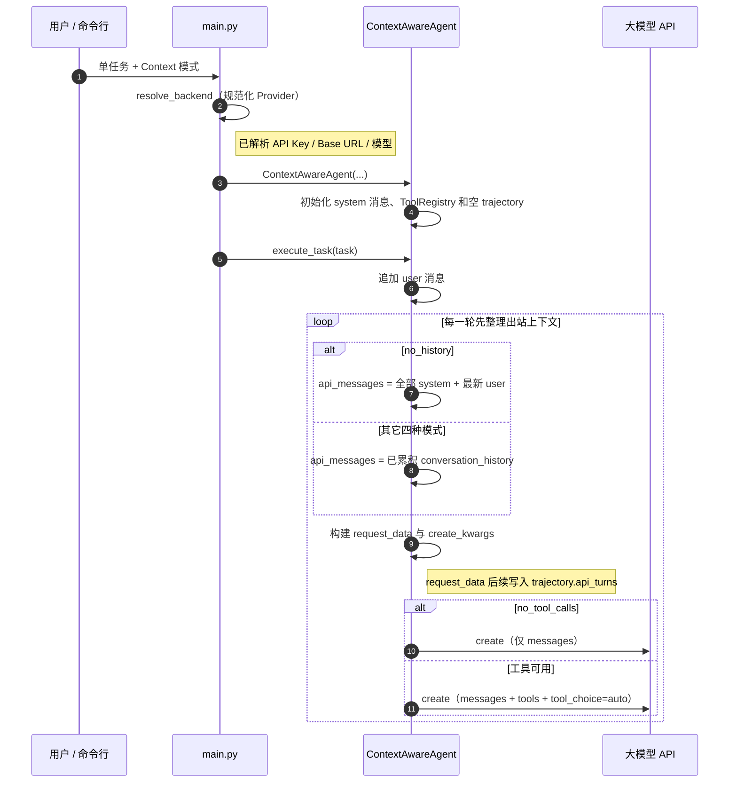
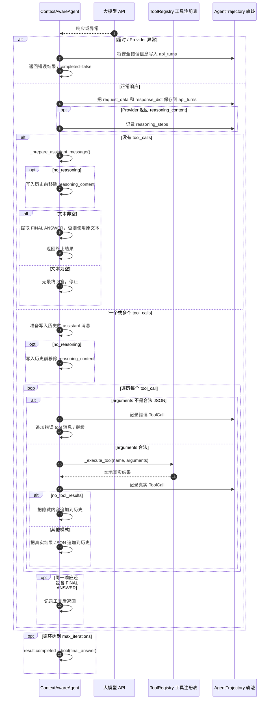
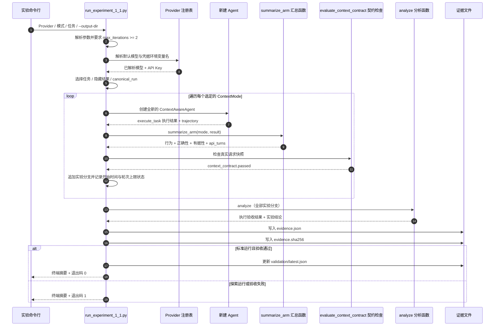

# Context Agent 执行流

> 文档依据：使用 CodeGraph MCP 的 `codegraph_explore` 读取当前源码。
> 范围：`main.py`、`agent.py`、`run_experiment_1_1.py`、`grounding.py`。
> 说明：本文件是实验 1-1 唯一维护的执行流程文档，流程图直接使用 Mermaid 展示。

## 先区分两条入口

| 入口 | 目的 | 进入 Agent 的位置 |
|---|---|---|
| `python main.py --mode single ...` | 运行一个任务或交互样例 | `main.py:1132` → `run_single_task()`（`main.py:605`） → `ContextAwareAgent.execute_task()` |
| `python run_experiment_1_1.py ...` | 对比五种上下文模式，并保存完整过程 | `run_experiment_1_1.py:559` 中逐模式创建 Agent，再调用 `execute_task()` |

下面的主流程描述两条入口共用的 Agent 执行路径。

## 主流程：一次任务怎样跑完

### 1. 命令行参数被解析

`main.py:1132` 根据 `--mode` 选择 `single`、`ablation` 或 `interactive`。
`single` 模式将 `--context-mode` 映射为 `ContextMode` 枚举，然后在
`main.py:632` 创建 `ContextAwareAgent`。

### 2. Agent 初始化

`agent.py:406` 的构造函数通过 `resolve_backend()` 解析提供商、模型和基础 URL，
创建 OpenAI SDK 客户端，并初始化三项本轮会持续使用的状态：

- `conversation_history`：先写入 system 提示词；
- `ToolRegistry`：注册 `parse_pdf`、`convert_currency`、`calculate`、`code_interpreter`；
- `AgentTrajectory`：保存每轮 API 请求、响应、工具调用和 reasoning 步骤，方便实验后检查。

### 3. 用户任务进入循环

`agent.py:716` 的 `execute_task()` 把 user 消息追加到 `conversation_history`，然后进入
最多 `max_iterations` 轮的 ReAct 循环。每轮开始时递增 `iteration`。

### 4. 组装“本轮真正发给模型”的消息

`agent.py:681` 的 `_prepare_messages_for_api()` 是第一个删减上下文的位置。

| 模式 | 实际发送的消息 |
|---|---|
| `full`、`no_reasoning`、`no_tool_calls`、`no_tool_results` | 直接使用完整的 `conversation_history` |
| `no_history` | 只保留 system 提示词和最新 user 任务；前几轮的 assistant、tool call、tool result 都不发送 |

注意：`no_history` 不会清空内存中的 `conversation_history`；它只在网络请求前构造一个更小的
`api_messages` 列表。

### 5. 组装模型请求

`agent.py:768` 构造 `request_data`，用于详细日志和轨迹快照；`agent.py:782` 构造真正传给 SDK 的
`create_kwargs`。

- 除 `no_tool_calls` 外，请求都带 `tools` 和 `tool_choice="auto"`；
- `no_tool_calls` 时，这两个字段不进入请求快照，SDK 参数为 `None`；
- DeepSeek 直连时会附加 `thinking.enabled`，以便提供商能够返回 `reasoning_content`。

### 6. 模型响应先被原样记录

`agent.py:801` 发送请求。收到响应后，`agent.py:812` 立即把不含 API Key 的请求快照和响应快照写入
`trajectory.api_turns`。这发生在后续上下文过滤之前，因此实验可以审计“提供商返回了什么”和
“下一轮实际发送了什么”。

若响应包含 `reasoning_content`，`agent.py:828` 会把它加入
`trajectory.reasoning_steps`。

### 7A. 没有工具调用：文本终止

当模型响应没有 `tool_calls` 时，`agent.py:835`：

1. 调用 `_prepare_assistant_message()`；
2. 将 assistant 消息加入 `conversation_history`；
3. 提取 `FINAL ANSWER:` 后的文本，若没有该标记则直接采用普通文本；
4. 跳出循环并返回结果。

`completed=True` 只表示收到了非空文本终止响应，**不表示任务一定正确**。

### 7B. 有工具调用：执行、记录、再进入下一轮

当模型返回 `tool_calls` 时，`agent.py:850` 开始处理每个调用：

1. 先把 assistant 的 tool-call 消息写入历史；
2. 解析函数参数 JSON；
3. 由 `_execute_tool()`（`agent.py:658`）按工具名动态分派到 `ToolRegistry`；
4. 将真实参数和真实结果记录到 `trajectory.tool_calls`；
5. 构造 role 为 `tool` 的消息并写入 `conversation_history`；
6. 若模型同轮带有 `FINAL ANSWER:`，记录答案并结束；否则回到第 4 步开始下一轮。

其中第 5 步是第二个删减上下文的位置：

| 模式 | 写入下一轮历史的 tool 消息内容 |
|---|---|
| `full`、`no_history`、`no_reasoning`、`no_tool_calls` | 工具真实结果的 JSON |
| `no_tool_results` | `hidden_result_content`；本实验的 `empty` 配置是空字符串 |

因此 `no_tool_results` 中，工具在本地仍真实执行，轨迹也保留真实结果；被扣留的是**模型下一轮能看到的 tool 消息内容**。

## 五个关键数据对象：每轮到底是谁在保存什么

| 对象 | 首次写入 | 后续如何变化 | 谁读取它 |
|---|---|---|---|
| `conversation_history` | Agent 初始化时写入 system；`execute_task()` 写入 user | 每次响应追加 assistant；每次工具调用追加 tool | `_prepare_messages_for_api()` |
| `api_messages` | 每轮由 `_prepare_messages_for_api()` 生成 | 通常只是完整历史的引用；`no_history` 时是 system + 最新 user 的过滤视图 | SDK 请求和 `request_data` 快照 |
| `request_data` / `response_dict` | 每轮请求前 / 响应后创建 | 被 JSON 深拷贝后追加到 `trajectory.api_turns` | 检查每种模式实际发送和收到的内容 |
| `trajectory.tool_calls` | 每个工具调用后写入 `ToolCall` | 保存真实参数与真实本地结果，即使 `no_tool_results` 隐藏了给模型的内容 | `summarize_arm()` 的工具次数与重复行为分析 |
| `result` | 循环结束或异常时返回 | 包含 final_answer、iterations、completed、error、trajectory、后端身份 | 普通 CLI 输出或实验运行器汇总 |

这里最重要的是分清三份数据：**模型实际看见的消息**、**工具在本地算出的结果**和**实验保存的完整过程**。它们并不相同。
`no_tool_results` 只影响第一份；`no_history` 只影响本轮出站消息；`no_reasoning` 只影响写回历史的 assistant 消息字段。

## Mermaid Sequence Diagram：单任务执行

为了保持细节可读，这条运行链拆成两张连续图，而不是把八个参与者挤进一张横向大图。
第一张停在 API 请求发出；第二张从同一轮响应回来开始。它们仍然只展示一次任务运行，
不是全局调用拓扑。

### A. 建立状态并发出请求

### B. 收响应、执行工具并决定何时停下

## Mermaid Sequence Diagram：实验记录过程

## 终止状态、正确性与证据通过不是同一个结论

| 字段 | 由谁给出 | 表示什么 | 不能推出什么 |
|---|---|---|---|
| `completed` | `execute_task()` | Agent 是否得到非空的最终文本 | 文本一定正确 |
| `task_success` | `canonical_answer_correct()` | 基准任务的数字是否匹配预期答案 | 答案来自工具观察 |
| `groundedness.verdict` | `assess_groundedness()` | 文本中数字是否有任务或模型实际可见观察支持 | 整体任务一定正确 |
| `context_contract.passed` | `evaluate_context_contract()` | 实际网络请求是否按该模式消融 | 该模式一定导致某种性能结论 |
| `experiment_execution_accepted` | `analyze()` | 各分支是否成功获得可审计的提供商响应 | 所有实验结论都已被推广 |

## 第二轮上下文差异带：五组实际发给模型的内容

这个视图比只看“工具调用总数”更能说明某类上下文是否真的被删除。比如第一轮模型正常请求过工具，
下面描述的是准备下一轮请求时模型能看到的消息形态：

| 模式 | 下一轮 messages | tools / tool_choice | 最关键的变化 |
|---|---|---|---|
| `full` | system → user → assistant（含 tool call / reasoning）→ tool（真实 JSON） | 存在 | 完整基线 |
| `no_history` | system → user | 存在 | 不发送前一轮 assistant 和 tool 消息 |
| `no_reasoning` | system → user → assistant（移除 reasoning_content）→ tool（真实 JSON） | 存在 | 仅删历史推理字段 |
| `no_tool_results` | system → user → assistant → tool（empty 或 marker） | 存在 | 工具已跑，但模型看不到真实观察 |
| `no_tool_calls` | 正常情况下没有第二轮工具续接；首轮为 system → user | 不存在 | 请求根本不携带工具 schema |

看实验的 `evidence.json` 时，对应应优先检查：

- `no_history`：`only_static_prefix_and_user_every_turn`；
- `no_reasoning`：`reasoning_removed_from_history`；
- `no_tool_results`：`tool_results_hidden`；
- `no_tool_calls`：`tools_absent_every_turn`。

## 五种模式分别拦截哪里

| 模式 | 代码位置 | 改变的内容 | 不改变的内容 |
|---|---|---|---|
| `full` | 无额外拦截 | 无 | 完整消息、工具定义、工具结果、历史 reasoning 都保留 |
| `no_history` | `agent.py:694-707` | 本轮出站消息被缩为 system + 最新 user | 内存轨迹仍累积，工具仍可执行 |
| `no_tool_calls` | `agent.py:776-786` | 出站请求中移除 `tools` 和 `tool_choice` | 普通文本请求/响应机制仍存在 |
| `no_tool_results` | `agent.py:889-902` | 下一轮历史中 tool 消息的 content 被替换 | 工具本地执行和 `trajectory.tool_calls` 的真实结果 |
| `no_reasoning` | `agent.py:557-574` | 写入历史的 assistant 消息移除 `reasoning_content` | 提供商本轮生成 reasoning、轨迹中的 `reasoning_steps`、工具与结果 |

## 已核验的 Kimi K3 单组实测结果

这不是从报告文字反推的结论。下表来自五种上下文模式的独立实测；
原始运行证据、请求标识和校验信息仅保存在本地。

共同配置是 `provider=moonshot`、`model=kimi-k3`、`task=guarded`、
`hidden-result=empty`、`max_iterations=3`。五个命令各只运行一个 mode，因此它们构成
它们可以用来对比不同模式，但不是一次同时包含五组结果的正式 `canonical_run`。

| mode | 终止与任务结果 | 轮次 / 工具 / 重复 | groundedness | 实际观察 |
|---|---|---:|---|---|
| `full` | `completed=True` `correct` | 3 / 4 / 0 | `not_assessable` | 三笔换汇后调用 Python 汇总，第三轮给出答案。 |
| `no_history` | `completed=False` `no_terminal_response` | 3 / 9 / 6 | `no_answer` | 三个币种的换汇批次连续重复三次，耗尽轮次。 |
| `no_tool_results` | `completed=False` `no_terminal_response` | 3 / 5 / 1 | `no_answer` | 首轮三笔换汇后重试 210 万 EUR，随后尝试查询 1 EUR 的单位汇率；模型始终看不到真实返回。 |
| `no_tool_calls` | `completed=True` `unsupported_numbers` | 1 / 0 / 0 | `ungrounded` | 没有工具调用和可见观察，却输出了数字；这是“终止”不等于“正确”的直接反例。 |
| `no_reasoning` | `completed=True` `correct` | 3 / 4 / 0 | `not_assessable` | 本次运行与 full 一样靠真实工具结果完成；契约证明 provider 生成 reasoning，但写入历史前已删除。 |

### 这五行结果能证明什么，不能证明什么

1. 五个 `context_contract.passed` 都为真，所以这些差异不是只改了命令行参数；保存的真实请求确实满足相应消融条件。
2. `no_history` 和 `no_tool_results` 的重复调用是本次真实观察，不是框架预设。前者重复完整三币种批次；后者出现“重试大额 EUR → 查询 1 EUR 单位汇率”的故障探测。
3. `no_tool_calls` 的 `completed=True` 不能读成成功：该组 `task_success=False`，而且无观察支撑的数字被判为 `ungrounded`。
4. `no_reasoning` 一次运行正确，不足以推出“去掉历史 reasoning 没有影响”。同配置复跑仍然 `completed=True`，但 `task_success=False`、`outcome=incorrect`。因此主表只报告所选运行，不能把单次现象提升为普遍规律。

### 为什么它们没有更新 `validation/latest.json`

每个目录只包含一个 mode，故 `exact_five_arms_present=false`、`canonical_run=false`。
`analyze()` 只有在五组齐全、契约通过、真实 API 证据齐全且 full 基线正确时才会给
`experiment_execution_accepted=true`。这说明单组目录适合做可审计的逐组比较；若要作为正式台账，
还需要同一批次的一次完整五组运行。

## 实验运行器怎样把执行变成证据

`run_experiment_1_1.py:559` 不走 `main.py` 的普通 CLI，而是独立做下面这条顺序：

1. 解析提供商、模型、模式集合、任务变体、隐藏结果样式和输出目录；
2. 对每个选定 `ContextMode` 创建一个全新 Agent；
3. 调用 `execute_task(task, max_iterations=...)`；
4. `summarize_arm()`（`run_experiment_1_1.py:343`）从轨迹生成工具次数、重复调用、完成状态、正确性、groundedness；
5. `evaluate_context_contract()`（`run_experiment_1_1.py:148`）直接检查保存的真实请求，例如：
   `tools_absent_every_turn`、`tool_results_hidden`、`reasoning_removed_from_history`；
6. 写入 `evidence.json`，计算并写入 `evidence.sha256`；
7. 只有标准五组、guarded 任务、empty 隐藏结果且验收通过时，才复制到 `validation/latest.json`。

## 本次分析边界

- 这是源码和请求轨迹结构的静态分析，未发起 Kimi、DeepSeek 或其他模型请求；
- `_execute_tool()` 是动态分派点：静态调用图无法在不知道模型返回工具名时唯一确定具体工具；
- 直接在支持 Mermaid 的 Markdown 预览中查看流程图，不再维护独立 HTML 版本。
