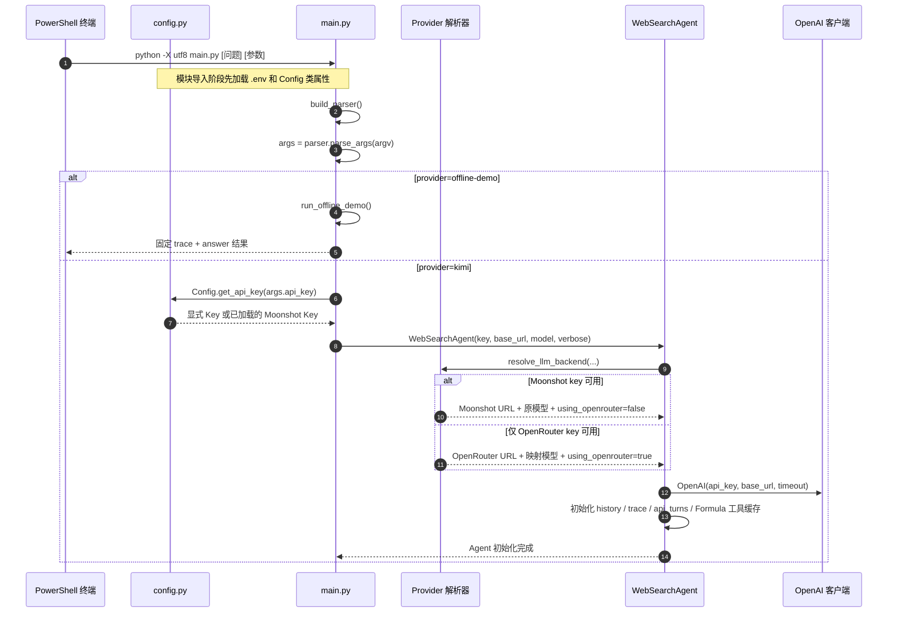
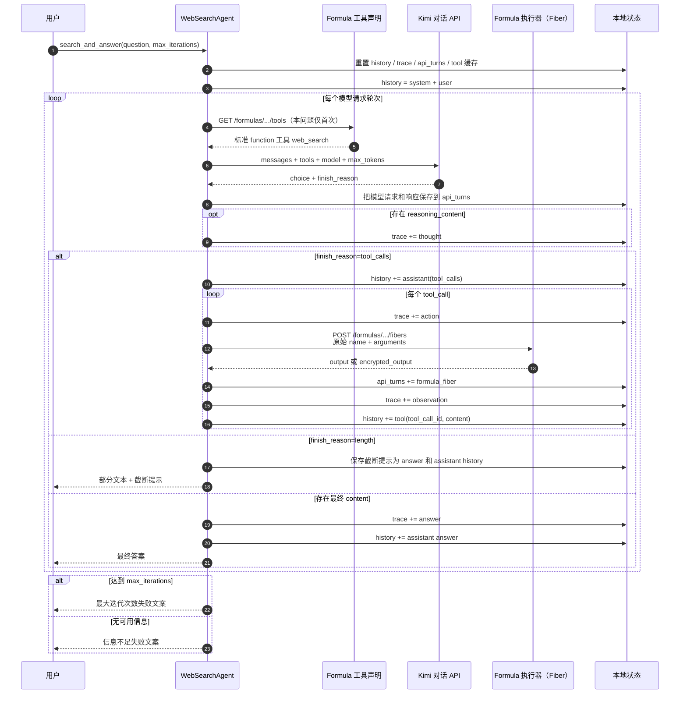
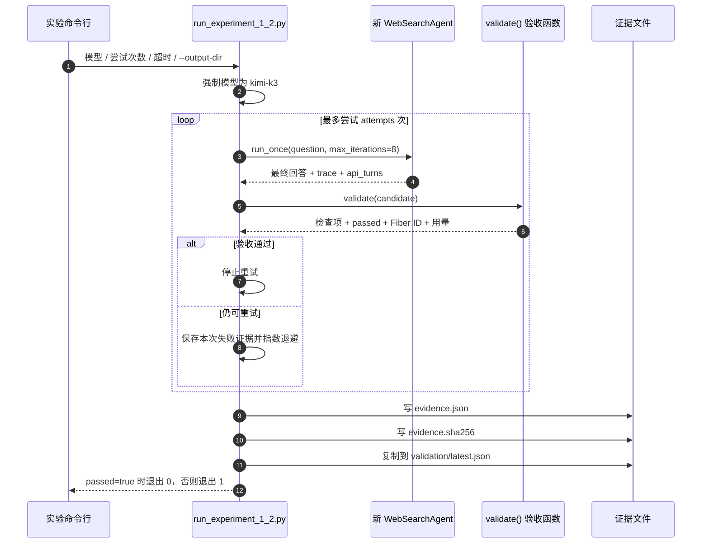

# Web Search Agent 初始化与执行流程

> 分析范围：`config.py`、`main.py`、`agent.py`、`run_experiment_1_2.py`。
> 目的：按一次运行的时间顺序解释代码，不做难读的全局拓扑。

## 先看结论

这个 Agent 的“搜索”不在本地执行。它把控制权拆成三部分：

1. 本地 Python 维护 `messages`、循环次数、轨迹和审计证据；
2. Kimi 决定是否调用 `web_search`、调用几次以及下一步搜什么；
3. Moonshot Formula Fiber 真正执行 `moonshot/web-search:latest` 并返回观察结果。

主链路是：

```text
PowerShell
  → main.py 解析参数
  → Config / provider resolver 选择后端
  → WebSearchAgent.__init__ 建立客户端和空状态
  → search_and_answer 重置本问题状态
  → _chat 首次获取 Formula 工具声明并请求 Kimi
  → Kimi 返回 tool_calls
  → _execute_formula 执行 Fiber
  → tool 结果写回 conversation_history
  → _chat 发起下一轮
  → 得到最终文本或进入失败出口
```

## 入口分流

| 命令 | 进入的函数 | 是否创建 `WebSearchAgent` | 是否访问网络 |
|---|---|---:|---:|
| `python -X utf8 main.py --provider offline-demo` | `run_offline_demo()` | 否 | 否 |
| `python -X utf8 main.py "问题"` | `run_single_question()` | 是 | 是 |
| `python -X utf8 main.py` | `run_interactive_mode()` | 是 | 每次问题会访问 |
| `python -X utf8 run_experiment_1_2.py` | 实验脚本 `main()` | 是 | 是，且可能重试 |

## Mermaid 1：CLI 到 Agent 初始化



### 初始化后有哪些状态

| 属性 | 初始值 | 在哪里变化 | 用途 |
|---|---|---|---|
| `conversation_history` | `[]` | 每个问题先重建，然后追加 assistant/tool/answer | 下一轮真正发给模型的上下文 |
| `trace` | `[]` | `_emit()` 追加 thought/action/observation/answer | 给学习者看的 ReAct 轨迹 |
| `api_turns` | `[]` | Formula GET、Chat Completion、Fiber POST 都追加 | 实验验收和问题诊断的原始证据 |
| `_formula_tools` | `None` | 本问题首次 `_get_tools()` 后缓存 | 避免同一问题每轮重复 GET 声明 |
| `formula_uri` | `moonshot/web-search:latest` | 本实现不变 | 绑定工具声明与 Fiber 实现 |
| `_request_timeout` | `Config.SEARCH_TIMEOUT` | 初始化时读取 | 同时限制 Formula 与 Chat 请求 |
| `temperature` | `0.6` | `set_temperature()` 可改 | Kimi K3 请求时被校正为 `1` |
| `max_tokens` | `32768` | 当前固定 | 给 reasoning 和最终回答留输出空间 |

注意：`Config` 的环境变量是在导入 `config.py` 时读取的。如果你在同一个 Python 进程已经导入
`Config` 之后才修改 `.env`，类属性不会自动刷新；重新启动脚本最直接。

## Mermaid 2：一次真实搜索的 ReAct 循环



## 三份“历史”不要混在一起

```text
conversation_history  → 模型下一轮看见什么
trace                 → 人在终端/JSON 中看见什么
api_turns             → 验收脚本能证明什么真实请求发生过
```

- `trace` 中的 observation 是为了学习和展示；
- `conversation_history` 中的 tool 消息才真正进入下一轮模型上下文；
- `api_turns` 同时记录 GET 工具声明、Chat Completion 与 POST Fiber，适合审计；
- 三者有关系，但不能互相替代。只看到最终答案或一条漂亮 trace，不能证明 Formula 真执行过。

## Moonshot 与 OpenRouter 分支

| 分支 | `_get_tools()` | 模型请求 | 结果含义 |
|---|---|---|---|
| Moonshot | GET Formula tools 并缓存 | 携带 `web_search` schema | 可以形成真实 Formula 搜索闭环 |
| OpenRouter fallback | 直接返回 `[]` | 不携带搜索工具 | 只能依赖模型知识，不是联网搜索 |
| offline-demo | 不创建 Agent | 不发请求 | 固定教学轨迹 |

所以 `provider` 字符串、模型回答中自称“已搜索”、甚至答案里出现链接，都不足以证明联网。
实验 1-2 会进一步核对 provider、base URL、响应 ID、Fiber ID、轮次和来源字段。

## Formula API 的两个阶段

### 阶段 A：获取声明

`_get_tools()` 调用：

```text
GET {base_url}/formulas/moonshot/web-search:latest/tools
```

它要求响应中的 `tools` 为非空列表，并至少包含：

```json
{
  "type": "function",
  "function": {
    "name": "web_search",
    "parameters": {}
  }
}
```

成功与失败都会写入 `api_turns[kind=formula_tools]`。同一个问题内成功声明会缓存；下一次
`search_and_answer()` 又会把 `_formula_tools` 设回 `None`，重新获取声明。

### 阶段 B：执行 Fiber

`_execute_formula()` 调用：

```text
POST {base_url}/formulas/moonshot/web-search:latest/fibers
body = {"name": <模型给出的工具名>, "arguments": <模型给出的原始 JSON 字符串>}
```

代码会解析一份参数副本用于可读 trace，但向 Fiber 转发的是模型原始 `arguments` 字符串。
只有 HTTP 成功且 `status == "succeeded"` 才接受结果；优先读取 `context.output`，否则读取
`context.encrypted_output`。

## 终止与失败出口

| 条件 | 返回值 | 是否进入 `trace` 的 answer | 是否一定正确 |
|---|---|---:|---:|
| 普通最终 content | 模型答案 | 是 | 否 |
| `finish_reason=length` | 部分文本或空文本 + 截断提示 | 是 | 否 |
| 达到最大轮次 | `MAX_ITERATIONS_MESSAGE` | 否 | 否 |
| 没有可用信息 | `NO_INFO_MESSAGE` | 否 | 否 |
| 请求/解析/Fiber 异常 | `搜索过程中出现错误: ...` | 否 | 否 |

`is_failure_answer()` 用固定前缀和固定文案识别后三类失败；它无法判断一个正常结束的答案是否
事实正确。因此实验 1-2 还需要来源、事实和真实调用证据的验收。

## Mermaid 3：实验 1-2 如何验收



验收重点不是“回答看起来不错”，而是：

- Moonshot 直连、精确模型 `kimi-k3`；
- 工具声明确实来自 Formula，且每轮 Chat 都携带；
- 至少两个成功且不同的 Fiber，并出现在至少两个搜索轮次；
- action 数量和 Fiber 请求数量匹配；
- 有 reasoning、最终答案、来源链接和指定官方域名；
- 指定任务中的成员数量、入盟日期、首都过渡和检索日期均出现。

当前脚本无论 `acceptance.passed` 是否为真都会复制到 `validation/latest.json`；读取台账时必须先
看 `acceptance.passed`，不能根据文件名 `latest` 推断它已验收。

## 历史验收快照说明

本地曾保存过一次通过验收的 Kimi K3 运行快照。它只能说明当时的运行满足脚本验收，
不能证明当前服务状态或下一次运行也会通过。原始响应、Fiber 标识、时间戳和用量信息不上传公开仓库。

## 建议阅读顺序

1. `main.py:137`：`build_parser()`，看参数从哪里来；
2. `main.py:170`：`main()`，看 offline/online 和 single/interactive 两层分流；
3. `agent.py:114`：`WebSearchAgent.__init__()`，看后端与状态初始化；
4. `agent.py:167`：`_get_tools()`，看 Formula 声明；
5. `agent.py:230`：`_execute_formula()`，看 Fiber 执行；
6. `agent.py:315`：`_chat()`，看真正的 Chat Completion 请求；
7. `agent.py:362`：`search_and_answer()`，看 ReAct 循环；
8. `run_experiment_1_2.py:91`：`validate()`，看什么才算实验通过；
9. `run_experiment_1_2.py:204`：实验入口、重试、证据和退出码。

## 分析边界

- 本文是当前源码、离线运行和仓库历史证据的分析；本次没有发起新的 Kimi/Formula 请求；
- `web_search` 的具体搜索内容由 Moonshot 托管服务决定，本地静态代码无法预测；
- Formula 与服务可用性会变化，实时运行结果应以新输出目录中的 `evidence.json` 为准。
