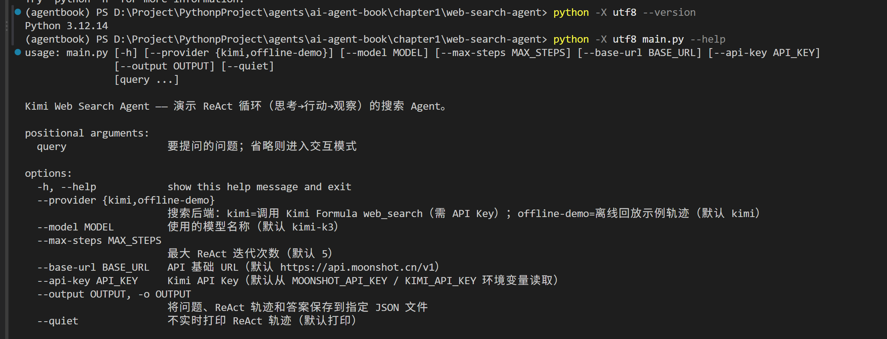

# 实验 1-2：Web Search Agent 运行手册

> 本文件只维护环境、命令、参数、入口、预期输出和故障排查；源码调用链见本目录的实验逻辑流程。

← [返回项目目录](README.md) · [阅读上游第一章正文](https://github.com/bojieli/ai-agent-book/blob/main/book/chapter1.md)

## 1. 文档与证据边界

| 位置 | 职责 |
|---|---|
| 本文件 | 实验运行手册 |
| `validation/<run-id>/` | 运行实验后在本地生成的原始证据，不上传公开仓库 |
| [实验逻辑流程](实验逻辑流程.md) | 源码调用链与 Mermaid 流程图 |

更新规则：

- 命令、参数或入口变化：修改本文件；
- 新运行一次实验：在本地输出目录保存证据；
- 新的理解和结论：更新配套学习笔记；
- 不把完整 JSON、日志或 Provider 响应上传公开仓库。

## 2. 当前联网实现

真实搜索使用 Moonshot 官方 `moonshot/web-search:latest` Formula：

```text
GET /v1/formulas/moonshot/web-search:latest/tools
↓
取得标准 web_search 工具声明
↓
POST /v1/chat/completions
↓
模型返回 tool_calls
↓
POST /v1/formulas/moonshot/web-search:latest/fibers
↓
把 Fiber output 作为 role=tool 写回下一轮
```

本项目不在本地运行搜索引擎。Kimi 决定是否调用工具，Formula Fiber 真正执行搜索，Python 运行层负责回填结果和控制最大轮次。

OpenRouter 兜底分支不会声明 Moonshot Formula 工具，因此不能用于实验 1-2 的真实搜索验收。

## 3. 环境准备

以下命令在 PowerShell 7 中运行：

```powershell
Set-Location '<clone-path>\learning\chapter1\web-search-agent\code'
conda activate agentbook
python -X utf8 --version
python -X utf8 -c "import openai, requests, dotenv; print('【环境检查】依赖导入成功')"
```


若当前终端不能激活 Conda，可直接通过环境名运行：

```powershell
conda run -n agentbook python -X utf8 .\main.py --help
```

把 Moonshot Key 放进仓库向上可发现的 `.env`：

```env
MOONSHOT_API_KEY=your-key
```

`KIMI_API_KEY` 仅用于兼容旧变量名。检查是否已加载时不要打印密钥：

```powershell
python -X utf8 -c "from config import Config; print('【密钥检查】MOONSHOT_API_KEY:', '已加载' if Config.MOONSHOT_API_KEY else '未加载')"
```

## 4. 应该运行哪个入口

| 入口 | 用途 | 联网 | 消耗模型额度 |
|---|---|---:|---:|
| `main.py --help` | 查看参数 | 否 | 否 |
| `main.py --provider offline-demo` | 回放固定 ReAct 示例轨迹 | 否 | 否 |
| `python -m pytest` | 验证本地循环、参数和失败分支 | 否 | 否 |
| `main.py "问题"` | 执行一次真实搜索问答 | 是 | 是 |
| `run_experiment_1_2.py` | 运行带严格验收、重试和 SHA-256 的实验 | 是 | 较多 |

推荐顺序：

```text
offline-demo
↓
pytest
↓
单次真实搜索
↓
正式实验 1-2
↓
读取 evidence
```

`quickstart.py` 和 `examples.py` 是额外示例，不是实验验收入口。

## 5. 第一步：离线演示

```powershell
python -X utf8 .\main.py --provider offline-demo
```

预期依次看到：

```text
💭 思考
🔧 行动：web_search
👀 观察
💭 第二轮思考
🔧 第二轮行动
👀 第二轮观察
✅ 最终答案
```

离线模式回放固定示例，不访问 Moonshot。它只能验证终端展示和轨迹形状，不能证明搜索结果真实、最新或 Provider 当前可用。

保存离线轨迹：

```powershell
python -X utf8 .\main.py --provider offline-demo --output '.\offline-demo.json'
```

## 6. 第二步：本地测试

```powershell
python -X utf8 -m pytest -q
```

若临时目录或 `.pytest_cache` 权限异常：

```powershell
python -X utf8 -m pytest -q -p no:cacheprovider --basetemp "$env:TEMP\web-search-agent-pytest"
```

测试会拦截外部网络，主要验证：

- Formula 工具声明获取和缓存；
- Fiber 原始参数转发；
- 多 Tool Call 与 `tool_call_id`；
- 最大轮次与截断分支；
- 非法 JSON 参数；
- 超时和 429 提示；
- 离线 CLI；
- 实验验收规则。

测试通过只说明本地实现满足测试，不代表 Moonshot 当前服务可用。

## 7. 第三步：单次真实搜索

先创建本地证据目录：

```powershell
$outputDir = '.\outputs\web-search-agent'
New-Item -ItemType Directory -Force -Path $outputDir | Out-Null
```

执行一次搜索：

```powershell
python -X utf8 .\main.py '核查今天一个你关心的技术新闻，并给出来源链接' `
  --provider kimi `
  --model kimi-k3 `
  --max-steps 5 `
  --output "$outputDir\single-search.json"
```

运行时观察：

1. 第一次 Chat 前是否成功取得 Formula 工具声明；
2. 是否出现 `thought → action(web_search) → observation`；
3. 后续搜索参数是否根据已有结果变化；
4. 最终答案是否使用 Observation 中的来源；
5. JSON 中 `trace` 和 `api_turns` 能否逐项对应。

真实 Kimi K3 搜索会产生模型和联网工具费用，也可能需要一到数分钟。

### 读取单次结果

```powershell
$result = Get-Content -LiteralPath "$outputDir\single-search.json" -Raw | ConvertFrom-Json

$result.trace | Format-List
$result.api_turns | Select-Object kind,http_status,elapsed_seconds | Format-Table
$result.answer
```

| 字段 | 作用 |
|---|---|
| `trace` | 面向人的 thought/action/observation/answer 轨迹 |
| `api_turns[kind=formula_tools]` | Formula 工具声明请求和响应 |
| `api_turns[kind=chat_completion]` | 每轮实际 messages、tools 和 Provider 响应 |
| `api_turns[kind=formula_fiber]` | 真实 Fiber 请求、状态和 ID |
| `answer` | 最终文本；不能单独证明搜索真实发生 |

`api_turns` 不保存 API Key，但会保存问题、查询参数和响应内容。分享前仍要检查敏感信息。

## 8. 第四步：正式实验 1-2

```powershell
$experimentDir = '.\outputs\web-search-agent-1-2'
New-Item -ItemType Directory -Force -Path $experimentDir | Out-Null

python -X utf8 .\run_experiment_1_2.py `
  --model kimi-k3 `
  --attempts 3 `
  --timeout 180 `
  --output-dir $experimentDir
```

实验脚本固定使用 Kimi K3 和研究任务，要求至少两个不同轮次的真实 Formula 搜索。输出目录包含：

```text
evidence.json
evidence.sha256
```

读取验收：

```powershell
$evidence = Get-Content -LiteralPath "$experimentDir\evidence.json" -Raw | ConvertFrom-Json

$evidence.acceptance.passed
$evidence.acceptance.checks | Format-List
$evidence.acceptance.usage | Format-List
```

只有 `acceptance.passed=True` 才表示本次实验通过。

当前脚本无论通过还是失败，都会把最后一次结果复制到 `validation/latest.json`。因此文件名叫 `latest` 不代表验收已经通过，使用前必须查看 `acceptance.passed`。

### 验收项目速查

| 维度 | 主要检查 |
|---|---|
| Provider | 直连 `https://api.moonshot.cn/v1` |
| 模型 | 精确为 `kimi-k3` |
| 工具声明 | 一次成功的 Formula Tools 请求，包含标准 `web_search` |
| Chat | 每轮有响应 ID，每轮声明 Formula 工具 |
| Fiber | 至少两个成功且不同的 Fiber ID |
| 对齐 | Fiber 数量与搜索 Action 数量一致 |
| 多轮 | 搜索 Action 至少分布在两个 iteration |
| 结果 | 有最终回答、来源链接、指定官方域名和固定任务事实 |

## 9. 校验 SHA-256

```powershell
$evidencePath = Join-Path $experimentDir 'evidence.json'
$shaPath = Join-Path $experimentDir 'evidence.sha256'
$expected = ((Get-Content -LiteralPath $shaPath -Raw) -split '\s+')[0].ToLower()
$actual = (Get-FileHash -LiteralPath $evidencePath -Algorithm SHA256).Hash.ToLower()
"【SHA-256】匹配：$($expected -eq $actual)"
```

SHA 匹配只证明当前 JSON 与当前 sidecar 一致，不等于 Provider 对内容进行了签名。

## 10. CLI 参数

```powershell
python -X utf8 .\main.py --help
python -X utf8 .\run_experiment_1_2.py --help
```

### `main.py`

| 参数 | 默认值 | 说明 |
|---|---|---|
| `query` | 无 | 问题；省略时循环接收独立问题 |
| `--provider` | `kimi` | `kimi` 或 `offline-demo` |
| `--model` | `kimi-k3` | 模型名称 |
| `--max-steps` | `5` | 最大 Chat Completion 轮次 |
| `--base-url` | `https://api.moonshot.cn/v1` | API Base URL |
| `--api-key` | 环境变量 | 显式 Key，不推荐写进命令 |
| `--output`, `-o` | 不保存 | JSON 输出路径 |
| `--quiet` | 关闭 | 不实时打印 `trace` |

`--max-steps` 是 Chat Completion 最大轮次，不等于搜索次数；一轮可以包含多个 Tool Call。

省略 `query` 后会循环接收输入，但每次 `search_and_answer()` 都重置 `conversation_history`、`trace`、`api_turns` 和 Formula 声明缓存，因此不是跨问题保留 Context 的连续聊天。

### `run_experiment_1_2.py`

| 参数 | 默认值 | 说明 |
|---|---|---|
| `--model` | `kimi-k3` | 只接受精确的 `kimi-k3` |
| `--attempts` | `3` | 完整独立运行的最大尝试次数 |
| `--timeout` | `180` | 请求超时秒数 |
| `--output-dir` | 自动生成 | evidence 输出目录 |

## 11. 常见故障

### 没有 Key

确认 `.env` 能被当前工作目录向上找到，并运行“密钥检查”命令。不要打印或提交 Key。

### 只有 OpenRouter Key

OpenRouter 分支不提供 Moonshot Formula `web_search`。它可能返回一段答案，但不属于实验 1-2 的真实搜索证据。

### Formula 工具声明失败

查看 `api_turns[kind=formula_tools]` 的：

```text
http_status
elapsed_seconds
error
```

### Fiber 失败或结果为空

查看 `api_turns[kind=formula_fiber]`。只有 HTTP 成功、`status=succeeded` 且 output 非空才会被接受。

### 429 或超时

SDK 可能先收到 429，再自动重试，最终只抛出超时。先看最早的 HTTP 日志，不要直接把超时当成本地 Agent Loop 错误。

### 达到最大轮次

检查 `trace` 是否重复搜索、搜索词是否变化、Observation 是否为空。不要只为得到最终文本而无限提高 `--max-steps`。

### `finish_reason=length`

表示输出预算耗尽。代码会返回已有内容并附加截断提示；它不是正常完成。

### `latest.json` 存在但 `passed=False`

这是当前脚本允许的状态。以自定义 `--output-dir` 中的证据为准，并先检查 `acceptance.passed`。

## 12. 代码与可视化入口

| 文件 | 运行职责 |
|---|---|
| `main.py` | CLI、离线演示、单次搜索和 JSON 保存 |
| `agent.py` | Formula Tools、Chat、Fiber、ReAct Loop 和三类记录 |
| `config.py` | Key、模型、Base URL 和超时 |
| `run_experiment_1_2.py` | 固定任务、重试、验收和 evidence |
| `tests/` | 本地行为和失败分支测试 |

本地 Markdown + Mermaid 执行流程：

- [实验逻辑流程.md](实验逻辑流程.md)

直接在 VS Code、Codex 或 Obsidian 的 Markdown 预览中查看 Mermaid。

源码阅读顺序：

```text
main.py: main()
↓
agent.py: WebSearchAgent.__init__()
↓
agent.py: search_and_answer()
↓
agent.py: _chat()
↓
agent.py: _get_tools()
↓
agent.py: _execute_formula()
↓
run_experiment_1_2.py: validate()
```

原理和调用链解释请查看本目录的实验逻辑流程。

## 13. 官方文档

- [Kimi API 文档](https://platform.kimi.com/docs)
- [Kimi 官方工具文档](https://platform.kimi.com/docs/guide/use-official-tools)
