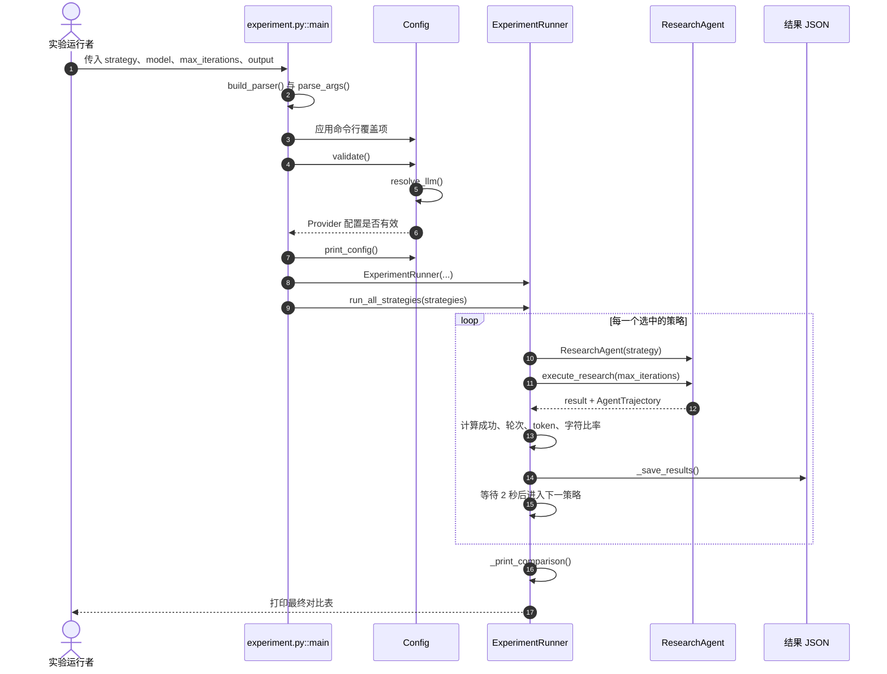
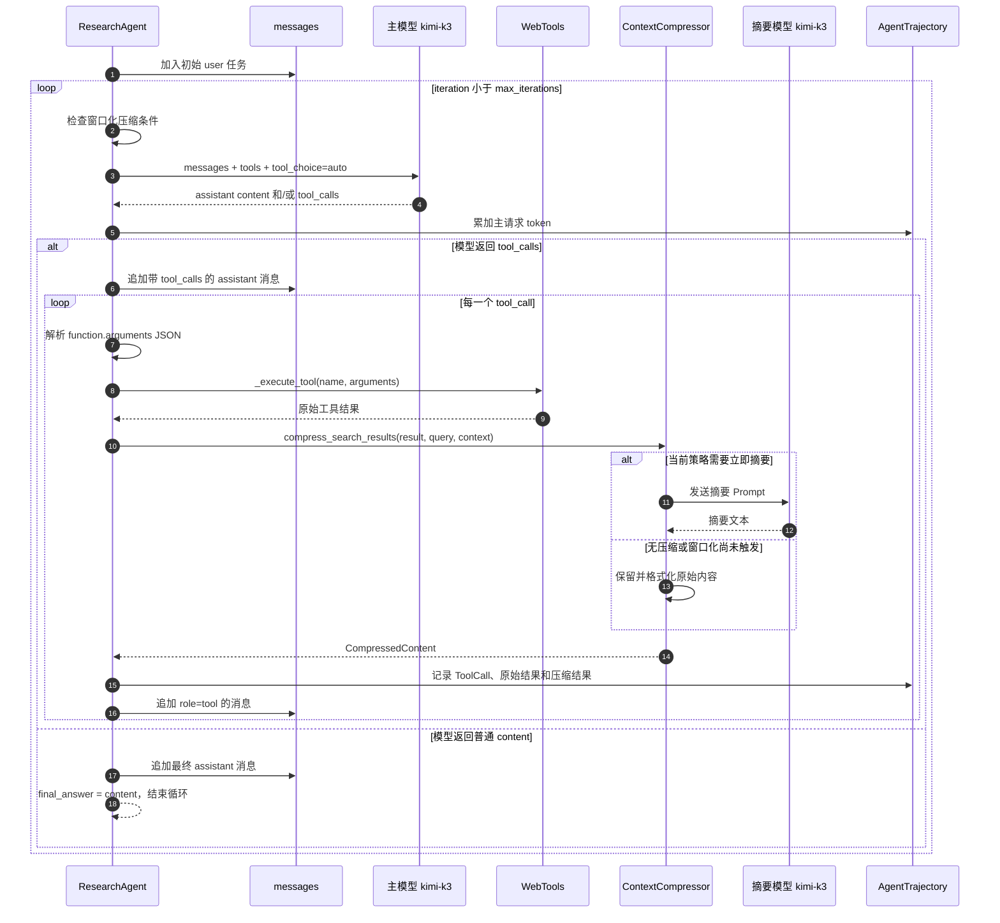
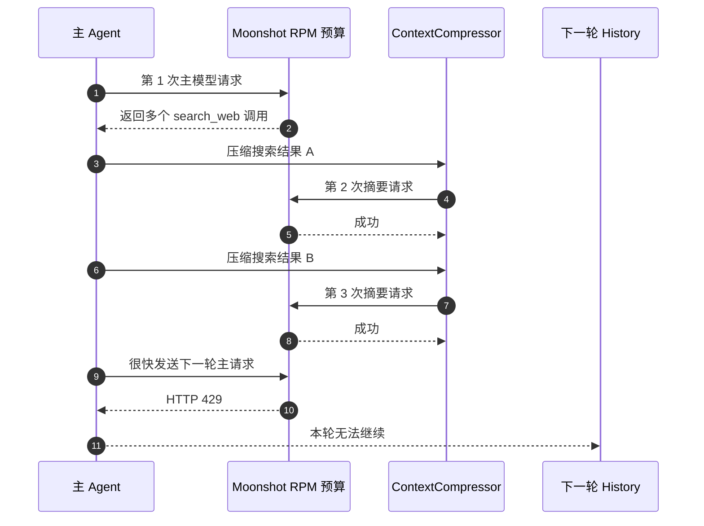

# 实验 2-10 执行流程

本文只解释 `context-compression` 目录中的代码怎样实际运行：入口函数怎样创建 Agent、一次模型响应怎样变成工具调用、搜索结果在哪里被压缩、消息历史怎样进入下一轮，以及最终指标怎样写入 JSON。

文档分工：

| 文件 | 负责内容 |
| --- | --- |
| [运行手册](运行手册.md) | 环境、命令、参数、预期输出和故障排查 |
| `实验 2-10 执行流程.md` | 源码调用链、消息状态变化和策略分支 |
| [实验 2-10 实验总结](<实验总结.md>) | 可公开的实验结果、限制和下一轮计划 |
| Obsidian 实验总结 | 个人反思、闭卷回答和迁移结论 |

本文件不复制完整运行手册，也不把一次 pilot 结果写成普遍结论。

## 1. 第一次看代码先抓住四个对象

| 对象 | 定义位置 | 作用 |
| --- | --- | --- |
| `ResearchAgent` | `agent.py` | 运行模型—工具—观察—再决策循环 |
| `AgentTrajectory` | `agent.py` | 记录工具调用、主 Agent token 和阈值计数 |
| `ContextCompressor` | `compression_strategies.py` | 根据当前策略处理搜索结果或历史工具消息 |
| `ExperimentRunner` | `experiment.py` | 顺序运行策略、计算指标、保存 JSON |

最短理解路径：

```text
experiment.py::main
→ ExperimentRunner.run_all_strategies
→ ExperimentRunner.run_single_strategy
→ ResearchAgent.execute_research
→ ResearchAgent._execute_tool
→ ContextCompressor.compress_search_results
→ ExperimentRunner._save_results
```

## 2. 三个入口有什么区别

### 2.1 `experiment.py`

正式对比入口。它可以运行一个、多个或全部六种策略，并保存统一格式的 JSON。

```text
build_parser()
→ parse_args()
→ Config.validate()
→ Config.print_config()
→ ExperimentRunner(...)
→ run_all_strategies(...)
```

### 2.2 `main.py`

交互观察入口。它让使用者选择一个策略，然后直接调用 `ResearchAgent.execute_research()`。适合逐轮观看，不负责六策略统一对比。

### 2.3 `run_all_strategies.py`

详细日志入口。核心 Agent 不变，但外围使用 `StrategyRunner` 保存 `.log` 和 JSON，适合事后复盘流式摘要和每轮行为。

三个入口最终都汇入同一个执行核心：

```text
ResearchAgent.execute_research()
```

## 3. Sequence Diagram 一：实验控制链

这张图回答“谁调用谁”，范围从命令行启动到策略结果写入磁盘。它不展开单轮内部的消息变化。



注意：`_save_results()` 在每个策略完成后都会重写整个结果列表，因此中途停止时，前面已经完成的策略通常仍有 JSON 记录。

## 4. Agent 初始化阶段

`ExperimentRunner.run_single_strategy()` 每运行一种策略，都会创建一个新的 `ResearchAgent`，所以不同策略之间不会共享消息历史和工具缓存。

初始化顺序：

```text
ResearchAgent.__init__
├─ Config.resolve_llm()
│  └─ 得到 api_key、base_url、model
├─ OpenAI(...)
├─ WebTools()
│  └─ 保存 Serper Key、HTML 转换器和页面缓存
├─ ContextCompressor(strategy)
│  └─ 创建独立的模型客户端和 tokenizer
├─ AgentTrajectory(strategy)
├─ conversation_history = []
└─ _init_system_prompt()
```

这里会创建两个逻辑上不同的模型调用者：

```text
ResearchAgent.client
    负责主 Agent 决策和工具调用

ContextCompressor.client
    负责生成摘要
```

它们当前使用同一 Provider 和模型，但 token 统计与请求节流没有统一管理。这是后续出现成本漏算和 HTTP 429 的代码基础。

## 5. System Prompt 和工具定义怎样进入请求

`_init_system_prompt()` 初始化第一条 `system` 消息，要求模型：

1. 找出全部 OpenAI 联合创始人。
2. 分别搜索每个人当前的职业归属。
3. 汇总成完整报告。

`_get_tools_description()` 每次主模型请求时提供两个工具 Schema：

| 工具 | 关键参数 | 用途 |
| --- | --- | --- |
| `search_web` | `query`、`num_results` | 搜索并返回多条带正文的结果 |
| `fetch_webpage` | `url` | 单独抓取一个网页 |

模型只能返回“要调用哪个工具以及参数是什么”；真正执行网络请求的是 Python Harness。

```text
模型：决定 search_web(query=...)
Harness：解析 JSON、调用 WebTools、取得结果
```

## 6. Sequence Diagram 二：一轮 Agent 数据流

这张图回答“消息怎样变化”。它只展开 `execute_research()` 中的一轮，所以比第一张图更细。



### 两张 Sequence Diagram 的区别

| 图 | 观察层级 | 主要问题 |
| --- | --- | --- |
| 实验控制链 | 脚本和对象级 | 一种策略怎样启动、结束和保存 |
| 单轮 Agent 数据流 | 消息和请求级 | 工具结果怎样被压缩并进入下一轮 |

第一张适合定位入口，第二张适合调试 History、Tool Result 和摘要请求。

## 7. `execute_research()` 的完整循环

源码逻辑可以压缩为：

```python
messages = system_prompt + user_task

while iteration < max_iterations:
    if strategy == WINDOWED_CONTEXT:
        messages = compress_old_tool_messages_if_needed(messages)

    check_previous_prompt_size()
    assistant_message = call_main_model(messages, tools)

    if assistant_message contains tool_calls:
        append assistant_message

        for each tool_call:
            arguments = parse_json_or_use_empty_dict()
            raw_result, compressed = execute_tool()
            record ToolCall in trajectory
            append raw or compressed tool message

    elif assistant_message contains content:
        final_answer = content
        break

return final_answer, trajectory, iterations, success
```

### 7.1 为什么一轮可以有多个工具调用

模型的一条 assistant 消息可以同时包含多个 `tool_calls`。Agent 会依次执行它们，但只有全部工具结果都追加到 `messages` 后，才进入下一次主模型请求。

因此：

```text
Agent 轮次 != 工具调用次数 != API 请求次数
```

例如一轮中模型返回两个搜索：

```text
1 次主模型请求
+ 2 次 search_web
+ 最多 2 次摘要模型请求
```

这正是压缩策略容易快速消耗 RPM 的原因。

### 7.2 工具参数解析失败时发生什么

工具参数可能是字符串、字节或字典。代码会尽量转换为字典；如果 JSON 畸形，则使用空字典继续运行。

后续 `search_web` 检查不到 `query` 时，返回结构化错误：

```text
Missing required argument 'query' for search_web
```

这样不会因为一次坏 JSON 直接让整个循环崩溃，但模型下一轮能否自我修复取决于错误消息是否正确进入 History。

## 8. Web 搜索分支

### 8.1 配置了 `SERPER_API_KEY`

```text
search_web(query, num_results)
→ POST Serper /search
→ 读取 organic 结果
→ 对每个 URL 调用 fetch_webpage()
→ BeautifulSoup 移除 script/style/nav/footer/header
→ html2text 转成文本
→ MAX_WEBPAGE_LENGTH 截断
→ 写入 page_cache
→ 返回 title、url、snippet、content
```

页面缓存只存在于当前 `ResearchAgent` 的 `WebTools` 实例中。换一个策略会新建 Agent，也会得到新的缓存。

### 8.2 没有 `SERPER_API_KEY`

直接调用 `_get_mock_search_results(query)`。返回对象包含：

```json
{
  "query": "...",
  "results": [],
  "mock": true
}
```

### 8.3 Serper 或页面抓取失败

当前实现会回退 mock，而不是让整个实验中断。这样有利于演示控制流，但也意味着：

```text
脚本继续运行
不等于真实搜索成功
```

审计结果时必须检查返回值中的 `mock` 和 `fetch_success`，不能只看进程退出码。

## 9. 六种压缩策略的真实分支

统一分发点是：

```text
ContextCompressor.compress_search_results()
```

| 策略 | 内部方法 | 摘要请求次数 | 写回 History 的内容 |
| --- | --- | ---: | --- |
| `no_compression` | `_no_compression()` | 0 | 完整搜索结果 |
| `individual` | `_non_context_aware_individual_summary()` | 每个有正文的页面 1 次 | 多份页面摘要拼接 |
| `combined` | `_non_context_aware_combined_summary()` | 每批搜索结果 1 次 | 一份综合摘要 |
| `context_aware` | `_context_aware_summary()` | 每批搜索结果 1 次 | 面向当前 query 的摘要 |
| `citations` | `_context_aware_with_citations()` | 每批搜索结果 1 次 | 摘要、来源编号和 URL |
| `windowed` | 首次调用 `_no_compression()`；以后调用 `compress_for_history()` | 阈值前 0 次，触发后每条旧工具消息 1 次 | 前期原文，后期带标记的摘要 |

### 9.1 无压缩

遍历每个搜索结果，把标题、URL、snippet 和正文格式化后拼接。它仍然返回 `CompressedContent`，只是内容没有语义压缩。

### 9.2 逐页摘要

每个页面最多取前 5,000 字符，分别请求摘要模型，再把：

```text
Source
URL
Summary
```

拼成一个工具结果。页面越多，请求次数越多。

单页摘要异常时，回退到该搜索结果的 `snippet`。

### 9.3 合并摘要

每页最多取前 5,000 字符，先合并，再发送一次综合摘要请求。它减少了请求次数，也能跨页面去重，但页面截断可能丢失末尾事实。

摘要异常时，回退为各结果 snippet 的拼接。

### 9.4 上下文感知摘要

它除了原始搜索结果，还把两个变量放进摘要 Prompt：

```text
query
current_context
```

`current_context` 不是完整对话，而是 `_get_current_context_summary()` 从最近三个工具调用中提取的查询词：

```text
Previous search: ... | Previous search: ...
```

所以它的“上下文感知”主要指查询轨迹感知，不等于让 Compressor 看见完整消息历史。

### 9.5 带引用的上下文感知摘要

先给来源编号，再要求摘要事实带引用，同时把标题和 URL 保存到 `CompressedContent.citations`。这是：

```text
有损语义摘要
+ 可回查的来源索引
```

### 9.6 窗口化上下文

搜索刚返回时先保留完整内容；只有历史上下文达到阈值后，才批量压缩旧的工具消息。它解决的是“何时压缩”，摘要内容仍由 `compress_for_history()` 生成。

## 10. Sequence Diagram 三：窗口化压缩

```mermaid
sequenceDiagram
    autonumber
    participant LOOP as execute_research
    participant TRAJ as AgentTrajectory
    participant HIST as messages
    participant CMP as ContextCompressor
    participant LLM as 摘要模型

    LOOP->>TRAJ: 读取 last_prompt_tokens
    alt 未超过 CONTEXT_WINDOW_SIZE 的 80%
        LOOP->>HIST: 原样保留全部消息
    else 超过 80%
        LOOP->>HIST: 扫描 role=tool 的消息
        loop 每条未标记的工具消息
            HIST-->>LOOP: tool_call_id + 原始 content
            LOOP->>TRAJ: 按 tool_call_id 找回原始 query
            LOOP->>CMP: compress_for_history(content, query)
            CMP->>LLM: 请求历史摘要
            LLM-->>CMP: summary
            CMP-->>LOOP: CompressedContent
            LOOP->>HIST: 用 [COMPRESSED] + summary 替换原内容
        end
        LOOP->>HIST: 已带 [COMPRESSED] 的消息保持不变
    end
```

### 10.1 为什么使用 `last_prompt_tokens`

`prompt_tokens_used` 是每次主请求的累计成本，其中共享前缀会在每轮重复计数；它会随着调用次数快速增长，但不代表某一次上下文有多大。

`last_prompt_tokens` 才是最近一次主请求的 Prompt 大小，因此窗口阈值应当比较：

```text
last_prompt_tokens > CONTEXT_WINDOW_SIZE * 0.8
```

### 10.2 为什么检测会晚一轮

窗口检查发生在本轮主模型请求之前，而 `last_prompt_tokens` 来自上一轮主请求。因此上一轮首次跨过阈值后，要到下一轮开头才会触发批量压缩。

### 10.3 `[COMPRESSED]` 的作用

压缩后的工具消息以 `[COMPRESSED]` 开头。下一次扫描时直接跳过，避免反复执行 summary-of-summary。

注意：它只能阻止同一条工具消息再次压缩，不能证明第一次摘要没有丢失关键信息。

## 11. 消息历史怎样变化

一次典型工具调用前后的 `messages`：

| 时刻 | 新增消息 | 模型下一轮能看到什么 |
| --- | --- | --- |
| 初始化 | `system` | 研究任务规则和日期 |
| 开始执行 | `user` | 要求查找联合创始人现状 |
| 模型选择工具 | `assistant` + `tool_calls` | 模型刚才提出的调用及参数 |
| 工具执行后 | `tool` | 原始结果或压缩摘要 |
| 再次请求 | 无新增类型 | 以上全部消息作为新 Context |
| 模型停止 | 普通 `assistant` content | 候选最终答案 |

`conversation_history` 是初始化模板；`execute_research()` 使用其副本 `messages` 执行当前任务。真正逐轮增长的是局部变量 `messages`。

## 12. Token、窗口和字符比率在哪里统计

### 12.1 主 Agent token

`_stream_response()` 和 `_non_streaming_response()` 从 Provider usage 中更新：

```text
last_prompt_tokens
prompt_tokens_used
completion_tokens_used
total_tokens_used
```

这些字段只由 `ResearchAgent.client` 更新。`ContextCompressor.client` 的摘要 token 没有合并到 `AgentTrajectory`，所以当前 `total_tokens` 低估压缩策略的端到端成本。

### 12.2 上下文阈值计数

当上一轮 `last_prompt_tokens` 超过 128K 预算的 80% 时：

```text
context_overflows += 1
```

因此当前字段更接近“达到压缩警戒线的次数”，不一定是 Provider 已经返回真正的 context overflow。

对于 `no_compression`，代码在警戒线处主动结束，用来演示不压缩的风险。

### 12.3 字符压缩率

`ExperimentRunner.run_single_strategy()` 汇总每个 `ToolCall.compressed_result`：

```text
compression_ratio = total_compressed_size / total_original_size
```

这里统计的是字符，不是模型 token。无压缩路径的原始正文长度与格式化后工具消息长度口径不同，因此可能出现超过 100% 的结果。

## 13. 结果怎样写入 Evidence

每种策略运行完后，`ExperimentRunner` 构造：

```json
{
  "metrics": {
    "strategy": "...",
    "success": false,
    "iterations": 0,
    "tool_calls": 0,
    "context_overflows": 0,
    "execution_time": 0,
    "total_tokens": 0,
    "error": null,
    "final_answer_length": 0,
    "compression_ratio": 0
  },
  "final_answer": null,
  "timestamp": "..."
}
```

然后 `_save_results()` 把当前已完成策略列表写入指定 JSON。

当前 JSON 不包含完整消息历史、摘要请求 usage 和每次 Provider 请求明细。因此它适合作为策略级汇总，但还不是完整 Trace。

## 14. 四条终止路径

### 14.1 正常完成

模型返回普通 `assistant.content` 且不包含工具调用：

```text
final_answer = content
success = True
```

### 14.2 达到最大轮次

循环用完仍没有 `final_answer`：

```text
success = False
error = None
```

对比表会把它解释为 `No final answer within max iterations`。

### 14.3 主动上下文保护

上一轮 Prompt 超过 80% 阈值，且策略是 `no_compression`：返回上下文超限错误并停止，不再发送下一次主请求。

### 14.4 异常返回

Provider、工具执行或消息处理抛出异常时，`execute_research()` 捕获异常并返回：

```text
error
trajectory
iterations
```

这不会继续向 `experiment.py::main` 抛异常。因此终端最后仍可能打印：

```text
Experiment completed successfully!
```

这句话只表示实验脚本完成了结果收集，不表示某个策略的 `success=True`。应以 JSON 中每个策略的 `metrics.success` 和 `metrics.error` 为准。

## 15. HTTP 429 故障链



如果摘要请求自己收到 429，各策略通常回退到 snippet 或截断内容；但紧接着的主 Agent 请求仍可能继续被同一个 RPM 窗口限制。

所以故障不应写成“上下文感知压缩无效”，而应写成：

```text
摘要调用放大请求数量
→ 主请求和摘要请求没有共享限流器
→ Provider RPM 被耗尽
→ Agent 无法继续决策
```

## 16. 从 Codex 工作方式理解这段代码

把研究任务换成 Codex 修复项目：

| 本实验 | Codex 类比 |
| --- | --- |
| `search_web` | `read_file`、`search_code`、`run_command` |
| 搜索正文 | 文件内容、终端日志、测试输出 |
| `messages` | Codex 当前可见的任务轨迹 |
| `ContextCompressor` | 把旧日志与旧文件内容提炼成状态摘要 |
| `windowed` | 保留最近操作全文，压缩较旧工具输出 |
| citations | 保留文件路径、命令和证据位置 |
| `AgentTrajectory` | 面向审计的工具调用和成本记录 |

Codex 长任务中的理想状态不是“删除旧消息”，而是：

```text
稳定规则保持不动
+ 已确认事实的结构化摘要
+ 未解决问题和下一步计划
+ 最近几轮原始工具结果
+ 可回查的文件、命令和测试证据
```

## 17. 推荐源码阅读顺序

按下面顺序阅读，最容易把调用链串起来：

1. `experiment.py:285`：CLI 参数从哪里来。
2. `experiment.py:328`：程序入口怎样解析并选择策略。
3. `experiment.py:192`：六种策略怎样依次运行。
4. `experiment.py:68`：单策略怎样创建 Agent 和汇总指标。
5. `agent.py:69`：Agent 初始化了哪些状态。
6. `agent.py:508`：主循环怎样继续或停止。
7. `agent.py:187`：工具调用怎样进入 WebTools 与 Compressor。
8. `web_tools.py:38`：真实搜索与 mock 回退。
9. `compression_strategies.py:100`：六种策略统一分发点。
10. `agent.py:249`：窗口化策略为什么延迟到历史阶段处理。
11. `experiment.py:217`：结果怎样写入 JSON。

## 18. 读完后应能回答

1. 为什么一次 Agent 轮次可能包含多次模型 API 请求？
2. `messages`、`conversation_history` 和 `AgentTrajectory` 分别保存什么？
3. 模型返回工具调用后，原始结果在哪一步被替换成摘要？
4. `context_aware` 看到的是完整历史还是最近查询摘要？
5. 为什么 `windowed` 在搜索刚返回时不立即压缩？
6. 为什么阈值判断必须使用 `last_prompt_tokens`？
7. `[COMPRESSED]` 防止了什么，不能保证什么？
8. 为什么没有 Serper Key 时脚本仍能成功退出？
9. 为什么当前 `total_tokens` 不能代表端到端成本？
10. 为什么终端显示实验完成，不代表每个策略成功？

如果这些问题不能只看代码回答，优先回到第二张和第三张 Sequence Diagram，再对照 `execute_research()` 与 `compress_search_results()`。

