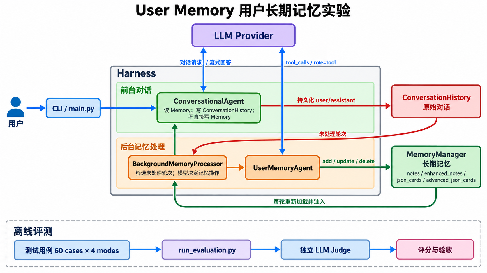
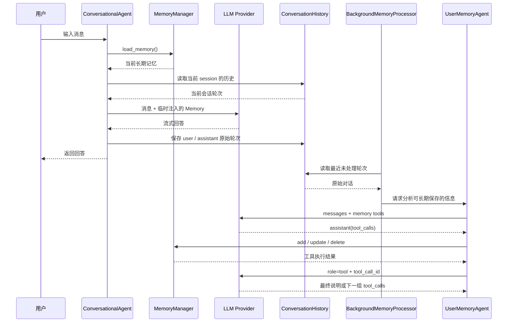
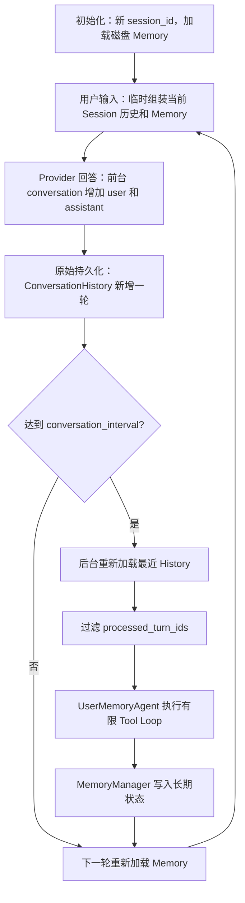

# User Memory 用户长期记忆学习笔记

## 1. 实验目标

这个实验要回答的问题是：

> Agent 怎样在保留原始对话证据的同时，把真正有长期价值的信息提炼成可跨会话使用的记忆？

它不是把所有聊天记录永久放进提示词，而是把信息分成两层：

- `ConversationHistory`：保存原始 user / assistant 对话，是可追溯的事实日志；
- `MemoryManager`：保存模型提炼后的偏好、事实和关系，是可修改的长期状态。

这次整理属于机制学习与代码快照。没有重新调用在线模型，也没有把历史评测当成当前源码的实时结果。

## 2. Architecture Diagram：系统由什么组成



| 组件 | 真实代码 | 责任 |
| --- | --- | --- |
| CLI / Harness | `main.py` | 创建前台 Agent 和后台 Processor，接收交互命令 |
| 前台对话 | `ConversationalAgent` | 读取长期记忆、回答用户、保存原始轮次 |
| 原始历史 | `ConversationHistory` | 按用户和 Session 持久化原始对话 |
| 后台调度 | `BackgroundMemoryProcessor` | 判断处理时机，筛选未处理轮次 |
| 记忆决策 | `UserMemoryAgent` | 让模型决定 add / update / delete |
| 长期存储 | `MemoryManager` | 按记忆模式读写本地 JSON |
| Provider | OpenAI 兼容接口 | 生成前台回答或后台记忆操作 |
| 离线评估 | `run_evaluation.py` | 使用测试用例和独立 Judge 评估记忆效果 |

最重要的职责边界是：

- 前台 `ConversationalAgent` **读取**长期记忆，但不直接写长期记忆；
- 后台 `UserMemoryAgent` 只能通过受控工具**修改**长期记忆；
- 原始历史和提炼后的 Memory 分开保存。

## 3. Sequence Diagram：一次对话怎样变成长期记忆



Tool Call 闭环中不能少掉这四步：

1. 模型返回带 `id`、`name`、`arguments` 的 Tool Call；
2. Harness 解析参数并真正执行工具；
3. 工具结果以 `role=tool` 写回，并使用相同的 `tool_call_id`；
4. 完整消息再次发送给模型，由模型决定继续还是结束。

## 4. State Evolution：状态怎样变化



| State 类型 | 真实对象 | 生命周期 |
| --- | --- | --- |
| 模型可见上下文 | `conversation`、临时 `api_messages`、`memory_context` | 当前请求或 Session |
| Harness 状态 | `session_id`、`conversation_count`、`last_processed_count`、`processed_turn_ids` | 当前进程 |
| 原始持久化数据 | `data/conversations/<user_id>_history.json` | 跨 Session |
| 长期持久化数据 | `data/memories/<user_id>_memory.json` | 跨 Session |
| 观测数据 | `tool_calls`、`operations`、summary | 一次后台处理任务 |

`reset_session()` 会创建新的 `session_id` 并重置前台消息，但不会删除磁盘上的长期记忆。这正是“短期会话”和“长期记忆”分离的表现。

## 5. 四种记忆模式

| 模式 | 存储特点 | 适合观察什么 |
| --- | --- | --- |
| `notes` | 简单事实条目 | 最直观地理解增删改 |
| `enhanced_notes` | 信息更完整的段落笔记 | 上下文完整度与冗余的平衡 |
| `json_cards` | 分层 JSON 字段 | 类别、字段和值的结构化维护 |
| `advanced_json_cards` | 增加人物、关系和背景 | 多人物隔离与关系表达 |

四种模式共用同一套前台/后台框架，主要区别是 Memory 的表示方式和 Prompt。`notes` 与 `enhanced_notes` 还共用 `NotesMemoryManager`，不是四套完全不同的 Agent。

## 6. 核心代码心智模型

下面是教学伪代码，省略了 Provider 适配、流式 delta 合并、日志和四种 schema：

```python
def chat_once(user_message):
    memory = memory_manager.load_memory()
    session_turns = history.get_current_session(session_id)
    api_messages = inject(conversation, user_message, memory, session_turns)

    answer = provider.stream(api_messages)
    conversation.extend([user_message, answer])
    history.add_turn(session_id, user_message, answer)
    processor.increment_conversation_count()
    return answer


def update_memory(max_iterations=15):
    turns = history.reload_recent()
    turns = filter_unprocessed(turns)
    messages = build_memory_task(turns, memory_manager.load_memory())

    for _ in range(max_iterations):
        assistant = provider.complete(messages, tools=memory_tools)
        messages.append(assistant)

        if not assistant.tool_calls:
            return

        for call in assistant.tool_calls:
            result = execute_memory_tool(call)
            messages.append({
                "role": "tool",
                "tool_call_id": call.id,
                "content": json.dumps(result),
            })
```

建议按下面顺序读源码：

1. `main.py::interactive_mode()`：前台和后台怎样连接；
2. `conversational_agent.py::ConversationalAgent.chat()`：长期记忆怎样临时注入；
3. `conversation_history.py::ConversationHistory.add_turn()`：原始轮次怎样保存；
4. `background_memory_processor.py::process_recent_conversations()`：怎样筛选新对话；
5. `agent.py::UserMemoryAgent.execute_task()`：Tool Call 怎样执行和停止；
6. `memory_manager.py::create_memory_manager()`：四种存储模式怎样分发。

## 7. 停止条件与失败出口

| 情况 | 当前行为 |
| --- | --- |
| 前台一次回答结束 | 保存原始轮次并返回 |
| 后台模型不再返回 Tool Call | 保存最终说明并结束 |
| 达到 `max_iterations=15` | Hard Stop，不再请求模型 |
| Tool 参数不是合法 JSON | 回填一条匹配的 Tool 错误消息 |
| Provider 请求失败 | 返回错误，不应宣称 Memory 已更新 |
| `stop_processing=true` | 后台线程退出 |

当前 `processed_turn_ids` 和处理计数只保存在进程内。某轮在模型分析前就被标为已处理时，如果随后失败，本进程不一定自动重试；进程重启后又可能重新扫描。因此它不是严格的 exactly-once，也不是可靠的持久化任务队列。

## 8. 实验结果应该怎样理解

本次上传前只进行了当前代码的静态语法编译：23 个顶层 Python 文件可被解释器解析。当前 Python 环境没有安装 `pytest`，因此没有得到本轮测试结果；也没有调用 Live Provider。

已有历史评测记录比较了 60 个用例和 4 种模式。历史结果中 `enhanced_notes` 的综合通过率、平均奖励、Token 和延迟表现最好，但这只能说明它在当时那组数据、模型和 Prompt 下表现较好，不能推出它在所有场景都最优。

历史验证也不能代替当前验证，因为代码、模型、Prompt 或测试输入都可能变化。

## 9. 已知边界

- Memory 写盘成功不等于记忆内容真实；在线路径没有独立事实 Verifier。
- JSON 文件适合教学，不等于已经具备生产级事务、并发和权限控制。
- 进程内去重状态无法提供持久化重试和 exactly-once。
- 日志、原始 History 和 Memory 都可能包含个人信息，不能直接上传。
- 复杂 schema 会增加 Token、延迟和出错面，不一定提升任务效果。

## 10. 闭卷自测

1. 为什么 `ConversationHistory` 和 `MemoryManager` 必须分开？
2. 为什么前台 Agent 只读长期记忆，不直接写长期记忆？
3. Memory 为什么只在当前 API 请求中临时注入？
4. 一条 Tool Call 从模型返回到下一轮请求需要哪些消息字段？
5. `conversation_interval`、`context_window`、`max_iterations` 各限制什么？
6. `reset_session()` 会重置什么，不会删除什么？
7. 为什么 `processed_turn_ids` 不能保证 exactly-once？
8. 为什么更复杂的 JSON 卡片不一定效果更好？
9. 怎样证明新会话使用的是长期记忆，而不是旧会话原文？
10. 为什么历史评测通过不能写成当前代码已复现？

## 11. 最终结论

1. 用户长期记忆不是无限聊天记录，而是从原始对话中提炼出来的可变状态。
2. 前台只读、后台可写的职责分离，让回答链和记忆治理链能够独立观察和失败。
3. 真正的记忆更新必须形成 Tool Call、工具执行、Tool Result、下一轮模型决策的闭环。
4. 原始 History 保证可追溯，结构化 Memory 提供跨 Session 个性化；两者缺一不可。
5. 当前项目适合学习机制，生产使用还需要持久化任务队列、权限、审计、冲突处理和事实验证。

一句话总结：

> 原始对话先成为可审计的 History，后台 Agent 再通过受控工具把它提炼成长期 Memory，下一次会话重新加载后才获得跨 Session 个性化。
