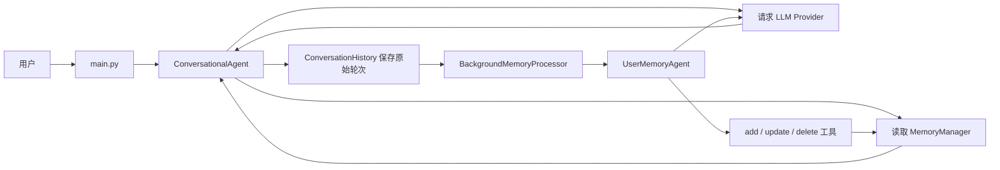
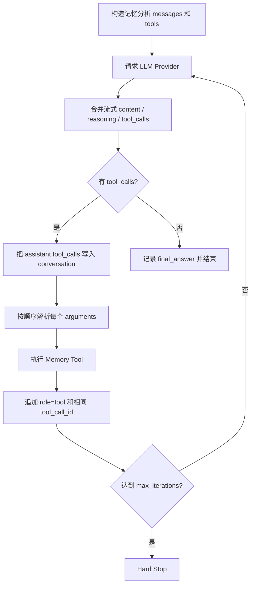

# User Memory 实验逻辑流程

## 1. 总体流程



系统有两条互相连接但责任不同的路径：

```text
前台：用户输入 -> 读取长期记忆 -> 模型回答 -> 保存原始对话
后台：读取新对话 -> 模型决定记忆操作 -> 工具修改长期记忆
```

## 2. 启动阶段

入口是 `main.py::main()`。

1. 解析 `--mode`、`--user`、`--memory-mode`、`--provider` 等参数。
2. 根据 `memory_mode` 创建对应的 `MemoryManager`。
3. 创建共享的 `ConversationHistory`。
4. 创建 `ConversationalAgent`，用于前台回答。
5. 创建 `BackgroundMemoryProcessor`，内部持有 `UserMemoryAgent`。
6. 如果没有关闭后台处理，则启动后台线程。
7. 进入 interactive、demo 或 evaluation 模式。

主要对象关系：

```text
interactive_mode
├─ ConversationHistory
├─ MemoryManager
├─ ConversationalAgent
└─ BackgroundMemoryProcessor
   └─ UserMemoryAgent
      └─ memory tools
```

前台和后台必须共享同一个用户作用域，否则前台读到的 Memory 与后台写入的 Memory 会对应不同用户。

## 3. 前台对话链

入口：`conversational_agent.py::ConversationalAgent.chat()`。

### 3.1 读取状态

每次收到用户消息时，前台不会只使用内存里的 `self.conversation`，还会重新读取：

- 当前用户已经持久化的长期 Memory；
- 当前 `session_id` 对应的原始对话轮次。

这里只读取当前 Session 的原始历史，避免新 Session 再次直接携带旧 Session 全文。旧 Session 中有长期价值的信息应该先由后台提炼到 Memory。

### 3.2 临时组装请求

当前用户原话、长期 Memory 和 Session 历史被组装为本次请求的 `api_messages`。

Memory Context 只临时进入当前请求，不直接写回 `self.conversation`。否则下一轮会把上一次注入的历史和 Memory 再次嵌套，导致上下文持续膨胀。

### 3.3 调用模型

`ConversationalAgent` 使用配置好的 OpenAI 兼容客户端执行流式请求：

```text
api_messages
-> chat.completions.create(stream=True)
-> 逐块读取 delta
-> 忽略没有 choices 的空块
-> 合并为最终回答
```

前台模型没有长期记忆写工具。它的职责是回答，不是决定每句话都应成为长期事实。

### 3.4 保存原始对话

模型回答完成后：

1. `self.conversation` 增加用户原话和 assistant 回答；
2. `ConversationHistory.add_turn()` 保存原始 user / assistant；
3. 增加后台处理所需的对话计数；
4. 返回回答给 CLI。

保存的是用户原话，不是已经拼入 Memory 的 `full_message`。

## 4. 后台触发链

入口：`background_memory_processor.py::BackgroundMemoryProcessor`。

后台线程按照配置周期检查：

```text
conversations_since_last
= conversation_count - last_processed_count

当 conversations_since_last >= conversation_interval
才开始一次处理
```

手动输入 `process` 或 `save` 也可以触发处理。

### 4.1 选择未处理轮次

`process_recent_conversations()` 会：

1. 从磁盘重新加载 ConversationHistory；
2. 取最近 `context_window` 范围的轮次；
3. 为轮次生成或读取 turn id；
4. 过滤当前进程 `processed_turn_ids` 中已有的 id；
5. 把新轮次组成记忆分析任务。

这里的去重状态只存在内存中。进程退出后会消失，所以它不能作为持久化 checkpoint。

## 5. 后台 Agent Tool Loop

入口：`agent.py::UserMemoryAgent.execute_task()`。



### 5.1 Tool Call 拼接

流式响应中的 Tool Call 可能被拆成多个 delta。代码按照 `index` 合并：

- `id`；
- `function.name`；
- 被拆开的 `function.arguments` 字符串。

只有合并完成后，Harness 才能把它当作一条完整调用。

### 5.2 工具执行

当前实现按顺序处理多条 Tool Call，而不是并行执行：

```text
for tool_call in current_tool_calls:
    解析 arguments
    根据 name 找到工具
    调用 MemoryManager
    记录 operation
    回填 tool message
```

主要动作：

| Action | 含义 |
| --- | --- |
| `add_memory` | 新增长期事实或卡片 |
| `update_memory` | 修改已有记忆，处理偏好变化或补充信息 |
| `delete_memory` | 删除错误、过期或不应保留的信息 |
| `search_memory` | 查找现有记忆，帮助判断新增还是更新 |

### 5.3 Tool Result 回填

模型提出动作后，真正执行动作的是 Harness。每个结果都必须回填：

```json
{
  "role": "tool",
  "tool_call_id": "与 assistant call 相同的 id",
  "content": "JSON 序列化后的执行结果"
}
```

如果 `arguments` 不是合法 JSON，也应回填匹配的错误 Tool Message。不能只丢弃失败调用，否则消息协议会留下无法配对的 Assistant Tool Call。

## 6. MemoryManager 持久化

入口：`memory_manager.py::create_memory_manager()`。

```text
notes / enhanced_notes -> NotesMemoryManager
json_cards              -> JSONMemoryManager
advanced_json_cards     -> AdvancedJSONMemoryManager
```

写入步骤大致是：

1. 读取现有 Memory 文件；
2. 按 mode 校验和规范化内容；
3. 执行新增、更新或删除；
4. 更新创建时间、修改时间、session 等元数据；
5. 写回该用户的 Memory 文件；
6. 返回结构化执行结果。

写盘成功只说明结构化操作完成，不证明记忆内容真实。事实正确性需要来源、评测或人工审核。

## 7. 下一轮怎样使用新记忆

后台处理结束后，Memory 不会直接修改已经完成的前台回答。

在用户下一次发送消息时，`ConversationalAgent.chat()` 会重新 `load_memory()`，把新状态加入本次 `api_messages`。跨 Session 个性化因此发生在“下一轮重新加载”阶段。

## 8. reset 的真实含义

交互命令 `reset` 调用 `ConversationalAgent.reset_session()`：

```text
新的 session_id
self.conversation 恢复为 system message
磁盘 ConversationHistory 不删除
磁盘 Memory 不删除
```

所以，验证跨会话记忆的正确方法是：

1. 在 Session A 告诉 Agent 一个偏好；
2. 确认原始 History 已保存；
3. 确认后台工具已经把偏好写入 Memory；
4. 执行 `reset`；
5. 在 Session B 提问；
6. 确认 Session B 没有直接读取 A 的原始全文，而是通过 Memory 得到偏好。

## 9. 失败定位顺序

如果长期记忆没有生效，按下面顺序排查：

1. 前台是否成功返回回答；
2. `ConversationHistory` 是否写入原始轮次；
3. `conversation_interval` 是否达到；
4. 后台是否选中了新 turn；
5. Provider 是否返回 Tool Call；
6. Tool Call 参数是否正确解析；
7. `MemoryManager` 是否写入目标用户文件；
8. 下一轮前台是否重新加载 Memory；
9. 新 Session 是否错误携带了旧 Session 原始历史。

这九步分别对应不同责任层，不能只根据模型说“我记住了”判断实验成功。

## 10. 最小验收闭环

```text
用户说出稳定偏好
-> 原始 History 出现该轮
-> 后台出现 Assistant Tool Call
-> Harness 返回匹配的 Tool Result
-> Memory 文件发生预期变化
-> reset 后新 Session 不含旧原文
-> 新一轮从长期 Memory 恢复偏好
```

只有这条链全部成立，才能说“跨 Session 长期记忆机制跑通”。
