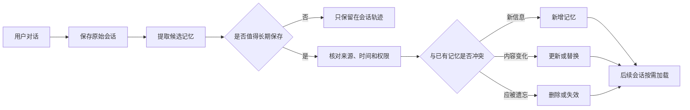
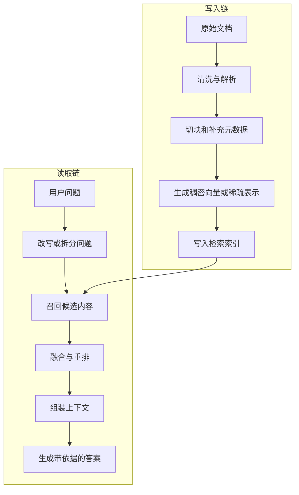

# 第 3 章学习笔记：用户记忆与知识库

> 对应章节：[Chapter 3：用户记忆和知识库](https://github.com/bojieli/ai-agent-book/blob/main/book/chapter3.md)  
> 配套项目：[chapter3](https://github.com/bojieli/ai-agent-book/tree/main/chapter3)

## 1. 这一章解决什么问题

第二章主要解决“当前这一次任务应该把什么放进上下文”。第三章继续往前走，解决两个更长期的问题：

1. **这个 Agent 怎样记住某个用户？**
2. **这个 Agent 怎样使用团队或业务共享的知识？**

因此，第三章不是单纯讲向量数据库，而是在讲两种持久化能力：

- 面向个人的**用户长期记忆**；
- 面向多人或业务的**共享知识库**。

它们都在做同一件事：把当前窗口装不下、但以后仍有价值的信息保存起来，并在需要时找回来。

## 2. 先分清四种容易混淆的信息

| 名称 | 保存什么 | 主要用途 | 生命周期 |
| --- | --- | --- | --- |
| 当前上下文 | 当前问题、系统提示、工具结果 | 完成本次推理 | 一次请求或一次会话 |
| 会话轨迹 | 原始消息、工具调用、观察结果 | 回放过程、排查错误 | 一次或多次会话 |
| 用户长期记忆 | 用户偏好、稳定事实、重要事件、可复用经验 | 跨会话个性化服务 | 长期保存，可更新和删除 |
| 共享知识库 | 产品文档、制度、手册、业务资料 | 为多个用户提供外部知识 | 长期维护、版本化更新 |

最关键的区别是：

- **会话轨迹是原始记录**，内容多，但噪声也多。
- **长期记忆是从原始记录中提炼出来的状态**，应该更短、更稳定，也必须允许修改。
- **知识库不是用户画像**，它保存的是可以被多人共享和引用的资料。

## 3. 用户记忆的完整生命周期

一个可靠的记忆系统不能只做“保存”，还要处理来源、冲突、更新和遗忘。



可以把它理解成六步：

1. **记录**：保留原始对话，作为证据。
2. **提取**：从对话中找出可能有长期价值的信息。
3. **判断**：区分临时内容和稳定信息。
4. **核验**：检查信息来源、时间、可信度和权限。
5. **写入**：执行新增、更新、合并、失效或删除。
6. **读取**：下次会话只加载与当前任务有关的记忆。

### 为什么不能把所有历史消息直接塞给模型

- 历史越来越长，成本会不断增加。
- 旧信息和新信息可能互相冲突。
- 大量无关内容会干扰模型判断。
- 原始记录中可能包含敏感信息，不适合每次都重新发送。

所以，用户记忆不是“无限聊天记录”，而是经过筛选和维护的长期状态。

## 4. 用户记忆可以怎样组织

课程实验展示了从简单文本到结构化卡片的几种形式。

| 形式 | 特点 | 适用情况 | 主要问题 |
| --- | --- | --- | --- |
| Simple Notes | 直接保存简短文本 | 原型验证、信息很少 | 不容易判断来源和更新时间 |
| Enhanced Notes | 增加分类、时间等信息 | 需要基本管理的场景 | 结构仍然比较松散 |
| JSON Cards | 按字段保存记忆卡片 | 需要查询、更新和去重 | 需要提前设计字段 |
| Advanced JSON Cards | 增加来源、状态、置信度、关系等字段 | 复杂的长期记忆系统 | 写入和维护成本更高 |

选择哪种格式，不是越复杂越好。小型实验可以先用 Notes；当系统开始需要冲突处理、审计和精确更新时，再使用结构化卡片。

## 5. 记忆类型和存储格式不是一回事

从认知作用看，长期记忆还可以分成三类：

- **情景记忆（Episodic Memory）**：发生过什么，例如“上次排查 API 超时，最后发现是代理配置问题”。
- **语义记忆（Semantic Memory）**：稳定事实，例如“用户更习惯使用 PowerShell”。
- **程序性记忆（Procedural Memory）**：怎样完成任务，例如“发布前要先运行哪些检查”。

这是按“记忆的作用”分类；Notes、JSON Cards 则是按“记忆怎样存储”分类。两套分类可以组合，不能混为一谈。

## 6. 怎样判断记忆功能是否真的有用

可以分三层评估：

1. **基础召回**：用户说过的信息，下一次能否正确找回来。
2. **多会话检索**：隔了多轮、多个会话以后，能否找到正确版本，而不是旧版本。
3. **主动服务**：在用户没有重复说明时，Agent 能否在合适的时机使用记忆，并且不过度推断。

除了“记住了没有”，还应检查：

- 是否把临时信息误当成长期事实；
- 新信息出现后是否更新旧记忆；
- 是否能说明信息来自哪里；
- 用户要求删除后是否真的不再使用；
- 不同用户之间是否发生数据串用。

## 7. RAG 的核心：先找证据，再回答

RAG（Retrieval-Augmented Generation，检索增强生成）的基本流程是：

```text
用户问题 -> 检索外部资料 -> 把相关内容放入上下文 -> 模型根据证据回答
```

它适合处理：

- 经常更新的知识；
- 企业内部或个人私有资料；
- 模型训练时没有见过的长尾内容；
- 需要给出来源或引用的回答。

但 RAG 不会自动保证答案正确。检索错了、资料过期、上下文拼接不清楚，最终答案仍然可能出错。

## 8. 完整 RAG 包含写入链和读取链

很多介绍只画“提问到回答”，但真正可维护的 RAG 至少有两条链。



写入链决定“系统里有什么、资料是否干净”；读取链决定“这次找到了什么、怎样交给模型”。任何一边出问题，最终效果都会下降。

## 9. 切块不是越小越好

文档通常需要切成较小的片段再建立索引，但切块存在明显取舍：

- **太小**：容易失去上下文，代词、标题和结论可能被分开。
- **太大**：一个片段包含太多主题，相似度被稀释，也会浪费上下文窗口。

常见改进方法包括：

- 按标题、段落或语义边界切分，而不是只按固定字符数；
- 保留文档标题、章节路径、时间、作者、权限等元数据；
- 给相邻片段设置少量重叠；
- 让返回片段能够定位回原文。

切块的目标不是得到统一大小，而是得到“能够独立理解、又便于准确检索”的最小信息单元。

## 10. 稠密检索、稀疏检索和混合检索

| 方法 | 擅长什么 | 容易漏掉什么 |
| --- | --- | --- |
| 稠密检索（Dense Retrieval） | 语义相近、表达方式不同的问题 | 精确编号、专有名词、罕见关键词 |
| 稀疏检索（如 BM25） | 关键词、型号、错误码、原词匹配 | 同义表达、隐含语义 |
| 混合检索（Hybrid Retrieval） | 综合两类结果，提高覆盖率 | 需要设计融合和权重策略 |

Embedding 模型负责把文本编码成便于比较的表示；生成模型负责阅读证据并组织答案。它们的职责不同，不能把 Embedding 当成“缩小版聊天模型”。

## 11. 召回和重排分别负责什么

检索通常分成两步：

1. **Retriever 召回**：快速找出一批可能相关的候选内容。
2. **Reranker 重排**：用更精细的方法重新判断候选内容与问题的相关性。

需要注意：重排器只能重新排列已有候选，不能找回召回阶段已经漏掉的资料。

因此：

- 召回阶段更关心“别漏掉”；
- 重排阶段更关心“把真正有用的内容排在前面”。

## 12. RAG 要分层评估

只看最终答案，很难判断问题出在哪里。更实用的做法是分层检查：

| 层级 | 要回答的问题 | 常见指标或检查项 |
| --- | --- | --- |
| 检索层 | 正确资料有没有被找回来 | Recall@K、Hit Rate@K、MRR、nDCG |
| 上下文层 | 交给模型的内容是否相关、完整、无冲突 | Context Precision、噪声比例、覆盖率 |
| 生成层 | 回答是否正确、是否忠于证据 | Answer Correctness、Faithfulness |
| 引用层 | 引用能否真正支持对应结论 | Citation Correctness、Citation Completeness |

向量相似度高，只说明两段文本在表示空间中接近，不等于证据真实，也不等于答案正确。

## 13. 知识库也需要维护和治理

知识库不是一次导入后永远不变。一个可长期使用的知识库至少需要：

- 保存来源、发布时间、更新时间和版本；
- 旧文档失效时能删除或降权；
- 支持增量更新，也能定期重新构建索引；
- 对自动写入的知识设置审核流程；
- 根据用户权限过滤可检索内容；
- 防止文档中的恶意提示词影响 Agent；
- 保留修改记录，并且能够回滚。

对于自动积累知识的 Agent，可以把流程拆成两个角色：一个角色提出新增或修改建议，另一个角色检查证据和冲突后再批准写入。

## 14. 结构化索引不只是“向量搜索”

当资料很多、层级复杂或问题需要跨文档推理时，可以在普通向量索引之外增加结构。

- **RAPTOR**：把内容分层聚类并生成摘要，先从高层找到方向，再深入到细节。
- **GraphRAG**：把实体和关系组织成图，适合查询“谁和谁有什么关系”以及跨文档关联。
- **文件系统式知识组织**：保留目录和层级，让 Agent 先浏览概要，再按需打开具体文件。

它们共同体现了一个原则：先给模型全局方向，再逐步加载细节，避免一次把大量资料全部塞进上下文。

## 15. 什么时候才需要 Agentic RAG

普通 RAG 的步骤通常固定：查询、召回、重排、生成。Agentic RAG 则允许 Agent 根据中间结果决定下一步，例如：

- 第一次搜索没有找到足够证据，于是改写问题再搜索；
- 发现两个来源冲突，于是查找更新版本；
- 一个复杂问题需要拆成多个子问题分别检索；
- 根据已找到的实体继续查询相关实体。

判断是否值得使用 Agentic RAG，可以问一句：

> 中间证据是否会改变下一步检索动作？

如果不会，固定工作流通常更便宜、更稳定，也更容易测试。不要为了“像 Agent”而增加不必要的循环。

## 16. Contextual Retrieval 和运行时压缩的区别

这两个概念都在处理“上下文”，但发生阶段不同：

- **Contextual Retrieval**：在建立索引时，为每个片段补充它在原文中的背景，帮助以后更准确地检索。
- **运行时上下文压缩**：在某次任务执行过程中，对已经取得的内容做摘要、裁剪或筛选，以节省上下文窗口。

一个发生在写入知识库时，一个发生在回答问题时，不能只因为名字相近就混在一起。

## 17. 双层记忆架构

一种实用设计是同时保留两层信息：

1. **结构化概览层**：保存用户画像、主题摘要、关键实体和最新状态，便于快速定位。
2. **原始证据层**：保存对话片段、文档和事件记录，便于追溯来源和补充细节。

读取时先看概览，再按当前问题检索原始证据。这样既不会只依赖模糊摘要，也不必每次读取全部历史。

## 18. 本章实验地图

| 项目 | 主要学习内容 |
| --- | --- |
| [user-memory](https://github.com/bojieli/ai-agent-book/tree/main/chapter3/user-memory) | 用户记忆的写入、读取和不同存储格式 |
| [user-memory-evaluation](https://github.com/bojieli/ai-agent-book/tree/main/chapter3/user-memory-evaluation) | 基础召回、多会话检索和主动服务评估 |
| [mem0](https://github.com/bojieli/ai-agent-book/tree/main/chapter3/mem0) / [memobase](https://github.com/bojieli/ai-agent-book/tree/main/chapter3/memobase) | 现成记忆框架的使用方式 |
| [log-sanitization](https://github.com/bojieli/ai-agent-book/tree/main/chapter3/log-sanitization) | 写入或分析日志前的敏感信息清理 |
| [dense-embedding](https://github.com/bojieli/ai-agent-book/tree/main/chapter3/dense-embedding) | Embedding 与稠密检索 |
| [sparse-embedding](https://github.com/bojieli/ai-agent-book/tree/main/chapter3/sparse-embedding) | BM25 等稀疏检索 |
| [retrieval-pipeline](https://github.com/bojieli/ai-agent-book/tree/main/chapter3/retrieval-pipeline) | 召回、融合、重排和上下文组装 |
| [structured-index](https://github.com/bojieli/ai-agent-book/tree/main/chapter3/structured-index) | RAPTOR、GraphRAG 等结构化索引思路 |
| [agentic-rag](https://github.com/bojieli/ai-agent-book/tree/main/chapter3/agentic-rag) | 由中间证据驱动下一步检索 |
| [agentic-rag-for-user-memory](https://github.com/bojieli/ai-agent-book/tree/main/chapter3/agentic-rag-for-user-memory) | 将 Agentic RAG 用于用户记忆 |
| [contextual-retrieval](https://github.com/bojieli/ai-agent-book/tree/main/chapter3/contextual-retrieval) | 在索引阶段为片段补充背景 |
| [contextual-retrieval-for-user-memory](https://github.com/bojieli/ai-agent-book/tree/main/chapter3/contextual-retrieval-for-user-memory) | 把上下文检索方法用于用户记忆 |
| [structured-knowledge-extraction](https://github.com/bojieli/ai-agent-book/tree/main/chapter3/structured-knowledge-extraction) | 从非结构化内容中提取可管理的知识 |

## 19. 容易踩的坑

1. 把全部聊天记录当成长期记忆，导致成本、噪声和隐私风险一起增长。
2. 只新增记忆，不处理更新、冲突和删除。
3. 只做向量检索，忽略错误码、编号等精确关键词。
4. 只看最终回答，不分别评估召回、上下文、生成和引用。
5. 只保存摘要，不保留可以追溯的原始证据。
6. 给所有问题都套 Agentic RAG，增加延迟和不可控性。
7. 把“相似”误认为“正确”，没有检查来源、时间和权限。

## 20. 闭卷自测

1. 当前上下文、会话轨迹、用户长期记忆和共享知识库有什么区别？
2. 为什么不能直接把所有历史对话都放入上下文？
3. 用户记忆的新增、更新、删除分别在什么情况下发生？
4. Simple Notes 和 JSON Cards 的取舍是什么？
5. 情景记忆、语义记忆和程序性记忆分别保存什么？
6. 评估用户记忆为什么不能只做一次简单召回？
7. RAG 的写入链和读取链各有哪些步骤？
8. 文档切块太小或太大分别会产生什么问题？
9. 稠密检索和稀疏检索分别擅长什么？
10. 为什么重排器不能弥补召回阶段漏掉的资料？
11. 为什么向量相似度高不等于答案正确？
12. 检索层、上下文层、生成层和引用层分别怎样评估？
13. 知识库为什么需要版本、权限、审核和回滚？
14. RAPTOR、GraphRAG 和文件系统式知识组织分别解决什么问题？
15. 什么时候 Agentic RAG 比固定流程更有价值？
16. Contextual Retrieval 和运行时上下文压缩有什么区别？
17. 双层记忆架构为什么要同时保留概览和原始证据？
18. 如果用户的新偏好与旧记忆冲突，系统应该怎样处理？

## 一句话总结

第三章的核心不是“把更多内容存起来”，而是让 Agent 能够把有价值的信息安全地写入、准确地找回、根据新证据持续更新，并在回答时说清楚依据来自哪里。

## 说明

本笔记依据第三章教材、项目结构和已有学习记录整理。本次只更新文档，没有重新运行需要在线模型或付费 API 的实验，因此这里总结的是机制、代码结构和已有证据边界，不把历史实验结果写成当前实时验证结果。
