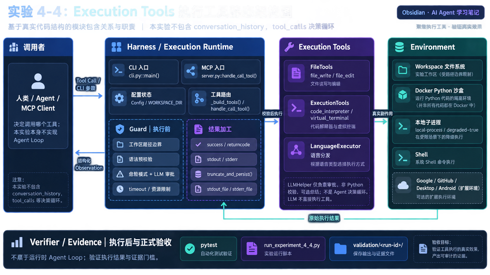
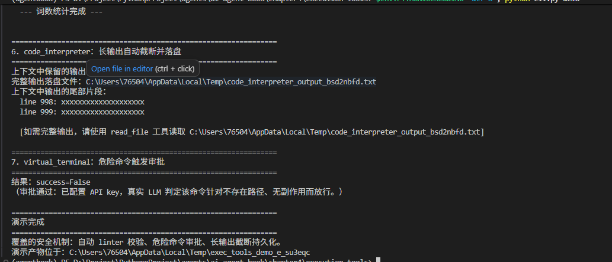

# 实验 4-4：Execution Tools + MCP

本目录整理执行工具实验的源码快照、学习笔记、流程图和实验总结。

## 阅读顺序

1. [学习笔记](学习笔记.md)
2. [实验逻辑流程](实验逻辑流程.md)
3. [实验总结](实验总结.md)
4. [源码快照与原项目说明](code/)

## 本轮实际结果

2026-09-22 严格离线运行 `cli.py demo` 成功，覆盖文件写入、语法拦截、代码执行、Shell 校验、长输出持久化和危险命令拒绝；自动测试结果为 `63 passed in 2.15s`。

这验证了 Tool Call 之后的 Guard、Execution、Observation 和 Verifier 基础设施，但没有实现 LLM 自主决策循环。

## 运行截图

下面是用户提供的另一轮本地运行截图，记录了长输出截断落盘、危险命令审批路径和 demo 完成状态。截图中显示配置了 API Key，与上面的严格离线验证不是同一次运行。

