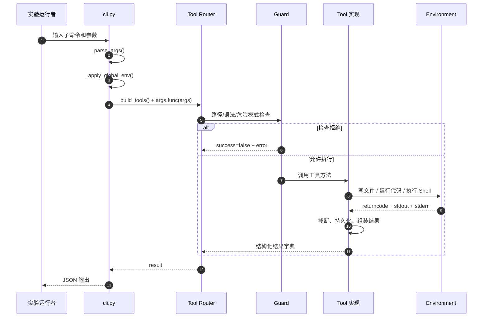
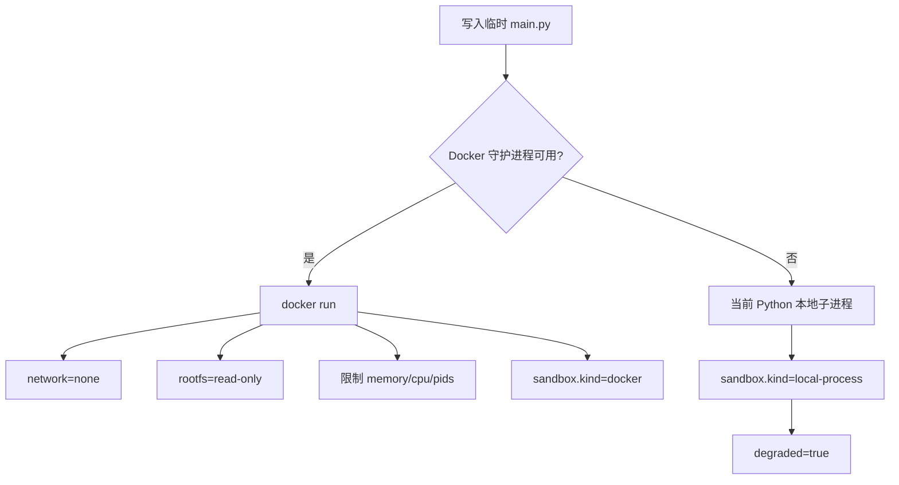
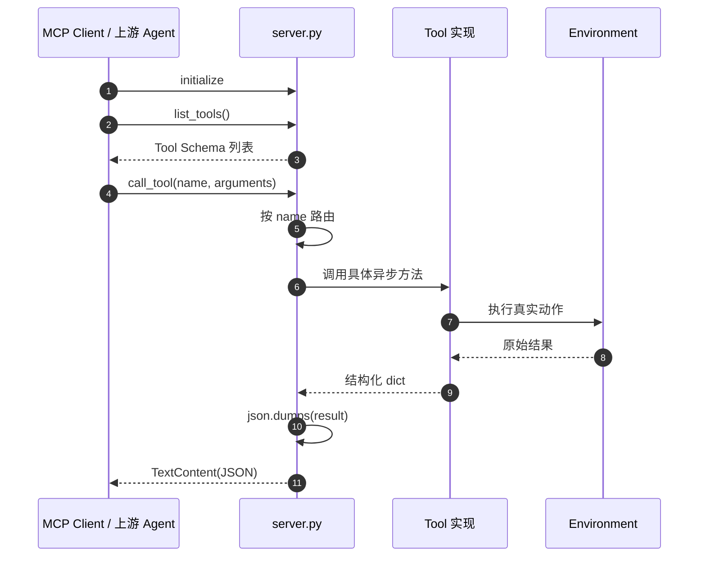
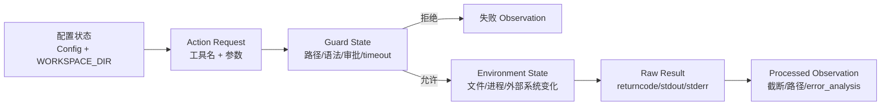

# 实验 4-4：Execution Tools 执行流程

> 本文只解释当前源码怎样执行，作为 `README.md` 的源码导航补充。环境、命令和故障排查以 `README.md` 为准；学习结论与自测保存在 Obsidian 实验总结中。

## 1. 先分清三个入口

当前目录没有一个“LLM 自己选工具并循环执行”的 Agent。它提供三种不同层级的入口：

| 入口 | 真实文件 | 谁选择工具 | 作用 |
| --- | --- | --- | --- |
| CLI | `cli.py` | 人通过子命令选择 | 本地学习、单工具调用、离线 demo |
| MCP Server | `server.py` | 上游 MCP Client / Agent | 公布 Schema、接收 `call_tool`、路由执行 |
| 正式验收 | `run_experiment_4_4.py` | 固定 case 列表 | 生成 receipt、summary、manifest 和门禁结论 |

因此不要把 `cli.py demo` 画成下面这种不存在的流程：

```text
用户自然语言 -> LLM 自主决定工具 -> conversation_history -> 下一轮 LLM
```

当前 CLI 的真实流程是：

```text
人手动选择子命令
-> CLI 解析参数
-> 创建工具对象
-> Guard
-> 工具执行
-> 结果加工
-> JSON 输出到终端
```

## 2. CLI 总入口

源码快照：2026-09-22，当前工作树包含本地学习改动，行号后续可能变化。

### 2.1 调用链

```text
cli.py::main()                              第 405 行
  -> build_parser()                         第 325 行
  -> parser.parse_args(argv)                读取终端参数
  -> _apply_global_env(args)                第 56 行
  -> args.func(args)                        路由到子命令
  -> cmd_code/cmd_shell/cmd_write/cmd_edit
  -> _build_tools()                         第 74 行
  -> 具体 Tool 方法
  -> _print_result()                        第 90 行
```

### 2.2 为什么必须延迟导入

`Config` 在模块导入阶段读取环境变量。CLI 必须先把这些参数写入环境变量：

```text
--provider
--workspace
--no-approval
--no-verify
--no-summarize
```

然后 `_build_tools()` 才导入 `LLMHelper`、`FileTools`、`ExecutionTools` 和 `ExternalTools`。否则命令行覆盖项不会进入本次 `Config`。

### 2.3 CLI 实际时序



这里没有 `messages`、`assistant(tool_calls)`、`role=tool` 或下一轮模型请求。

## 3. `file_write`：文件写入流程

核心入口：`file_tools.py::FileTools.write_file()`，当前第 34 行。

```text
cmd_write()
-> FileTools.write_file(path, content, overwrite)
-> _resolve_path()
-> _is_safe_path()
-> 检查文件是否存在
-> 必要时审批覆盖操作
-> 根据扩展名选择 Python / JavaScript / TypeScript 校验
-> verify_code_syntax()
-> resolved_path.write_text()
-> 返回 success / path / bytes_written / verification
```

### Guard 与 Verifier 的准确归属

`file_write` 的语法校验发生在 `write_text()` 之前。因此它在当前实现中属于写入前 Guard，而不是写入后的 Verifier。

```text
语法错误
-> success=false
-> 不执行 write_text()
-> 文件不落盘
```

写入成功只证明文件系统动作完成，不证明文件表达的业务逻辑正确。

## 4. `file_edit`：搜索替换流程

核心入口：`file_tools.py::FileTools.edit_file()`，当前第 107 行。

```text
解析路径与工作区边界
-> 检查文件存在
-> 读取原内容
-> 拒绝空 search
-> 检查 search 是否存在
-> 只替换第一个匹配项
-> 生成 Diff Preview
-> 对修改后的代码做语法预校验
-> 写回文件
-> 返回 old/new 相关信息、diff、verification
```

关键点：Diff 是给调用者观察变化的结果，不等于语义验证。

## 5. `code_interpreter`：代码执行流程

核心入口：`execution_tools.py::ExecutionTools.code_interpreter()`，当前第 77 行。

### 5.1 总调用链

```text
cmd_code()
-> ExecutionTools.code_interpreter()
-> 规范化 language
-> Python compile() 语法预校验
-> 危险模式匹配
-> 命中时 request_approval()
-> LanguageExecutor.execute_code()
-> 按语言分派 _run_python/_run_javascript/...
-> _run_command()
-> 捕获 status/returncode/stdout/stderr/execution_time
-> truncate_and_persist()
-> 组装 error/error_analysis/sandbox/verification
-> 返回 Observation
```

### 5.2 Python 的真实执行环境

`multilang_executor.py::_run_python()` 当前第 272 行：



所以“代码执行成功”和“容器沙盒验收通过”不是同一结论。只有返回 `sandbox.kind=docker`，并且网络拒绝等探针也通过，才能确认当前 Docker 门禁。

### 5.3 进程和输出

`LanguageExecutor._run_command()` 同时读取 stdout、stderr，避免子进程写满管道后出现假超时。超过 timeout 后，`kill_process_tree()` 会终止父进程及其子进程。

失败时：

```text
success=false
error=执行器 error 或 stderr
error_analysis=本地第一手诊断
```

当前不会因为普通执行失败就自动调用 LLM 做错误分析。

## 6. `virtual_terminal`：Shell 执行流程

核心入口：`execution_tools.py::ExecutionTools.virtual_terminal()`，当前第 205 行。

```text
cmd_shell()
-> 匹配 rm -rf / dd / mkfs / format / chmod -R 等危险模式
-> 命中时 request_approval()
-> subprocess.run(shell=True, cwd=WORKSPACE_DIR, timeout=...)
-> 捕获 returncode/stdout/stderr
-> truncate_and_persist()
-> 返回结构化结果
```

> `cwd=WORKSPACE_DIR` 只设置 Shell 的起始目录，不是文件系统隔离。命令仍可能使用绝对路径访问工作区之外。真正执行高风险命令还需要容器、最小权限和人工边界。

## 7. 危险操作审批到底是谁做

`LLMHelper.request_approval()` 是一个局部安全审查器：

```text
Tool 已经由人或上游 Agent 选好
-> Harness 发现危险模式
-> 把 operation + details 发给审查模型
-> 审查模型只返回 approved/reason
-> approved=false 时工具不执行
```

它不是负责选择工具的 Agent Policy，也不会维护 Agent Loop。

离线 `cli.py demo` 会把 `request_approval` 替换成本地固定拒绝器，保证即使 `.env` 已有 API Key，也不会在 demo 中意外请求模型。

## 8. 长输出怎样进入 Observation

入口：`execution_tools.py::truncate_and_persist()`，当前第 24 行。

```text
原始 stdout / stderr
-> 是否超过 200 行或 10000 字符
-> 未超过：原样返回，file=null
-> 超过：完整输出写入系统临时文件
-> Context 只保留前 50 行 + 后 50 行
-> 返回 stdout_file / stderr_file
```

注意当前实际顺序：代码先截断，再检查截断后文本是否仍超过总结阈值。因此通常观察到的是“头尾片段 + 完整文件路径”，不能笼统写成“LLM 摘要 + 文件路径”。

## 9. MCP Server 执行流程

MCP 入口：

- `server.py::handle_list_tools()`：当前第 31 行；
- `server.py::handle_call_tool()`：当前第 255 行；
- `server.py::main()`：当前第 345 行。



`server.py` 不构造对话 history，也不决定下一步调用哪个工具。若上游是 Agent，`assistant(tool_calls)`、`role=tool`、`tool_call_id` 和下一次模型请求都属于上游 Agent Harness。

## 10. 运行状态怎样演化

当前 CLI/MCP 工具层没有 Round 0/1/2 的对话历史，真实状态变化是：



| 状态层 | 真实对象 | 生命周期 |
| --- | --- | --- |
| 配置状态 | `Config`、`WORKSPACE_DIR`、安全开关 | 进程内 |
| 工具请求 | CLI 参数或 MCP `name + arguments` | 单次调用 |
| 执行状态 | 临时目录、子进程、Docker、当前文件 | 单次调用或真实持久化 |
| Observation | 返回结果字典 / MCP JSON | 返回给调用者 |
| 完整长输出 | `stdout_file` / `stderr_file` | 系统临时文件，需主动保留 |
| 正式证据 | receipts、summary、manifest | `validation/<run-id>/` 持久化 |

## 11. 正式验收脚本

`run_experiment_4_4.py` 不是 Agent Loop，而是固定的实验 Harness：

```text
创建 campaign 目录和隔离 workspace
-> 启动真实 MCP stdio Server
-> initialize + list_tools
-> 按固定顺序执行 20 个 case
-> 每个 case 立即写 receipt
-> 汇总 LLM 回执和长输出文件
-> 计算 gates
-> 写 summary.json
-> 写 manifest.json + SHA-256
-> 更新 latest.json
```

主要门禁包括：

```text
真实 MCP catalog 与调用
Python / JavaScript linter
文件编辑和路径逃逸拒绝
终端 timeout 与危险操作审查
Docker Python 沙盒与断网
长输出截断和完整文件
Excel 公式与截图
Webhook / Browser
Calendar / GitHub PR / Email
Virtual Desktop / Android
无凭据使用量和延迟回执
```

正式状态规则：

```text
全部 gate=true                  -> passed
核心 gate=true、外部门禁缺失    -> blocked
任一核心 gate=false             -> failed
```

## 12. 当前证据边界

### 本轮当前源码验证（2026-09-22）

```text
py_compile：通过
pytest：63 passed
cli.py demo：通过
demo 模型/API 调用：未触发
```

它能证明当前核心工具链和离线演示正常，但不能证明 Calendar、Email、GitHub、Desktop、Android 等正式外部门禁全部可复现。

### 历史正式 campaign（2026-08-02）

`validation/experiment_4_4/latest.json` 指向：

```text
campaign_id=real_mcp_gui_20260802T093657Z
status=blocked
official_complete=false
receipt_count=20
llm_call_count=3
blockers=real_calendar_mutation, real_email_mutation
```

历史 `summary.json` 的 `experiment` 错写为 `4-3`，而 `latest.json` 和当前脚本为 `4-4`。这是一处证据元数据不一致，因此该 campaign 只能作为历史部分证据，不能声明“实验 4-4 已正式完成”。

## 13. 修改代码后的检查顺序

```powershell
conda activate agentbook
cd D:\Project\PythonpProject\agents\ai-agent-book\chapter4\execution-tools

python -m py_compile cli.py config.py execution_tools.py file_tools.py `
  llm_helper.py multilang_executor.py server.py terminal_controller.py

python -m pytest -q -p no:cacheprovider `
  -o asyncio_mode=auto --basetemp .pytest-tmp

python cli.py demo
```

只在明确准备好 Docker、GUI、Android 和真实外部写入凭据后，才运行 `run_experiment_4_4.py`。该脚本可能创建真实 GitHub PR、日历事件或其他外部副作用，不能把它当普通本地测试随手执行。

## 14. 第一次阅读源码只看这些位置

| 顺序 | 文件与符号 | 要回答的问题 |
| --- | --- | --- |
| 1 | `cli.py::main()` / `_build_tools()` | 参数如何变成一次工具调用？ |
| 2 | `execution_tools.py::code_interpreter()` | Guard、执行与 Observation 如何串联？ |
| 3 | `multilang_executor.py::_run_python()` | Docker 和本地降级如何区分？ |
| 4 | `file_tools.py::write_file()` | 路径逃逸和错误代码在哪里被拦截？ |
| 5 | `server.py::handle_call_tool()` | MCP 如何路由并返回结果？ |

读完后应能准确说出：

```text
Decision 不在本实验内实现；
Harness 接收 Action Request；
Guard 在执行前限制风险；
Environment 真正产生副作用；
Observation 返回执行结果；
Verifier 和 validation 在执行后判断证据是否达标。
```
