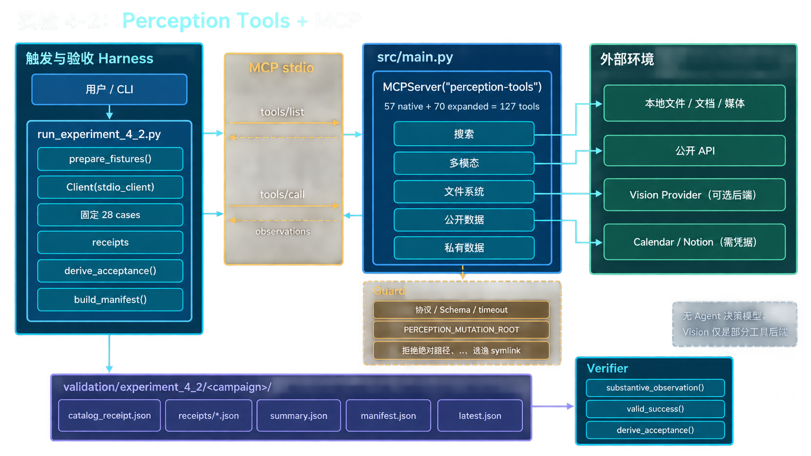

# 实验 4-2：Perception Tools + MCP

本目录整理感知工具实验的源码快照、学习笔记、流程图和实验总结。

## 阅读顺序

1. [学习笔记](学习笔记.md)
2. [实验逻辑流程](实验逻辑流程.md)
3. [实验总结](实验总结.md)
4. [运行手册](运行手册.md)
5. [源码快照](code/)

## 本轮实际结果

2026-09-22 运行 `smoke_test_mcp_v2.py` 成功：MCP SDK `2.2.0`、协议 `2026-07-28`、发现 127 个工具，并通过 `file_reader` 读取 `requirements.txt`。

这验证了 MCP 初始化、工具发现和固定工具调用链，但没有实现 LLM 自主选择工具。

