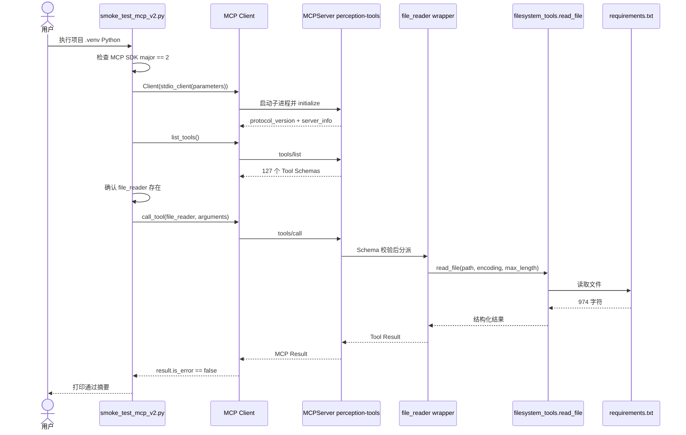

# 实验 4-2：Perception Tools + MCP 源码执行流程

> 面向第一次阅读 MCP 代码的人。  
> 主入口：`smoke_test_mcp_v2.py`。  
> 行号对应 2026-09-22、源码提交 `972174fe3c51e6a33ad5dd53a3685061aaaac7e6` 的当前工作树；以后代码变化时，以函数名为准。

## 0. 先建立完整地图

当前最短实验没有 LLM，也没有 Agent Tool Selection。它验证的是：

```text
smoke_test_mcp_v2.py
负责检查 SDK、创建 MCP Client、发现并调用工具
        ↓ stdio
src/main.py
负责创建 MCPServer、注册工具、接收协议请求
        ↓
src/filesystem_tools.py::read_file
负责实际读取 requirements.txt
        ↓
MCP Result
返回 Client，并由冒烟脚本检查 is_error
```

只能记一句话时：

```text
Client 通过 MCP 发现 Schema，再按 Schema 调用 Server 暴露的 Tool。
```

## 1. 运行入口

在实验目录执行：

```powershell
cd D:\Project\PythonpProject\agents\ai-agent-book\chapter4\perception-tools
$env:PYTHONUTF8='1'
$env:PYTHONIOENCODING='utf-8'
.\.venv\Scripts\python.exe .\smoke_test_mcp_v2.py
```

必须优先使用实验自己的 `.venv`。当前机器上的 `rtk python` 曾解析到 Hermes 的全局环境，其中 MCP 版本不兼容，不能代表本项目运行状态。

这条命令不会调用天气、搜索、Vision、Calendar 或 Notion；它只启动本地 MCP Server、发现 catalog，并调用 `file_reader` 读取本地 `requirements.txt`。

## 2. 八步主链

| 步骤 | 当前源码位置 | 实际发生什么 |
| ---: | --- | --- |
| 1 | `smoke_test_mcp_v2.py:32` | 读取已安装的 MCP SDK 版本，要求 major version 为 2 |
| 2 | `smoke_test_mcp_v2.py:38-42` | 构造 `StdioServerParameters`，命令使用当前 Python，参数指向 `src/main.py` |
| 3 | `smoke_test_mcp_v2.py:46` | 进入 `Client(stdio_client(parameters))`，启动 Server 子进程并自动完成 initialize |
| 4 | `smoke_test_mcp_v2.py:48-50` | 检查协商后的协议必须为 `2026-07-28` |
| 5 | `smoke_test_mcp_v2.py:55-58` | 调用 `list_tools()`，提取工具名并确认存在 `file_reader` |
| 6 | `smoke_test_mcp_v2.py:63-66` | 调用 `file_reader`，参数是 `requirements.txt` 和 `max_length=2000` |
| 7 | `src/main.py:180-181` → `src/filesystem_tools.py:315` | MCP Server 根据 Schema 分派 wrapper，实际函数读取文件 |
| 8 | `smoke_test_mcp_v2.py:67-74` | 检查 `result.is_error`，读取 Server 信息并打印 SDK、协议和工具数量 |

## 3. Server 启动与注册

### 3.1 创建 Server

`src/main.py:57`：

```python
mcp = MCPServer(
    "perception-tools",
    instructions="""...""",
)
```

Server 名称随后通过 `client.server_info.name` 返回，当前实测为 `perception-tools`。

### 3.2 注册原生工具

`src/main.py:180-181`：

```python
@mcp.tool(description="Read a file and return its contents")
async def file_reader(...):
    return await read_file(file_path, encoding, max_length)
```

Decorator 把 Python 函数转换成 MCP Tool，包括 name、description 与输入 Schema。wrapper 自身不读取文件，而是把参数交给 `src/filesystem_tools.py::read_file`。

### 3.3 补充和扩展 catalog

| 位置 | 作用 |
| --- | --- |
| `src/main.py:712` | `enrich_existing_tools(mcp)` 给原生工具补充 provenance、成功形状和失败语义 |
| `src/main.py:719` | `register_expanded_tools(mcp)` 动态注册 70 个扩展工具 |
| `src/expanded_catalog.py:1007` | 遍历 `EXPANDED_SPECS`，使用 `mcp.add_tool()` 注册扩展工具 |
| `src/expanded_catalog.py:1014` | 检查原生/扩展工具重名，并更新原生工具 description |

当前源码是 57 个原生工具加 70 个扩展工具，冒烟运行返回 127 个唯一工具。旧 `INDEX.md` 中的 18 工具统计属于早期文档，不能代表当前运行 catalog。

### 3.4 使用 stdio 启动

`src/main.py:728`：

```python
mcp.run(transport="stdio")
```

Server 不需要监听 HTTP 端口。Client 通过子进程 stdin/stdout 发送和接收 MCP JSON-RPC 消息。

## 4. initialize 在哪里发生

脚本没有显式写：

```python
await client.initialize()
```

而是在进入 `Client` 异步上下文时由 SDK 完成连接和初始化：

```python
async with Client(stdio_client(parameters)) as client:
```

初始化完成后才读取：

```python
client.protocol_version
client.server_info
```

如果协议不是 `2026-07-28`，脚本立即抛出 `RuntimeError`，不会继续调用工具。

## 5. `tools/list` 怎样执行

```python
listed = await client.list_tools()
names = {tool.name for tool in listed.tools}
```

返回的是 Tool definitions，而不是 Tool Results。每个 definition 包含名称、说明和输入 Schema。脚本只做两个最小检查：

1. 能收到工具列表。
2. `file_reader` 在列表中。

当前打印的 127 是 `names` 集合大小，因此代表唯一工具名数量。

## 6. `tools/call` 怎样执行

Client 发送：

```python
result = await client.call_tool(
    "file_reader",
    arguments={
        "file_path": str(HERE / "requirements.txt"),
        "max_length": 2_000,
    },
)
```

调用链：

```text
Client.call_tool
→ MCP stdio request
→ MCPServer 查找 file_reader
→ Pydantic / Schema 参数校验
→ src/main.py::file_reader
→ src/filesystem_tools.py::read_file
→ Path 校验与文件读取
→ ActionResponse / content
→ MCP Result
→ Client
```

`max_length=2000` 是读取上限，不代表文件必须有 2000 个字符。当前 `requirements.txt` 实际返回 974 个字符。

## 7. Sequence Diagram



## 8. State Evolution

```text
S0  尚未连接
    protocol = unknown
    tools = unknown

S1  Client 上下文已建立
    protocol = 2026-07-28
    server = perception-tools

S2  tools/list 完成
    unique tool names = 127
    file_reader 已发现

S3  tools/call 已发送
    name = file_reader
    arguments = requirements.txt + max_length

S4  Tool Result 返回
    is_error = false
    content = 文件读取结果

S5  Harness 输出摘要并退出
```

这里没有“Observation 回填给 LLM”的 S6，因为冒烟脚本没有 Agent 模型。真实 Agent Host 接入后，才会把 MCP Result 转成模型可见 Observation 并继续决策。

## 9. 失败出口

| 失败位置 | 表现 | 应先检查什么 |
| --- | --- | --- |
| SDK 导入 | `Client` 无法从 `mcp` 导入 | 是否误用了全局 Python / MCP 1.x |
| SDK 版本 | “要求 mcp>=2,<3” | `.venv` 中 `mcp` 版本 |
| initialize | Client 上下文建立失败 | Server 启动异常、stdio 被污染、依赖缺失 |
| 协议版本 | 实际版本不是 `2026-07-28` | Client/Server SDK 是否匹配 |
| tools/list | 缺少 `file_reader` | `src/main.py` 是否正常导入并注册工具 |
| tools/call | `result.is_error` 为 true | 参数 Schema、文件路径、权限和工具异常 |

日志必须写 stderr，不能把普通日志写进 stdout，否则会污染 stdio 协议帧。

## 10. Guard 与 Verifier

本次冒烟只读取文件，但完整 Server 的安全边界仍值得区分：

| 类型 | 真实位置 | 责任 |
| --- | --- | --- |
| SDK/协议 Guard | `smoke_test_mcp_v2.py:32-50` | 阻止错误 SDK 与协议继续运行 |
| Tool discovery Guard | `smoke_test_mcp_v2.py:55-58` | 确认必需 Tool 存在 |
| 结果 Guard | `smoke_test_mcp_v2.py:67-68` | MCP Error 时立即失败 |
| Mutation Guard | `filesystem_tools.py:51,87,109` | 限制 mutation root，拒绝绝对路径、父级穿越与逃逸 symlink |
| Campaign Verifier | `run_experiment_4_2.py::derive_acceptance` | 用 receipts、实质结果与分类 gates 判定 passed/blocked/failed |

Guard 决定某次调用能否安全执行；Verifier 判断一组运行证据能否支持实验结论。

## 11. 本轮真实输出

2026-09-22：

```text
MCP 冒烟测试通过：sdk 版本=2.2.0, 协议版本=2026-07-28,
服务端名称=perception-tools, 成功发现工具数=127
```

Server 同时记录：

```text
Reading file: ...\requirements.txt
Successfully read file (974 characters)
```

验证范围到这里结束。没有运行 28-case campaign，没有访问外部 Provider，也没有验证所有 127 个工具。

## 12. 下一步阅读

掌握这条最短链后，再读 `run_experiment_4_2.py`：

```text
prepare_fixtures
→ credential_preflight
→ list_tools
→ 固定 28 cases
→ call_case
→ substantive_observation
→ derive_acceptance
→ summary / manifest / latest
```

不要从 127 个工具逐个阅读开始；先理解统一协议，再按需要进入具体 Tool implementation。

