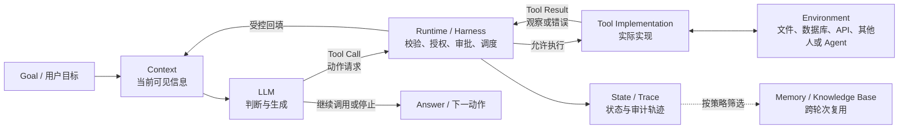

# 工具调用、MCP与安全

> [!summary] 一句话先讲清楚
> **工具让模型获得查询和行动的通道，运行系统把模型提出的请求变成受控、可验证的实际动作。** MCP 统一接入方式，不能替代工具设计、权限检查或结果验证。

## 第四章从这里读

这篇是 `ai-agent-book` 第四章的**唯一正文入口**；不需要同时翻多篇才能读完这一章。

| 层次 | 要解决的问题 | 阅读位置 |
|---|---|---|
| 第一遍：建立骨架 | 谁决定、谁执行、结果去哪？ | 第一部分：Tool Calling 闭环 |
| 第二遍：会设计接口 | 工具怎样命名、返回什么、很多工具怎样找？ | 第二部分：工具接口设计 → 第三部分：五类工具落地 |
| 第三遍：理解接入 | MCP 连接哪些角色，怎样发现和调用？ | 第四部分：MCP 接入层 |
| 第四遍：理解工程边界 | 怎样限制越权、处理超时、验证真实效果？ | 第五部分：安全与恢复 → 第六部分：复习与实验 |

前置只需知道 [Chapter 1：Agent 基础](../chapter1/) 中“模型 ≠ 完整 Agent”。第二、三章的 Context（本轮可见上下文）与 Memory（跨轮次或会话保留的记忆）在这里分别对应**工具定义与结果放在哪里、哪些信息值得保留**；不用重新背一套定义。

> [!note] 正文、实验、掌握状态分开
> 本文整合用户提供的第四章笔记，并对照 2026-09-21 读取的教材第四章正文。例子为合成数据；2026-09-22 已完成 4-2 MCP 冒烟验证和 4-4 严格离线 demo，具体结果放在对应实验目录。本轮没有调用在线模型或外部服务。参考答案不等于个人已掌握，个人闭卷区保持空白。

### 学完本章要回答

1. 为什么模型需要工具，调用契约与真实实现怎样分工？
2. 怎样设计可选择、可传参、可解释结果的接口？
3. 工具数量增加后，怎样接入、发现和按需加载？
4. 工具会改变外部世界时，谁授权、谁审批、怎样验证和恢复？

## 第一部分：Tool Calling 闭环

### 1. 概念区分

LLM 可以生成关于订单的文字，但仅凭参数中的知识，不能保证知道订单此刻是否发货，也不能凭一句“已修改”就改变数据库。工具负责连接最新信息、确定性计算和真实操作；模型负责判断何时使用、怎样解释结果。

- **Tool Calling（工具调用）**：模型通过约定接口提出使用外部能力的请求；完整系统还包含校验、执行、结果回传。
- **Function Calling（函数调用）**：常见的结构化工具调用形式，模型输出函数名和参数，应用分派到实际实现。不同平台有时近似混用这两个名字，不应据此推断能力强弱。
- **Tool Call（一次调用请求）**：这次“调用什么、传什么”的数据，不是执行已经完成的证明。
- **Tool Result（工具结果）**：执行方返回的观察、错误或状态；必须区分真实查询结果与示例、缓存、推测。

### 2. 一般调用链路

```text
用户提出任务 → 应用提供当前允许使用的工具定义
    → LLM 输出 Tool Call（工具名、参数、调用标识）
    → Runtime 校验名称、参数、权限与必要审批
    → Tool Implementation 真正执行
    → Runtime 接收结果／错误，关联对应调用
    → 把必要结果回填 Context
    → LLM 根据新 Observation 继续调用、回答或停止
```

**Runtime（运行系统）**负责调度和状态推进，**Harness（配套运行与治理系统）**组织权限、观测、验证和纠错。它们可以由同一应用实现，不一定是两个独立程序。

模型生成的调用通常带有调用标识；回传结果时要按所用 API 的协议与原调用对应，不能把 A 工具的输出误配给 B。工具可能在本机、远端服务或供应商托管环境执行，但不意味着模型凭自然语言直接执行了代码。

**为什么结果必须回到 Context？** 下一次模型推理只能依据实际收到的输入。结果只留在日志或界面中，模型就不知道动作是否成功，可能猜测、重复调用或提前结束。回填可以是受控摘要加证据引用，不必把整份输出原样塞入；详细原件可留在状态存储中按需读取。轨迹和停止条件见“Agent 运行机制”相关笔记。

### 3. 把前四章串成一张图



这张图的关键不是背组件，而是辨认边界：

- LLM 负责**提出**动作，不持有最终执行权。
- Runtime / Harness 负责**是否允许、怎样执行、怎样记录**。
- Environment 是事实和副作用真正发生的地方。
- Tool Result 是新的 Observation（观察），不是天然正确的最终答案。
- Trace 记录本次过程；只有经过筛选的信息才适合进入长期 Memory，不能把所有工具输出都永久保存。

### 4. Tool Schema 与 Tool Function / Implementation

| 层 | 中文含义 | 负责什么 |
|---|---|---|
| Tool Schema | 工具调用契约／结构定义 | 名称、用途、输入类型、必填字段、允许范围；让模型知道怎样请求 |
| Tool Function / Implementation | 工具函数／实际实现 | 接收经过校验的参数，查询、计算或产生动作，并返回结果 |
| Registry / Dispatcher | 注册表／分派器 | 把允许的工具名映射到实际实现，拒绝未知工具 |

Schema 并不执行代码，也不等于访问许可。模型生成合法的 `order_id`，仍不代表当前用户有权查看这笔订单。实现可能是 Python 函数，也可能是调用远端 API 的适配器。

下面是按 MCP 工具定义风格展示的契约，其他模型 API 的外层封装可能不同：

```json
{
  "name": "get_order_status",
  "description": "按订单号查询当前用户有权查看的订单状态；只读，不取消或修改订单；不存在或无权访问时不返回订单详情。",
  "inputSchema": {
    "type": "object",
    "properties": {
      "order_id": {
        "type": "string",
        "pattern": "^ORD-[0-9]{4}$",
        "description": "订单号，例如 ORD-1042"
      }
    },
    "required": ["order_id"],
    "additionalProperties": false
  }
}
```

`required` 表示必填；`additionalProperties: false` 表示拒绝未声明字段；`pattern` 表示字符串格式约束。模型端的结构化生成可以降低格式错误，但运行系统仍须独立验证。

### 5. 只读订单查询的最小调用

沿用上面的契约，以下代码只演示边界，不连接真实订单系统。为保持可直接运行，手工验证这一份简单 Schema；生产代码应使用受维护的校验器并保持契约与实现一致。

```python
import re

def get_order_status(order_id: str) -> dict:
    # 合成数据，不代表真实查询结果。
    return {"status": "ok", "order_id": order_id, "order_status": "shipped"}

IMPLEMENTATIONS = {"get_order_status": get_order_status}

def execute_tool(call: dict, allowed_order_ids: frozenset[str]) -> dict:
    # allowed_order_ids 来自可信的登录/授权上下文，不能让模型自行声明。
    if (not isinstance(call, dict)
            or not isinstance(call.get("name"), str)
            or call["name"] not in IMPLEMENTATIONS):
        return {"status": "rejected", "reason": "unknown_tool"}
    args = call.get("arguments")
    if not isinstance(args, dict) or set(args) != {"order_id"}:
        return {"status": "rejected", "reason": "invalid_arguments"}
    order_id = args["order_id"]
    if not isinstance(order_id, str) or re.fullmatch(r"ORD-[0-9]{4}", order_id) is None:
        return {"status": "rejected", "reason": "invalid_order_id"}
    if order_id not in allowed_order_ids:
        return {"status": "rejected", "reason": "not_authorized"}
    return IMPLEMENTATIONS[call["name"]](**args)

call = {"name": "get_order_status", "arguments": {"order_id": "ORD-1042"}}
result = execute_tool(call, frozenset({"ORD-1042"}))
print(result)
```

输出为 `{'status': 'ok', 'order_id': 'ORD-1042', 'order_status': 'shipped'}`。这只证明示例的实现被调用；真实应用还需要处理不存在、服务故障、超时、鉴权和数据来源。

运行系统随后按模型 API 的工具结果格式回传 `result`，模型才能回答“订单已发货”。这份代码**未实现模型调用或 MCP Server**，也没有把打印到终端冒充回填 Context。

### 6. 从请求到答案，需要留下哪六类证据

| 对象 | 订单示例 | 能证明什么 | 不能证明什么 |
|---|---|---|---|
| Tool Schema | `get_order_status(order_id)` | 模型被告知怎样提出请求 | 用户有权查询、工具已经执行 |
| Tool Call | 请求查询 `ORD-1042` | 模型选择了工具并生成参数 | 参数合法、请求已经获批 |
| Policy Decision | `allowed`／`denied` 及理由 | 运行系统做过权限和审批判断 | 底层服务一定会成功 |
| Execution Record | 调用标识、开始／结束时间、服务状态 | 实现层确实尝试过执行 | 业务目标一定达成 |
| Tool Result | `order_status=shipped`，附来源和时间 | 工具返回了什么观察 | 结果永远正确、已经被模型正确解释 |
| Final Answer | “订单已发货” | 模型根据当前证据组织了用户答案 | 原始系统以后不会变化 |

因此要避免三种跳步：**有 Schema 就当有权限、有 Tool Call 就当已执行、有 Tool Result 就当最终答案。**

## 第二部分：工具接口设计与渐进式加载

### 1. ACI：给 Agent 使用的接口

**ACI（Agent-Computer Interface，Agent 与计算机交互接口）**关注模型能否可靠使用工具，而不只是开发者能否调通 API。一个面向任务的工具应让模型知道：

- **何时用、何时不用**：例如查询订单，不用于取消订单。
- **参数是什么意思**：类型、单位、范围、可接受示例、默认值。
- **结果能证明什么**：来源、时间、状态、单位、分页和错误信息。
- **会不会改变外界**：收费、写文件、发消息等副作用要明确。

差描述是“处理订单”；好描述是上面的“只读查询、需要订单号、不能修改、无权时不返回详情”。描述不是越长越好，应消除与相邻工具的歧义，而不是重复一整篇说明书。

接口粒度以任务为单位：可以把稳定的多步只读查询封装为一次调用，但不要为了少调用而把“查看”和“删除”隐藏在一个含糊动作里。这与 [Anthropic 的工具设计实践](https://www.anthropic.com/engineering/writing-tools-for-agents) 中面向任务、清晰描述和控制返回内容的思路一致，效果仍应通过评测确认。

### 2. 通用工具、专用工具与 Skill

| 形态 | 直观理解 | 更适合 | 主要代价 |
|---|---|---|---|
| 通用工具 | 给解释器、终端、浏览器等通用能力 | 长尾任务、多步组合、探索 | 模型要自己组织过程；权限面和出错空间较大 |
| 专用工具 | 给明确任务的窄接口 | 高频稳定操作、严格输入输出、敏感权限边界 | 需要开发维护；过细会产生大量相似工具 |
| Skill（技能包） | 按需读取的操作方法、约束、示例及脚本等资料 | 某类任务有可复用流程，但没必要增加一批独立接口 | 说明可能过时；执行能力仍来自底层工具 |

**Tool 提供能做什么，Skill 指导怎样做。** Skill 不是新的权限，也不是模型权重更新；其脚本执行仍要经过已有执行工具和安全策略。上下文视角见 [Chapter 2：上下文工程](../chapter2/) 中的 Dynamic Context 与 Agent Skills。

教材偏向用少量通用能力覆盖长尾任务，这是设计取向，不是“专用工具一定差”。稳定、高频、需要严格授权和可观测性的动作，专用接口可能更可靠。**工具形态**与**加载策略**是两条轴：通用工具、专用工具和 Skill 都可以按需加载，并非只有 Skill 才能减少上下文。

#### Function、MCP、Skill、Workflow 选型速查

| 需求 | 首选 | 判断理由 |
|---|---|---|
| 同一应用内只有少量稳定能力 | 直接注册 Function / Tool | 链路短，没必要为了标准化引入独立协议层 |
| 同一外部能力要被多个兼容宿主复用 | MCP Server | 统一能力声明、连接、列举和调用方式 |
| 已有工具，但模型经常不知道正确步骤 | Skill | 补方法、约束和示例，不新增执行权限 |
| 步骤固定，审批、重试和恢复要求明确 | Workflow | 把控制流写进程序，不把所有顺序都交给模型临场决定 |
| 长尾任务难以预先枚举 | 通用工具 + 按需 Skill／发现 | 保留组合能力，同时控制初始上下文和候选集 |
| 高频敏感业务动作 | 专用工具 + Workflow／审批 | 缩小参数和权限边界，增强审计与验证 |

这些不是互斥方案。一个 Workflow 可以调用通过 MCP 接入的专用工具，Agent 也可以先加载 Skill，再按流程使用工具。选型时先问“缺的是能力、连接、方法，还是控制流”，不要只看流行名词。

### 3. 参数与结果都要保持信息保真

**Fidelity（保真性）**是不要在传递过程中悄悄改变原意。复制代码时替换引号、遗漏参数或自动补上影响行为的选项，都可能导致“看起来相似，执行却不同”。复杂嵌套结构更适合结构化参数；Shell 字符串还涉及转义和注入风险，不能把自然语言直接拼成命令。

结果也要设计。例如查询得到 10,000 行，不应全塞给模型，也不能只返回“成功”。可以先返回总数、过滤条件、关键行与分页游标；长日志保留关键错误和摘要，完整件持久化，返回可再次读取的引用。截断必须显式标注，且不能假定错误只在头尾。

输出应区分 `ok`（成功）、`no_data`（没有数据）、`error`（执行错误）、`pending`（尚未完成）。**没有搜到证据不等于事实不存在；任务已提交不等于任务已完成。**

### 4. Tool Explosion：为什么工具越多不一定越好

**Tool Explosion（工具膨胀）**指候选工具、相似描述和参数定义不断增加，带来上下文开销、选择歧义和维护负担。不是某个固定数量必然使模型失效，要用实际任务评估选择准确率、调用成功率、时延与成本。

处理顺序可以是：合并重复接口 → 清晰命名和领域命名空间 → 只开放本任务允许的候选集 → 必要时按需发现。不要先堆几百个工具，再期待模型自动理解所有细微差别。

### 5. Active Tool Discovery：先找能力，再加载契约

**Active Tool Discovery（主动工具发现）**不是模型猜一个工具名，而是通过检索接口找到真实可用的候选定义。

```text
起初只有少量常用工具和发现入口
    → 按任务检索工具／先选服务领域再检索工具
    → 返回少量候选的名称、用途和契约
    → 宿主核验来源与权限，按接入方式登记可调用能力
    → 模型生成调用请求 → 正常校验执行 → 回填结果
```

**Hierarchical Loading（分层加载）**先看粗粒度目录，再展开相关服务或工具，避免首次展示全部细节。查不到时应换检索词、澄清任务或承认没有能力，不能编造接口。

两个边界尤其重要：

1. **发现 ≠ 授权**：搜索到删除工具，也不代表当前任务允许删除。
2. **看见 Schema ≠ 接口已注册**：把定义作为普通文本给模型，不会自动让常规模型 API 接受新工具。宿主必须按平台机制注册、引用或路由调用；教材特定实现中的做法不能无条件套用。

### 6. 动态工具、上下文与缓存

工具描述和 Schema 在许多模型接口中会占用输入预算；工具返回内容也会竞争注意力。按需加载减少无关输入，但多了一次发现过程，可能有漏检和延迟，收益需要评测。

**Prompt Cache（提示缓存）**能否复用取决于平台规则、前缀是否一致、工具排列、缓存有效期等；改动前部工具定义可能缩短可复用前缀。不能简单写成“动态工具一定破坏缓存”，也不能认为“把新定义追加到用户消息就保证命中”。

组织原则是保持高复用的规则和定义稳定，把任务变化放在后部，并遵循接口真正支持的工具注册方式。KV Cache（注意力计算缓存）与提示缓存的区别见 [Chapter 2：上下文工程](../chapter2/)。

对确定性强的重复查询，还可以让受控程序组合多次工具调用，只向模型返回必要结果；代价是程序本身需要错误处理和可观测性。这不是绕开授权。调度实现可继续阅读“Runtime 中的 Tool 调度”相关笔记，这里不复制另一套正文。

## 第三部分：五类工具怎样落地

### 1. 五类工具总览

分类依据是**用途及效果**，不是五种互斥的 API 技术。同一个发邮件工具既能用于用户沟通，也有执行工具的外部副作用。

| 类别 | 谁发起、发生什么 | 例子 | 关键边界 |
|---|---|---|---|
| 感知工具 | Agent 发起读取，环境返回观察 | 搜索、读文件、数据库查询 | 只读也有隐私、配额、费用与陈旧数据风险 |
| 执行工具 | Agent 请求改变环境 | 改文件、创建日历事件、提交代码 | Runtime 校验授权、参数和副作用 |
| 协作工具 | Agent 委托其他 Agent 或请求人协助 | 分派子任务、人工审批 | 明确任务、上下文、结果、失败和取消边界 |
| 事件触发工具／机制 | 先注册监听或任务，再由外部事件触发运行 | 定时任务、新邮件、Webhook 回调 | 注册可以是工具调用；未来触发由调度器或事件系统负责 |
| 用户沟通工具 | Agent 向用户传递信息或发起询问 | 进度消息、确认问题、完成通知 | 发通知不代表业务操作成功；跨渠道发送仍需授权 |

> [!important] 调用方向与信息方向不是一回事
> 搜索通常由 Agent 主动调用，但知识从环境回到 Agent。事件触发则可能在模型尚未运行时就启动任务。“环境 → Agent”不能统一理解成模型正在调用工具。

### 2. 感知工具：拿到足够而可信的观察

搜索、文件读取、数据库查询和网页解析都在扩展 Observation Space（观察空间）。结果要保留来源和时间；会变化的数据不能长期当成当前事实。缓存还要区分用户身份、权限、查询参数、数据版本与有效期，不能让一个用户读到另一个用户的缓存。

无依赖的多次读取可以并行，但要考虑限流和资源预算；后一个查询依赖前一个结果时仍要顺序执行。只读不等于可以无限读取、越权读取或免费读取。

### 3. 多模态感知：三条路线各有损失

| 路线 | 做法 | 适合与限制 |
|---|---|---|
| 原生多模态 | 将模型支持的图像、音频等输入直接交给模型 | 有机会利用布局和跨模态关系；受实际模型、接口与分辨率限制，不能保证理解正确 |
| 提取为文本 | 用文本解析、OCR（光学字符识别）、语音转写后再交给语言模型 | 文字为主时实用；纯文本提取会丢失部分视觉、布局或声音信息，表格结构能否保留取决于提取器 |
| 工具化多模态分析 | 主 Agent 向专用模型工具提交文件与具体问题 | 按需深入、减少主上下文体积；回答受问题范围与摘要质量影响，可能漏掉未问到的信息 |

例如问 PDF 的退款期限，文本解析可能足够；问两条曲线何时相交，则应保留图像证据或调用图表分析能力。不要把“原生路线总最好”“OCR 必然丢光全部布局”“某方案固定节省多少 token”当成普遍结论。

### 4. 执行工具：返回成功之外还要验证效果

执行工具扩展 Action Space（动作空间）。写文件后可做语法检查，修改配置后可做受控加载测试，创建记录后可按操作标识读回。验证要匹配目标：语法通过不等于功能正确，读回成功不等于所有业务约束满足。

安全策略、重试、沙盒和验证闭环集中在第五部分“安全、错误、验证与恢复”。

### 5. 协作、用户沟通与事件

协作工具最少要交代**任务边界、可用上下文、结果格式、状态和取消方式**。常见接口包括启动、发送补充信息、查看状态、获取结果、取消；同步方式等待结果，异步方式先返回任务 ID，流式方式逐步传回进展。标注信息来源有助于减少混淆，但标签本身不能阻止提示注入。协作拓扑与交接可继续阅读“多 Agent 协作与 Handoff”相关笔记。

**HITL（Human-in-the-Loop，人在回路）**是在关键节点请求人判断。等待要有超时与保守降级，尤其不能把“用户没回复”解释成批准。人的反馈可以作为带来源的改进材料，但不是一次批准就永久扩大权限。

用户沟通要区分“正在准备”“已提交”“已验证完成”，避免把进度提示当成结果。定时或邮件触发则分两阶段：先授权注册监听／任务，再由外部事件系统启动未来运行；需要任务身份、去重、取消和权限复核，不是模型在后台永远自转。

## 第四部分：MCP 把外部能力标准化接入

### 1. MCP 到底是什么

**MCP（Model Context Protocol，模型上下文协议）**让模型应用以统一协议连接外部工具和上下文。它统一的是接入与通信边界，不负责让模型更聪明，也不代替 Agent Loop（运行循环）、Memory（记忆）、Eval（评估）或 Workflow（工作流）。

### 2. 为什么 MCP 会变重要

如果多个 AI 应用分别适配多个数据源，每一对连接都可能维护一套接口。标准协议可以复用服务端能力与客户端实现，但具体业务的身份、字段含义和错误处理仍然需要设计，不是“接上协议就消除所有适配”。

### 3. MCP 不是什么

- 不是 Agent 框架，也不是更高级的 Prompt。
- 不是小型本地函数的必需前置；直接注册函数常常已经足够。
- 不是工具市场或 Skill 市场本身。市场负责分发与发现，协议负责互操作，两者可以结合。
- 不是可信或安全认证；接入外部能力仍要审查供应方与权限。

### 4. MCP 的基本架构怎么理解

```text
Host（宿主应用：交互、模型、策略）
    ├─ Client A（客户端：维护连接） ↔ Server A（暴露能力） → 外部系统 A
    └─ Client B（客户端：维护连接） ↔ Server B（暴露能力） → 外部系统 B
```

Host 可以管理多个客户端；每个客户端与一个服务端维护连接。Client 是宿主内的协议组件，不是另一个负责推理的 LLM；Server 也不必拥有大模型，可以只是数据库或 API 的封装。[架构说明](https://modelcontextprotocol.io/docs/learn/architecture)

**以 2025-11-25 版 MCP 为例**，基础生命周期是：

```text
Client → Server：initialize（声明协议版本与客户端能力）
Server → Client：返回协商版本与服务端能力
Client → Server：notifications/initialized（通知初始化完成）
    → 支持工具能力时 tools/list（列举定义，必要时分页）
    → Host 按权限将相关工具接入模型调用层
    → tools/call（发送工具名和参数）
    → 返回结果，Host 再按模型 API 格式回填上下文
```

`tools/list` 是协议层列举，不自动等于语义搜索式的主动发现。版本与能力协商也不等于获得访问所有数据的授权。[生命周期](https://modelcontextprotocol.io/specification/2025-11-25/basic/lifecycle)、[工具规范](https://modelcontextprotocol.io/specification/2025-11-25/server/tools)

常见传输有本地进程的 **stdio（标准输入／输出）** 和远端 **Streamable HTTP（可流式 HTTP）**。后者可使用 SSE（服务器发送事件）传递流式消息；不能把“旧 HTTP+SSE 传输被替代”误读成“SSE 在 MCP 中完全不能用”。[传输规范](https://modelcontextprotocol.io/specification/2025-11-25/basic/transports)

### 5. MCP 和 Tool Calling / Function Calling / API 的关系

| 概念 | 回答的问题 |
|---|---|
| API（应用程序接口） | 软件能力本身怎样被程序调用？ |
| Function Calling | 模型怎样提出函数名与结构化参数？ |
| Tool Calling | 模型应用怎样提出、执行并反馈工具请求？ |
| MCP | 外部工具、资源和提示模板怎样标准化暴露给宿主？ |
| Skill | 这类任务应按什么方法使用已有能力？ |

MCP Server 内部通常仍调用 API；Host 可以把 MCP 工具映射为模型可见的函数调用定义。MCP 不替代 API，也不要求只能采用某一家模型的调用格式。

### 6. MCP 在 Agent / Harness 里处于哪一层

MCP 位于**工具与上下文接入面**。Runtime 决定执行顺序、关联结果和恢复；Harness 组织授权、审批、验证与观测。连接成功只说明具备通信条件，不说明任务成功。

### 7. MCP server 到底暴露什么

- **Tools（工具）**：供调用的能力，既可以只读，也可以有副作用。
- **Resources（资源）**：可读取的文件、记录或上下文材料。
- **Prompts（提示模板）**：可复用的提示或交互模板。

这是能力分类，不是每个 Server 都必须提供三者。应查看协商结果与实际定义，不能凭名称推断存在某个接口。

### 8. MCP 的工程价值

把连接、声明与调用方式标准化，有助于复用和互操作，也便于工具注册表（registry）、检查器（inspector）和日志（logging）等配套能力统一管理。实际效果仍依赖双方实现、协议版本和支持的能力。

### 9. MCP 的边界和局限

远端 MCP 还涉及认证、OAuth scope（授权范围）、数据发送边界和第三方服务信任。相同工具名可能来自不同服务器，应带服务来源或命名空间区分；不能因为接口名字一样就切换到不可信实现。

MCP 不自动解决规划、结果正确性、持久化恢复或业务审批。发现新工具、更新服务版本后，也要重新核对能力与风险是否改变。

## 第五部分：安全、错误、验证与恢复

### 1. 失败不只在执行阶段

```text
意图理解 → 工具选择 → 参数生成 → 授权与审批 → 工具执行
        → 结果解释 → 状态回填 → 效果验证 → 下一步决策
```

**接口成功、任务成功、用户允许做这件事，是三个不同判断。**

### 2. 常见失败模式

| 失败点 | 表现 | 基本防线 |
|---|---|---|
| 使用判断 | 该查证时猜测，或简单问题滥用工具 | 明确使用条件 |
| 工具选择 | 搜索误选写入，相似接口混淆 | 清晰描述、命名空间、最小候选集 |
| 参数 | 缺字段、类型错误、参数被悄悄改动 | Schema 与运行时独立校验 |
| 权限 | 越权读数据、向外发送敏感信息 | 最小权限、沙盒、必要审批 |
| 执行 | 超时、限流、服务故障 | 分类错误、有界重试与降级 |
| 结果 | 截断未标注、单位不明、把未找到当不存在 | 保留来源、单位、完整件引用 |
| 状态 | 结果未回填，反复调用同一动作 | 关联调用标识、更新状态与轨迹 |
| 顺序 | 未审批就执行、未验证就宣称完成 | 执行门控、验证和停止条件 |

### 2.1 错误返回要告诉 Agent 下一步能做什么

只返回 `failed` 会迫使模型猜原因。工具结果至少应区分：

| 状态 | 含义 | Agent 的合理下一步 |
|---|---|---|
| `rejected` | 请求在执行前被拒绝，如参数非法或没有权限 | 修正参数；权限不足时停止或请求授权，不能伪装重试 |
| `error` | 已尝试执行但失败，结果中应标明是否可重试 | 仅在可重试且预算允许时重试，否则换方案或上报 |
| `pending` | 已受理但尚未完成，并返回操作标识 | 查询该操作标识的状态，不重复创建 |
| `ok` | 工具调用成功并返回观察 | 检查证据是否足以满足用户目标，必要时做独立验证 |
| `unknown_outcome` | 超时或断连后无法确认副作用是否发生 | 先查询外部状态；不能直接重复有副作用的动作 |

`error` 与 `unknown_outcome` 的区别很重要：前者可以明确知道失败，后者只知道没有收到确定结果。错误结构还应包含稳定的错误码、可读说明、是否可重试、调用或操作标识，以及不会泄漏敏感信息的诊断证据。

### 3. 五个核心控制面

| 控制面 | 中文与职责 |
|---|---|
| Permission | 应用权限：本任务可以使用哪些工具、文件和域名 |
| Sandbox | 沙盒：从系统层限制文件、网络、进程与资源访问 |
| Approval | 审批：特定动作是否需要人或审核流程放行 |
| Guardrails | 护栏：对输入、输出和行为设置规则与检测 |
| Authorization | 服务端授权：当前身份能访问哪些资源、执行哪些动作 |

这些控制面可以重叠，但不能互相替代。Schema 合法不等于有权限；用户批准也不能让服务端放弃身份校验。对路径、命令等输入应先规范化并按允许范围验证，不能只靠危险字符串黑名单或一段“请安全操作”的提示。

### 4. Prompt injection 与高风险动作

**Prompt Injection（提示注入）**指外部材料试图把自己从“待处理数据”升级成“应遵守的指令”。网页、日志、邮件、仓库文件，以及第三方工具描述和结果，都可能是入口。

相关风险包括：

- **Tool Poisoning（工具投毒）**：在描述、参数说明或返回内容中夹入诱导行为的文字。
- **Tool Shadowing（工具冒名／遮蔽）**：利用近似名称或冲突定义，让系统误选攻击者的工具；不同资料对该词的范围略有差异，这里关注来源混淆。
- **Supply-chain Risk（供应链风险）**：服务、依赖、插件或更新版本被恶意替换，即使原先接入时可信，后续也可能变化。

防线是来源与指令层级隔离、按可信身份授权、限制出站网络和数据范围、确认有副作用的目标，以及独立验证。仅加“以下是工具结果”的标签有帮助，但不能独立保证安全。

### 5. 最小防线

1. 只开放本任务必要能力，校验输入类型、格式、范围和目标资源。
2. 执行前检查可信身份与授权；高风险操作先审批，未答复不放行。
3. 输出限制大小并保留证据引用，敏感内容脱敏，不把密钥写入日志。
4. 执行后按实际目标验证，将结果或拒绝理由回填给模型。
5. 记录工具来源、调用标识、耗时、状态和验证结果；失败有重试预算与停止条件。

### 6. 提议者—审核者与 Sidecar：第二视角不等于安全保证

**Proposer–Reviewer（提议者—审核者）**可以在执行前审查动作，也可以在执行后检验结果。双方要依据相同的可信约束；审核者不应无条件相信提议者提供的理由。不同模型或不同验证方式可能减少相关错误，但“来自不同家族”本身不是可靠性证明，仍需评测。

**Sidecar（旁路辅助模块，常译边车）**是伴随主流程运行的独立辅助机制。例如主模型继续生成说明时，旁路模块审查已生成的工具请求。若承担安全门控，**必须先放行，再执行被审查动作**；并行审查不等于先执行后补票。旁路也可用于输出摘要或记忆筛选，是否适合轻量模型取决于任务难度。

把安全审查输入限制为必要的结构化动作和可信策略，可以减少无关话术干扰；但结构化字符串也可能含恶意内容，且审查仍需要目标、身份和授权背景。连续拒绝应停止或升级人工判断，不能改写同一危险请求反复试探。

### 7. 执行—验证—反馈：验证要换一种证据

| 操作 | 比“返回成功”更有价值的验证 | 仍不能证明什么 |
|---|---|---|
| 修改代码 | 静态检查、针对性测试 | 全部场景正确 |
| 生成文档 | 检查实际渲染、页面和内容 | 事实全部可靠 |
| 修改配置 | 沙盒加载或最小运行检查 | 生产环境必然生效 |
| 创建外部记录 | 用操作 ID 读回状态和关键字段 | 所有后续流程都完成 |

这是**模态／证据视角切换**：不要只让另一个模型读同一份文字后说“没问题”。验证也可能花钱、泄漏数据或产生副作用，因此应选择必要、受控的检查，不能用再次付款或再次发邮件来验证上一次是否成功。

### 8. 超时、取消、幂等与重试

**Idempotency（幂等性）**指同一逻辑操作重复执行不会增加额外效果。例如用同一个幂等键创建订单，服务端识别重复请求并返回原结果；前提是服务端确实实现了去重语义、作用域和保存期限，光传一个字符串无效。

网络超时或客户端取消，可能发生在服务端已写入但结果尚未送达之后。所以：

- 对明确的瞬时只读失败，可以在预算内重试，不必每次改变查询内容。
- 对结果未知的写操作，先按操作 ID 查询状态，或使用服务明确支持的幂等机制。
- 查询后再写仍可能有竞争条件，强保证需要服务端原子约束，不能只靠客户端“先看一眼”。
- 不支持去重且无法确认结果时，暂停并请求核查，不盲目重发。

发邮件、转账等也可能由具体服务提供幂等请求支持；不能断言这些业务绝对无法幂等。预检与确认能降低误操作风险，但不自动消除重复执行。取消也不自动撤销已发生的效果。

### 9. 沙盒与可观测性

Python `venv`／Conda 环境主要隔离依赖，**不是安全沙盒**。文件系统与网络限制、进程隔离、容器或虚拟机需要按威胁模型配置；容器挂载、特权和网络配置不当仍可能暴露宿主资源，虚拟机也不是绝对安全保证。

无论采用哪种隔离，都要限制 CPU、内存、磁盘、网络和运行时长。**Observability（可观测性）**记录调用链、错误、耗时和资源消耗，以便定位与审计；日志要最小化收集并脱敏，不能为了审计保存全部敏感上下文。

## 第六部分：章节收束、复习与实验

### 与 Agent / Workflow / RAG 的关系

- Agent 用工具把观察、决策和行动接起来；有工具不代表系统已具备完整自主循环。
- Workflow 用固定流程调用工具；自主 Agent 可以动态选择，但执行边界仍然受控。
- RAG 的检索可以作为感知工具；“搜到文档”与“根据证据生成答案”是不同步骤。
- 前两章的上下文工程负责把合适的定义与结果交给模型；第三章的记忆与知识库负责可复用信息；第四章负责真实交互通道与执行边界。

### 常见误区

- “MCP 接通了，所以工具可信、模型更聪明了。”
- “Schema 正确，所以执行已获授权。”
- “通用工具一定比专用工具好，工具越多能力越强。”
- “第二个模型说安全，就不需要沙盒和人工审批。”
- “返回成功、任务已提交、界面显示完成，都等于效果验证通过。”
- “把工具结果打印或展示给用户，就等于已回填模型上下文。”
- “超时没有结果，所以动作没有发生，可以重新执行。”

### 第四章掌握标准与反思

先闭卷作答，再展开参考答案。以下“个人回答”刻意留空；最后四题对应教材思考题，侧重设计权衡，而不是背术语。

#### 1. 为什么 LLM 需要工具？

个人回答：

> [!answer]- 参考答案
> 模型参数不能保证掌握当前外部状态，也不能仅靠文字完成真实操作。工具提供新观察、可靠计算和行动接口；模型负责选择与解释，运行系统负责执行与约束。

#### 2. 完整的 Tool Calling 流程是什么？

个人回答：

> [!answer]- 参考答案
> 提供允许的定义 → 模型提出名称、参数和调用标识 → 运行系统校验并审批 → 实现执行 → 结果关联原调用并回填 → 模型继续或结束。

#### 3. Tool Schema 是什么？

个人回答：

> [!answer]- 参考答案
> 工具的调用契约，包括用途、字段类型、必填项和范围约束；它不是实现代码，也不是访问授权。

#### 4. Tool Call 到底是谁执行的？

个人回答：

> [!answer]- 参考答案
> 宿主运行系统分派到本地函数、远端服务或托管执行环境。模型输出的是请求；究竟哪个组件执行应看具体集成，不能把模型输出当作执行证据。

#### 5. Tool Result 为什么必须回到 Context？它等于最终答案吗？

个人回答：

> [!answer]- 参考答案
> 下一轮模型只能依据实际收到的输入决策。未回填就可能猜结果、重复动作。可以回填保留关键证据的摘要，但要能追溯详细结果，并遵循调用关联格式。Tool Result 只是新的观察，还要经过来源核对、业务解释和必要验证，才可能形成最终答案。

#### 6. 感知工具与执行工具有什么区别？

个人回答：

> [!answer]- 参考答案
> 感知以读取观察为主，执行以改变外部状态为主；是按效果分类。只读仍有隐私、成本与过期风险；有副作用的动作还要处理授权、确认和结果未知。

#### 7. 为什么执行工具必须有 Guardrails（护栏）？

个人回答：

> [!answer]- 参考答案
> 错误可能造成真实、持久甚至不可逆的影响。仅依赖模型自觉不够，需要参数校验、最小权限、沙盒、审批、执行后验证与停止机制共同约束。

#### 8. MCP 解决什么问题？

个人回答：

> [!answer]- 参考答案
> 统一模型应用接入外部工具、资源和提示模板的协议边界，提高连接与能力复用；不负责替模型规划，不自动保证权限或结果正确。

#### 9. MCP Host、Client、Server 分别是什么？

个人回答：

> [!answer]- 参考答案
> Host 承载应用、模型和策略；Client 是宿主内维护协议连接的组件；Server 暴露能力并连接实际系统。一个 Host 可以管理连接不同 Server 的多个 Client。

#### 10. MCP 与 Tool Calling 有什么区别？

个人回答：

> [!answer]- 参考答案
> MCP 是外部能力的标准接入协议，Tool Calling 是模型应用提出、执行和反馈工具请求的机制。Host 可以把 MCP 定义转为模型可调用的工具，两者配合而非替代。

#### 11. Tool 与 Skill 有什么区别？

个人回答：

> [!answer]- 参考答案
> Tool 提供可执行能力，Skill 提供完成某类任务的方法、约束、示例或脚本等材料。Skill 依赖底层工具实施，不会自行增加权限；两者都可以按需加载。

#### 12. 为什么工具太多可能降低效果？

个人回答：

> [!answer]- 参考答案
> 定义消耗输入预算，相似接口增加选择歧义，还增加维护负担。影响要按真实任务评估，不存在对所有模型都适用的固定工具数阈值。

#### 13. 什么是 Active Tool Discovery？

个人回答：

> [!answer]- 参考答案
> 先通过发现接口查找真实候选，再加载相关契约并由宿主接入调用链。它不是编造工具名；查到工具不代表允许执行，普通文本 Schema 也不会自动注册成可调用接口。

#### 14. 工具定义与 Context Engineering 有什么关系？

个人回答：

> [!answer]- 参考答案
> 候选定义、描述和结果都影响模型可见信息与输入开销。要选择必要内容、保留证据、减少歧义，并兼顾稳定前缀和接口支持的动态加载方式；缓存收益需实测。

#### 15. 接入第三方 MCP 有哪些风险？

个人回答：

> [!answer]- 参考答案
> 不可信描述或返回值中的提示注入、工具投毒与冒名、过宽授权、数据外泄、服务和依赖更新引发的供应链风险。核对来源、版本、权限和数据边界，不能把接入成功当成安全。

#### 16. 进阶 1：复杂交互对 MCP 提出哪些要求？

个人回答：

> [!answer]- 参考答案
> 先核实目标协议版本与实现已经支持哪些能力，不要假定 MCP 只能请求—响应或没有流式能力。再考虑能力协商、长任务状态、断连恢复、取消后副作用、身份隔离与跨实现兼容。应用层持久化任务恢复也不能仅依赖协议连接。

#### 17. 进阶 2：多个 MCP Server 提供相似工具，怎样选择？

个人回答：

> [!answer]- 参考答案
> 先按可信来源、授权范围和任务适配性筛选，再比较输入输出契约、数据新鲜度、可验证性、延迟和成本；用命名空间区分来源并以代表性任务评测。不能只看名字或选最快的，更不能无授权切换到范围更大的替代工具。

#### 18. 进阶 3：执行—验证—反馈还能用在哪里？

个人回答：

> [!answer]- 参考答案
> 文档生成后看实际渲染，配置变更后做受控加载，外部记录创建后按操作 ID 读回。验证要提供独立证据，并控制成本和副作用；不要为了确认发送是否成功而再次发送。

#### 19. 进阶 4：除了主动发现，还怎样缓解工具膨胀？

个人回答：

> [!answer]- 参考答案
> 删除或合并重叠接口、按领域命名、使用任务相关允许列表、用稳定流程或 Skill 组织重复操作，必要时通过受控程序组合调用。比较漏选、误选、成功率、成本和时延，防止为减少工具数量而隐藏重要权限边界。

#### 反思与迁移

- 我是否曾把“模型说成功”“接口返回成功”和“真实效果已验证”混为一谈？我的例子：
- 如果订单修改超时，下一步该查什么，什么条件下才允许重试？我的判断：
- 为常用任务选择通用工具还是专用工具，我依据哪些证据？我的理由：
- 我会给第三方工具开放哪些最小权限，怎样验证它没有超出范围？我的方案：

### 第四章实验桥接

实验按要验证的机制选择，不必一次跑完五个。本次已整理 [实验 4-2：Perception Tools + MCP](perception-tools/) 和 [实验 4-4：Execution Tools + MCP](execution-tools/)。4-2 观察 MCP 初始化、工具发现与感知结果，4-4 观察“动作请求 → 权限与审批 → 执行 → 验证 → 反馈”。

章节正文不重复粘贴完整实验报告。当前实跑结果、证据边界、源码快照和流程图分别保存在两个实验目录；原始 `validation` 与敏感运行材料不进入公开学习目录。

### 章节导航

- 前置学习：[Chapter 1：Agent 基础](../chapter1/)
- 上下文学习：[Chapter 2：上下文工程](../chapter2/)
- 执行治理实现：Runtime 中的 Tool 调度
- 协作架构进阶：多 Agent 协作与 Handoff
- 本章实验：[实验 4-2](perception-tools/) / [实验 4-4](execution-tools/)

### 我当前的理解

个人总结（先闭卷用一个例子串起“提出请求、批准执行、观察结果、验证效果”）：

### 权威来源

- [ai-agent-book 第四章：工具](https://github.com/bojieli/ai-agent-book/blob/main/book/chapter4.md)：2026-09-21 读取的主教材，结合用户提供的第四章笔记整合。保留机制与权衡，不把教材中的具体模型表现、时延或实验结论当成本人的实测结果。
- [MCP 生命周期（2025-11-25）](https://modelcontextprotocol.io/specification/2025-11-25/basic/lifecycle)：初始化、版本／能力协商、初始化完成通知。本文明确使用该固定修订版举例，不宣称是当前最新版本。
- [MCP Tools（2025-11-25）](https://modelcontextprotocol.io/specification/2025-11-25/server/tools)：工具定义、列举与调用。
- [MCP 传输（2025-11-25）](https://modelcontextprotocol.io/specification/2025-11-25/basic/transports)：stdio 与 Streamable HTTP，以及 SSE 的使用边界。
- [MCP 架构说明](https://modelcontextprotocol.io/docs/learn/architecture)：Host、Client、Server 的职责与连接关系。
- [MCP 安全实践](https://modelcontextprotocol.io/specification/2025-11-25/basic/security_best_practices)：授权、令牌与信任边界。
- [Anthropic：为 Agent 编写有效工具](https://www.anthropic.com/engineering/writing-tools-for-agents)：面向任务的接口、工具命名、描述、返回内容与评测。
- [OpenAI Function calling guide](https://platform.openai.com/docs/guides/function-calling)、[Anthropic Tool use](https://docs.anthropic.com/en/docs/agents-and-tools/tool-use/overview)：原笔记保留的工具调用接口参考；使用具体 SDK 时另行核对当前版本。

