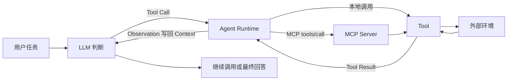

# 第四章：工具

> 本章核心：LLM 负责理解任务和提出动作，Tool 负责读取外部信息或执行真实操作，Agent Runtime 负责把 Tool Call、Tool Result 和下一轮模型判断连接起来。

## 1. 为什么 Agent 需要工具

LLM 只能根据当前输入生成内容，不能只靠文字保证掌握最新外部状态，也不能直接改变文件、数据库或第三方系统。工具为 Agent 增加三类能力：

- 获取模型参数之外的最新信息。
- 完成计算、解析、检索等确定性任务。
- 对外部环境产生真实操作。

可以先记住这个关系：

```text
Agent = LLM + Context + Tools

LLM：判断下一步做什么
Context：保存当前任务需要的信息
Tools：读取环境或执行动作
```

工具不会自动让模型变成完整 Agent。系统还需要把工具定义交给模型、接收模型生成的调用请求、真正执行工具，并把结果放回下一轮 Context。

## 2. 工具的分类

### 2.1 感知工具

感知工具用于读取外部世界，把信息转换成 Agent 可以处理的 Observation，例如：

- 搜索网页和知识库。
- 读取文件、PDF 和数据库。
- 获取天气、行情等公开数据。
- 识别图片、音频和视频内容。

感知工具的重点不是“返回越多越好”，而是结果要与问题有关、来源明确，并适合放入 Context。

### 2.2 执行工具

执行工具用于改变外部环境，例如：

- 写入或编辑文件。
- 执行 Python 代码或 Shell 命令。
- 创建日历事项、工单或 Pull Request。
- 操作浏览器、桌面应用或移动设备。

执行结果不能只返回一句“成功”。至少应说明执行状态、输出、错误和必要的结果位置，让上层 Agent 能判断任务是否继续。

### 2.3 协作工具

协作工具把任务交给其他人或 Agent，例如启动子任务、发送补充信息、查询任务状态和取得结果。它们需要明确：

- 子任务目标是什么。
- 提供哪些 Context。
- 结果使用什么格式返回。
- 任务是同步、异步还是流式执行。

## 3. 工具设计的通用原则

### 3.1 专用工具、通用执行器与 Skill

| 形式 | 适合场景 | 例子 |
| --- | --- | --- |
| 专用工具 | 高频、稳定、输入输出明确的任务 | `get_weather(city)` |
| 通用执行器 | 长尾任务和多步探索 | Python、Terminal、Browser |
| Skill | 已有工具，但需要补充可复用的方法和步骤 | “怎样检查项目并运行测试” |

Tool 提供“能做什么”，Skill 说明“怎样做”。Skill 不会凭空增加新的执行能力，最终仍要调用底层工具。

### 3.2 工具描述要让模型会选择

一个可用的工具说明应告诉模型：

- 什么情况下使用。
- 什么情况下不要使用。
- 每个参数表示什么。
- 返回结果包含什么。

描述过于模糊时，模型很难在相似工具之间做出正确选择。

### 3.3 参数和结果要保持信息保真

参数传递不能悄悄改变原意。结构化数据应保持字段、类型和嵌套关系，命令和代码要注意转义。

工具结果也不能只有“成功”或“失败”。更实用的结果通常包含：

```json
{
  "success": true,
  "data": {},
  "error": null,
  "metadata": {
    "source": "...",
    "timestamp": "..."
  }
}
```

长结果可以先返回摘要和完整结果的位置，避免把全部内容一次塞进 Context。

## 4. Function Calling 与 Tool Calling

Function Calling / Tool Calling 指模型生成结构化的工具调用请求。模型负责生成工具名和参数，真正执行函数的是 Agent Runtime 或应用代码。

### 4.1 Tool Schema

Tool Schema 是工具的调用说明书：

```json
{
  "name": "get_weather",
  "description": "查询指定城市的当前天气",
  "inputSchema": {
    "type": "object",
    "properties": {
      "city": {
        "type": "string",
        "description": "城市名称"
      }
    },
    "required": ["city"]
  }
}
```

Schema 告诉模型工具叫什么、什么时候使用、参数怎样填写。它不是工具实现，也不代表工具已经执行。

### 4.2 一次完整的 Tool Calling 流程

```text
用户提出问题
-> Runtime 把 messages 和可用 tools 交给 LLM
-> LLM 判断需要调用工具
-> LLM 返回 tool_call（name + arguments + id）
-> Runtime 找到并执行对应 Tool
-> Tool 返回 Tool Result
-> Runtime 用 tool_call_id 把结果放回 messages
-> LLM 根据新的 Observation 继续调用或生成最终回答
```

最容易混淆的三个概念：

| 对象 | 表示什么 |
| --- | --- |
| Tool Schema | 工具说明书 |
| Tool Call | 模型提出的一次结构化调用请求 |
| Tool Result | 工具真实执行后返回的观察 |

只有 Tool Call 不能证明工具已经执行；Tool Result 也不等于最终回答，它需要回到 Context，供模型继续判断。

## 5. MCP：统一外部工具的接入方式

MCP（Model Context Protocol）用于标准化模型应用与外部能力之间的连接、发现和调用。

### 5.1 三个角色

| 角色 | 作用 |
| --- | --- |
| MCP Host | 承载 Agent、模型和用户交互的应用 |
| MCP Client | Host 内维护与某个 Server 的连接 |
| MCP Server | 对外提供 Tools、Resources 或 Prompts |

一个 Host 可以连接多个 Server，每条连接通常由对应的 Client 管理。

### 5.2 最小协议流程

```text
Client -> Server：initialize
Server -> Client：返回协议版本和能力
Client -> Server：tools/list
Server -> Client：返回工具定义
Client -> Server：tools/call(name, arguments)
Server -> Tool：执行具体实现
Tool -> Server -> Client：返回结果
```

在本章实验里，最重要的是先看懂 `initialize`、`tools/list` 和 `tools/call` 这三个动作。

### 5.3 MCP 与 Tool Calling 的关系

- Tool Calling 是模型提出和处理工具调用的机制。
- MCP 是 Host 接入外部工具的一种标准协议。
- API 是具体服务提供的程序接口。

它们可以组合使用：MCP Server 把外部 API 包装为工具，Host 把这些工具定义交给模型；模型生成 Tool Call 后，MCP Client 再请求 Server 执行。

## 6. 工具生态：MCP 与 Skill Hub

当工具来自不同项目时，MCP 可以统一连接和调用方式；当某类任务需要一套可复用的方法时，可以通过 Skill Hub 按需找到相关 Skill。

二者关注点不同：

```text
MCP：怎样接入外部能力
Skill：怎样使用已有能力完成一类任务
```

实际系统可以同时使用二者：先加载 Skill 中的方法，再通过 MCP 工具完成具体步骤。

## 7. 工具太多怎么办

工具越多，不一定越容易完成任务。大量相似工具会增加 Tool Schema 占用的 Context，也会让模型更难选择。

### 7.1 层次化组织与按需加载

先展示领域或工具组，再加载当前任务需要的少量工具定义：

```text
全部能力
-> 选择领域
-> 加载候选工具
-> 选择并调用具体工具
```

### 7.2 Active Tool Discovery

主动工具发现是先通过发现入口搜索真实存在的工具，再把少量候选 Schema 交给模型。它不是让模型凭空猜工具名称。

这种方式减少初始 Context，但会多一次发现过程，因此需要比较选择准确率、调用成功率、时延和成本。

## 8. 感知工具实验 4-2

[实验 4-2：Perception Tools + MCP](perception-tools/) 对应本章的感知工具和 MCP 接入。

当前实跑链路：

```text
启动 MCP Server
-> initialize
-> tools/list
-> 发现 127 个工具
-> tools/call(file_reader)
-> 读取 requirements.txt
-> 返回 Tool Result
```

2026-09-22 的 MCP 冒烟测试成功，SDK 版本为 `2.2.0`，协议版本为 `2026-07-28`。这是固定工具调用验证，没有让 LLM 自主选择工具。

## 9. 执行工具实验 4-4

[实验 4-4：Execution Tools + MCP](execution-tools/) 对应本章的执行工具。

当前离线 demo 覆盖：

- 写入 Python 文件并完成语法校验。
- 拦截包含语法错误的文件。
- 执行 Python 代码并取得 stdout。
- 执行 Shell 命令并取得 returncode。
- 截断长输出并保存完整结果。
- 拒绝 demo 中预设的危险命令。

本轮自动测试结果为 `63 passed`。当前项目验证的是工具执行层，没有实现 LLM 自主选工具的 Agent Loop。

## 10. 把第四章串起来



第四章要掌握的不是某个具体 SDK，而是这条完整链路：模型提出调用，运行系统执行工具，结果回到 Context，模型再根据真实观察继续决策。

## 11. 闭卷自测

1. 为什么只有 LLM 还不能成为完整 Agent？
2. 感知工具、执行工具和协作工具分别解决什么问题？
3. Tool、Skill 和 MCP 的作用有什么区别？
4. Tool Schema、Tool Call 和 Tool Result 分别是什么？
5. Tool Call 最终由谁执行？
6. 为什么 Tool Result 必须回到 Context？
7. MCP Host、Client、Server 分别负责什么？
8. `initialize`、`tools/list`、`tools/call` 的顺序是什么？
9. MCP 和 Tool Calling 为什么不是同一个概念？
10. 工具数量很多时，怎样减少 Context 和选择压力？

## 本章总结

1. 工具把 Agent 与外部信息、计算能力和真实环境连接起来。
2. 模型生成 Tool Call，Runtime 或 MCP Client 负责实际执行。
3. Tool Result 是新的 Observation，必须回到 Context 才能支持下一步判断。
4. MCP 统一工具的连接、发现和调用方式，Skill 提供可复用的方法。
5. 工具较多时，应使用层次化组织、按需加载和主动发现。


